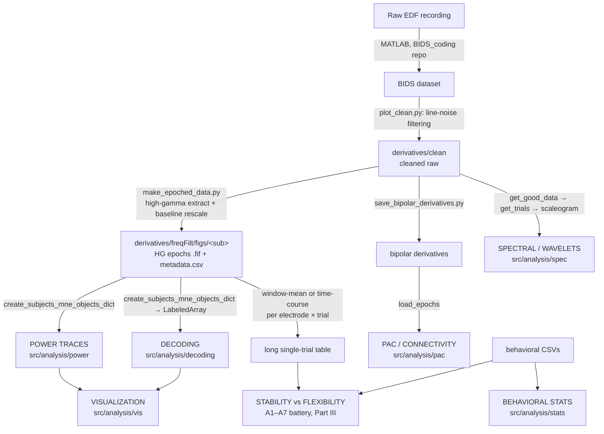

# GlobalLocal Analysis Guide

**The single guide to the GlobalLocal iEEG analysis codebase.** For each
analysis it puts the three things you need in one place: the **motivation**
(what question it answers and why it is designed this way), the **method** (the
statistics, at the level of the actual code), and the **scripts** (which files,
which launcher, which knobs, which outputs, and how to read them).

Everything downstream starts from **epoched iEEG data**. Each analysis path
consumes epoched data and produces a different kind of result — power traces,
decoding accuracies, time-frequency spectra, connectivity, statistical models.
Part I is the shared plumbing, Part II is one section per analysis path, and
Part III is the stability-vs-flexibility battery (A1–A7), which is large enough
to be its own part.

> Source lives under `src/analysis/`. Cluster entry points (the scripts you
> actually launch) live under `dcc_scripts/`. Tests live under `tests/analysis/`.

Where a design decision hinges on a specific line of code, the reasoning is kept
in a collapsed **▸ Line-by-line** block — click to expand. Everything you need to
*run* an analysis is in the visible text.

### The other docs

This guide is the only place that documents how to run an analysis. Four
companion docs remain, each with a job this one doesn't do:

| Doc | Read it when you want |
|---|---|
| `stability_flexibility_data_flow.md` | The **shape of the data at every step** of A1–A7 — one fake dataset followed end to end with the actual intermediate tables printed. Backed by the runnable `docs/examples/stability_flexibility_data_flow_demo.py` |
| `stability_flexibility_segregation_methods.md` | Manuscript-ready **Methods** text for the segregation analysis, in a `cluster` and a `cohens_d` version |
| `refactoring_guide.md` | How the big modules were split (and how to split the next one). Records what has already been done to `decoding/` and `power/` |
| `learning_assignments/segregation_bootstrap/README.md` | **A7** — a build-a-feature self-check with a pytest grader (§20) |

The repo-root `README.md` covers environment setup, BIDS conversion, cluster
access, and the experiment itself. Runnable assignment stubs are in
`docs/skeletons/`.

---

## Contents

**Part I — Orientation**
1. [The big picture](#1-the-big-picture)
2. [Directory map](#2-directory-map)
3. [Shared building blocks](#3-shared-building-blocks-read-these-first)
4. [Preprocessing — produces the shared input](#4-preprocessing--produces-the-shared-input)

**Part II — The analysis paths**

5. [Spectral / wavelets](#5-spectral--wavelets-spec)
6. [Power traces](#6-power-traces-power)
7. [Decoding](#7-decoding-decoding)
8. [PAC / connectivity](#8-pac--connectivity-pac)
9. [Behavioral / mixed-effects stats](#9-behavioral--mixed-effects-stats-stats)
10. [Visualization](#10-visualization-vis)
11. [Quick reference](#11-quick-reference)

**Part III — Stability vs. Flexibility (A1–A7)**

12. [The question, the figure plan, and the statistical principles](#12-the-question-the-figure-plan-and-the-statistical-principles)
13. [What every job in the battery shares](#13-what-every-job-in-the-battery-shares)
14. [**A1/A2** — electrode definition, conjunction, and the segregation verdict](#14-a1a2--electrode-definition-conjunction-and-the-segregation-verdict)
15. [**A1′/A2** — the same conjunction on `power_traces` electrodes](#15-a1a2--the-same-conjunction-on-power_traces-electrodes)
16. [**A3** — anatomy](#16-a3--anatomy)
17. [**A4** — cross-decoding](#17-a4--cross-decoding)
18. [**A5** — timing](#18-a5--timing)
19. [**A6** — brain–behavior](#19-a6--brainbehavior)
20. [**A7** — reconciling the two layers (self-check)](#20-a7--reconciling-the-two-layers-self-check)
21. [Circularity control — the disjoint trial splits](#21-circularity-control--the-disjoint-trial-splits)
22. [Run order, tutorials, and the function map](#22-run-order-tutorials-and-the-function-map)

---

# Part I — Orientation

## 1. The big picture



There are **two flavors of "epoched data"** in this repo, and knowing which one
a path consumes is the single most important thing to keep straight:

| Flavor | Produced by | Stored where | Loaded by | Consumed by |
|--------|-------------|--------------|-----------|-------------|
| **Saved high-gamma epochs** (`.fif`) | `preproc/make_epoched_data.py` | `derivatives/freqFilt/figs/<sub>/` | `general_utils.load_mne_objects` → `create_subjects_mne_objects_dict` | **Power traces**, **Decoding** |
| **On-the-fly re-epoched cleaned raw** | epoched at runtime | `derivatives/clean` (raw) | `general_utils.get_good_data` → `get_trials` | **Wavelets/Spectral**, **PAC** (via bipolar) |

The power and decoding paths share the *exact same* pre-computed high-gamma
epochs. The spectral and PAC paths re-epoch the cleaned raw data themselves
because they need the full-band (not high-gamma-only) signal.

There is also a **third shape**, derived from the first: the stability/flexibility
battery (Part III) flattens the saved HG epochs into a **long single-trial
table**, one row per (electrode, trial), where `hg` is either the window mean or
the window's time course. Every module in that battery consumes only that table —
which is why each one can be run end to end on synthetic ground truth with no
data on disk. See `docs/stability_flexibility_data_flow.md`.

---

## 2. Directory map

```
src/analysis/
├── preproc/     # Produces the epoched data everything else consumes
│   ├── plot_clean.py                     # line-noise filtering → derivatives/clean
│   ├── make_epoched_data.py              # high-gamma epochs (main shared input)
│   ├── make_epoched_data_with_phase.py   # variant that keeps complex/phase
│   ├── epoch_helpers.py                  # shared epoching/outlier helpers
│   ├── save_bipolar_derivatives.py       # bipolar-referenced derivatives (feeds PAC)
│   ├── makeRawBehavioralData.py          # accuracy/RT behavioral arrays
│   └── parcellation.py                   # anatomy / atlas labels
│
├── config/      # Shared definitions (conditions, ROIs, plotting)
│   ├── experiment_conditions.py          # condition name → BIDS event mapping
│   ├── condition_registry.py             # CONDITION_REGISTRY + get_comparisons(), etc.
│   ├── rois.py                           # ROI → Destrieux atlas label lists
│   ├── plotting_parameters.py
│   └── group_data.py
│
├── utils/       # Shared data-loading & array plumbing
│   ├── general_utils.py                  # load_mne_objects, get_good_data, sig chans, ROI maps
│   ├── labeled_array_utils.py            # MNE epochs → LabeledArray, bootstrapping (decoding)
│   └── epoch_metadata_utils.py           # trial metadata construction
│
├── spec/        # ANALYSIS PATH: time-frequency / wavelets  (§5)
│   ├── wavelet_functions.py
│   └── subjects_tfr_objects_functions.py
│
├── power/       # ANALYSIS PATH: high-gamma power traces + windowed ANOVA  (§6)
│   ├── power_traces.py                   # FACADE — re-exports the three modules below
│   ├── evoked_builders.py                # per-ROI/condition evoked construction + subtraction
│   ├── windowed_anova.py                 # windowed ANOVA, cluster correction, FDR
│   ├── plots.py                          # power traces + interaction plots
│   └── roi_analysis.py
│
├── decoding/    # ANALYSIS PATH: time-resolved decoding  (§7)
│   ├── decoding.py                       # FACADE — re-exports every public name below
│   ├── decoder.py                        # the Decoder class + cv_cm_* methods
│   ├── data_prep.py                      # balancing, mixup2, flatten_features, sample_fold
│   ├── accuracy_stats.py                 # permutation / bootstrap / cluster stats on accuracies
│   ├── roi_confusion.py                  # per-ROI confusion-matrix orchestration
│   ├── tfr_cluster.py                    # sig-TFR masks + cluster decoding (bridge from spec/)
│   ├── context_comparison.py             # cross-block / context comparisons + overlay
│   ├── plots/                            # accuracies.py, confusion.py, trajectories.py, style.py
│   ├── process_bootstrap.py
│   ├── cross_decoding.py                 # A4: contrasts + circularity table + label-pair glue (§17)
│   ├── trial_splitting.py                # disjoint def/decode split (circularity control, §21)
│   ├── anova_electrode_selection.py      # trial-id-keyed split + power_traces ANOVA electrode sets (§21)
│   ├── run_anova_electrode_selection.py  # selection -> decode orchestration for the above
│   └── run_*.py                          # per-stage orchestration helpers
│
├── pac/         # ANALYSIS PATH: phase-amplitude coupling / connectivity  (§8)
│   ├── theta_connect.py                  # main coherence entry point
│   ├── env_correlation.py
│   └── *_plot.py, sig_test.py, get_channels_detail.py
│
├── stats/       # ANALYSIS PATH: behavioral / mixed-effects models (§9)
│   │            # + the stability/flexibility battery (Part III)
│   ├── erin_linear_mixed_effects_model.py
│   ├── stability_flexibility_segregation.py    # A1 ANOVA defn + A2 conjunction + continuous corr/CMH
│   ├── power_traces_conjunction.py             # A1′: the same conjunction on power_traces electrodes
│   ├── stability_flexibility_anatomy.py        # A3: coverage-conditioned ROI/Destrieux enrichment + brain maps
│   ├── stability_flexibility_timing.py         # A5: relative onset (50%-of-peak + jackknife)
│   ├── stability_flexibility_brain_behavior.py # A6: brain↔behavior correlation
│   ├── stability_flexibility_*_tutorial.ipynb  # per-analysis walk-throughs
│   └── stability_flexibility_assignments_sandbox.ipynb  # learn-by-doing A1–A6
│
└── vis/         # Cross-path visualization (brain figures, F-traces)  (§10)
    ├── brain_figure_glasser_separate_svgs_lateral_medial_view_less_bold.py
    ├── jim_mri.py
    └── power_traces_anova_f_traces_vis.py

dcc_scripts/      # Cluster launchers (what you actually run)
├── preproc/      # submit_plot_clean.sh, submit_make_epoched_data.sh
├── spec/         # make_wavelets, plot_wavelets, wavelet_differences,
│                 # get_sig_tfr_differences + sbatch/submit *.sh
├── power/        # run_power_traces_dcc.py, power_traces_dcc.py, sbatch/submit *.sh
├── decoding/     # run_decoding_dcc.py, decoding_dcc.py, sbatch/submit *.sh
│                 # + stability_flexibility_cross_decoding (A4, §17)
│                 # + the two def/decode split launchers (§21)
├── stats/        # A1/A2 (anova_conjunction, segregation) + A1′ (power_traces_conjunction)
│                 # + A3 (anatomy) + A5 (timing) + A6 (brain_behavior) launchers
└── vis/          # plot_sig_electrodes_dcc.py + condition_plot_specs.py

docs/examples/    # Runnable doc companions
└── stability_flexibility_data_flow_demo.py   # every table in the data-flow doc
```

> **Two facades.** `decoding/decoding.py` and `power/power_traces.py` used to be
> ~4.7k- and ~2.4k-line monoliths. They are now thin re-export shims, so every
> existing `from src.analysis.decoding.decoding import ...` still resolves — but
> **new code should import from the specific submodule** (`decoding.decoder`,
> `power.windowed_anova`, …). See `docs/refactoring_guide.md` for the full map
> and for two pre-existing bugs the split surfaced.

---

## 3. Shared building blocks (read these first)

Every path leans on the same small set of shared concepts. Learn these once and
the individual paths become easy to read.

### Conditions (`config/experiment_conditions.py` + `config/condition_registry.py`)

A **condition** is a human-readable name mapped to a list of BIDS event strings.
Example from `experiment_conditions.py`:

```python
stimulus_task_by_congruency_conditions = {
    "Stimulus_i_taskG": {"BIDS_events": ["Stimulus/i25.0/Taskg", "Stimulus/i75.0/Taskg"], ...},
    "Stimulus_c_taskG": {"BIDS_events": ["Stimulus/c25.0/Taskg", "Stimulus/c75.0/Taskg"], ...},
    ...
}
```

`condition_registry.py` wraps these into a registry keyed by a *comparison label*
and exposes accessor functions the paths call:

- `get_comparisons(label)` — the condition pairs to contrast (decoding, power)
- `get_conditions_obj(label)` — the full conditions object
- `get_anova_factors(label)` / `get_anova_interactions(label)` — ANOVA design (power)
- `get_subtraction_pairs(label)` — evoked subtraction pairs (power)
- `get_balance_strata(label)` / `get_pooled_shuffle_settings(label)` — decoding options

> **When you add a new condition or comparison, you edit `condition_registry.py`.**
> This is the single source of truth both the power and decoding paths read from.

### ROIs (`config/rois.py`)

`rois_dict` maps an ROI name (`dlpfc`, `acc`, `lpfc`, `v1`, `occ`, `parietal`, …)
to a list of Destrieux-atlas label substrings. Electrodes are assigned to ROIs
by matching their anatomical labels against these lists.

### Data loading & electrode plumbing (`utils/general_utils.py`)

| Function | Role |
|----------|------|
| `get_default_LAB_root()` | Resolve the data root per-OS / per-cluster |
| `load_mne_objects(sub, epochs_root_file, task, ...)` | Load one subject's saved HG epochs (`HG_ev1`, `HG_ev1_rescaled`, `HG_ev1_power_rescaled`, `HG_base`) |
| `create_subjects_mne_objects_dict(subjects, ..., conditions, ...)` | Load **all** subjects and slice each into the requested conditions → `subjects_mne_objects[sub][cond][obj_type]` |
| `get_good_data(sub, layout)` | Load cleaned raw for on-the-fly epoching (spec path) |
| `get_trials(data, events, times, ...)` | Epoch cleaned raw around events (spec path) |
| `make_or_load_subjects_electrodes_to_ROIs_dict(...)` | Build/lookup the electrode→ROI mapping |
| `get_sig_chans_per_subject(...)` | Task-significant electrodes per subject |
| `make_sig_electrodes_per_subject_and_roi_dict(...)` | Cross ROI membership with significance |
| `filter_electrode_lists_against_subjects_mne_objects(...)` | Drop electrodes missing from the loaded epochs |

### LabeledArray plumbing (`utils/labeled_array_utils.py`) — decoding only

Decoding needs dense arrays, not MNE objects. This module converts
`subjects_mne_objects` into `LabeledArray`s (`obs × channel × time`, plus `freq`
for TFR), and provides the **bootstrapping / downsampling** used to equalize
trial counts across electrodes and conditions:

- `put_data_in_labeled_array_per_roi_subject(...)`
- `remove_nans_from_all_roi_labeled_arrays(...)`
- `concatenate_conditions_by_string(...)`
- `make_bootstrapped_roi_labeled_arrays_with_nan_trials_removed_for_each_channel(...)`

---

## 4. Preprocessing — produces the shared input

Not an "analysis path" per se, but everything depends on it, so it comes first.

**`preproc/make_epoched_data.py`** is the workhorse. For each subject it:

1. Loads the cleaned raw: `raw_from_layout(layout.derivatives['derivatives/clean'], ...)`.
2. Epochs around events (`trial_ieeg`), with a baseline epoch too.
3. Extracts high gamma with `ieeg.timefreq.gamma.extract` (or a filter+Hilbert
   fallback), then `crop_pad` + `decimate`.
4. Baseline-rescales with `ieeg.calc.scaling.rescale(..., mode='zscore')`.
5. Saves the epochs to `derivatives/freqFilt/figs/<sub>/` as `.fif` plus
   `metadata.csv`:
   - `<sub>_<name>_HG_ev1-epo.fif` — raw high-gamma epochs
   - `<sub>_<name>_HG_ev1_rescaled-epo.fif` — z-scored high gamma
   - `<sub>_<name>_HG_ev1_power_rescaled-epo.fif` — z-scored power
   - `<sub>_<name>_HG_base-epo.fif` — baseline epochs

**Run it:**
```bash
python src/analysis/preproc/make_epoched_data.py --passband 70 150 --subjects D0057
```

The string `<name>` (e.g. `Stimulus_1sec_preStimulusBase_decFactor_10`) becomes
the **`epochs_root_file`** argument that the power and decoding paths pass to
`create_subjects_mne_objects_dict` to load these files back, and the
`EPOCHS_ROOT_FILE` env var every Part III launcher takes.

**`preproc/save_bipolar_derivatives.py`** builds bipolar-referenced derivatives
(adjacent-contact A−B). These are the input to the **PAC** path (§8).

---

# Part II — The analysis paths

## 5. Spectral / wavelets (`spec/`)

**Produces:** per-trial time-frequency representations (TFRs) — a
`freq × time` spectrogram per channel per trial — and cluster-corrected
**significant TFR differences** between conditions.

**Consumes:** cleaned raw, re-epoched on the fly (`get_good_data` → `get_trials`).
It does *not* use the saved HG epochs, because it needs the full-band signal.

**Key files:**
- `spec/wavelet_functions.py` — the low-level TFR computations (wavelet scaleogram
  and multitaper), plus significance testing between conditions.
- `spec/subjects_tfr_objects_functions.py` — the per-subject / per-ROI orchestration.
- **Runners:** `dcc_scripts/spec/` — `make_wavelets_dcc.py` (compute TFRs),
  `plot_wavelets_dcc.py`, `wavelet_differences_dcc.py`, and
  `get_sig_tfr_differences_dcc.py`, each with a `run_*.py` config and
  `sbatch_*.sh` / `submit_*.sh` pair, in the same shape as the power and decoding
  launchers.

### Function-call structure

```
make_subjects_tfr_objects(subjects, layout, conditions, spec_method, ...)
└── for each subject, condition:
    make_subject_tfr_object(sub, layout, condition_name, condition_dict, spec_method, ...)
    ├── spec_method == 'wavelet':
    │   get_uncorrected_wavelets(sub, layout, events, times, ...)
    │   ├── get_good_data(sub, layout)              # cleaned raw
    │   ├── get_trials(good, events, padded_times)  # epoch it
    │   └── wavelet_scaleogram(...) + crop_pad(...)
    └── spec_method == 'multitaper':
        get_uncorrected_multitaper(...) / get_corrected_multitaper(...)  # baseline-corrected

load_or_make_subjects_tfr_objects(...)   # cached wrapper: load from disk or compute

# Significance between two conditions:
get_sig_tfr_differences_per_subject(...) / get_sig_tfr_differences_per_roi(...)
└── get_sig_tfr_differences(tfr1, tfr2, ...)   # ieeg time_perm_cluster over freq×time
```

TFR objects are saved to `derivatives/spec/<method>/<sub>/`. Convenience loaders
`load_wavelets` / `load_multitaper` / `load_tfrs` read them back;
`make_and_get_sig_wavelet_differences` / `load_and_get_sig_wavelet_differences`
combine compute+significance in one call. `plot_mask_pages` renders the
significant-cluster masks per channel.

**Bridge to decoding:** the significant TFR masks produced here feed
`decoding.decode_on_sig_tfr_clusters` (§7).

---

## 6. Power traces (`power/`)

**Produces:** ROI-averaged **high-gamma power time traces** per condition, with
cluster-corrected significance between conditions, plus **within-electrode
windowed ANOVA** F-traces and interaction plots.

**Consumes:** the saved HG epochs, via `create_subjects_mne_objects_dict`.

**Key files:**
- `power/power_traces.py` — **facade only**; re-exports the three modules below so
  old imports keep working. New code should import from the specific module:
  - `power/evoked_builders.py` — per-subject/ROI/condition evoked construction,
    grand averages, subtraction pairs, `time_perm_cluster_between_two_evokeds`.
  - `power/windowed_anova.py` — `process_windowed_data_for_anova`,
    `create_windowed_anova_dataframe`,
    `run_within_electrode_windowed_anova_cluster_correction`, FDR helpers.
  - `power/plots.py` — `plot_power_trace_for_roi`, the 2-way / 16-condition
    interaction plots, `DEFAULT_PLOT_STYLE`.
- `power/roi_analysis.py` — an older per-subject stats entry (`main()` currently
  being refactored; not the primary path).
- **Runner:** `dcc_scripts/power/power_traces_dcc.py` (`main(args)`), configured
  by `run_power_traces_dcc.py`, launched via `submit_specific_conditions_power_traces_dcc.sh`.

### Function-call structure (`power_traces_dcc.py: main`)

```
main(args)
├── subjects_mne_objects = create_subjects_mne_objects_dict(subjects, epochs_root_file, conditions, ...)
├── electrode/ROI setup:
│   make_or_load_subjects_electrodes_to_ROIs_dict(...)
│   get_sig_chans_per_subject(...) + make_sig_electrodes_per_subject_and_roi_dict(...)
│   filter_electrode_lists_against_subjects_mne_objects(...)
│
├── evks_dict_elecs = make_multi_channel_evokeds_for_all_conditions_and_rois(subjects_mne_objects, ...)
│   └── make_evoked_electrode_lists_for_all_conditions_and_rois(...)
│       └── create_list_of_single_channel_evokeds_across_subjects_for_roi_and_condition(...)
│           ├── get_evoked_for_specific_subject_and_condition(...)
│           ├── extract_single_electrode_evokeds(...)
│           └── combine_single_channel_evokeds(...)     # → per-ROI grand-average evoked
│
├── windowed ANOVA (optional):
│   windowed_data = process_windowed_data_for_anova(subjects_mne_objects, conditions, rois, ...)
│   df = create_windowed_anova_dataframe(windowed_data, ...)
│   run_within_electrode_windowed_anova_cluster_correction(df, ...)   # per-electrode F-traces
│       └── _fit_anova_per_window_per_unit(...) + _shuffle_labels_within_electrode(...)
│   # (or perform_windowed_anova / apply_fdr_correction_to_windowed_results for the simpler design)
│
└── plotting:
    plot_power_traces_for_all_rois(evks_dict_elecs, rois, ...)
    └── plot_power_trace_for_roi(...)
        ├── time_perm_cluster_between_two_evokeds(...)   # significance between two conditions
        └── find_clusters(...)                           # contiguous significant spans
    # interaction variants:
    plot_2way_interaction_for_roi(...) / plot_16_conditions_with_interaction_clusters_for_roi(...)
    plot_anova_interaction_results(...)
```

`subtract_evoked_conditions` / `create_subtracted_evokeds_dict` build difference
waves (using `get_subtraction_pairs` from the registry). The saved F-trace `.npz`
files are plotted separately by `vis/power_traces_anova_f_traces_vis.py`.

The **within-electrode windowed ANOVA with cluster correction** run by this path
does double duty: it is also an electrode *definition* consumed by A1′ (§15) and
by the ANOVA-selector split (§21). A run directory is the one holding
`summary.csv` + `run_config.json`:
`dcc_scripts/power/figs/<EPOCHS_ROOT_FILE>/anova_within_electrode/<conditions_save_name>`.

**Run it:**
```bash
# from dcc_scripts/power on the cluster:
sh submit_specific_conditions_power_traces_dcc.sh
# (edit conditions in submit_*.sh and parameters in run_power_traces_dcc.py)
```

---

## 7. Decoding (`decoding/`)

**Produces:** time-resolved **decoding accuracy traces** (true vs. shuffle) with
cluster-based significance, **confusion matrices** (static and over time), and
context/cross-block comparisons and low-dimensional (PCA/UMAP) trajectories.

**Consumes:** the saved HG epochs → converted to `LabeledArray`, then
**bootstrapped** (each electrode randomly downsampled to the min trial count in
its ROI×condition; then downsampled again to the min across the two conditions
being compared).

**Key files:** `decoding/decoding.py` used to hold the whole pipeline in one
~4.8k-line file. It is now a **125-line facade** that re-exports everything, so
every old `from src.analysis.decoding.decoding import ...` still works — but the
code now lives in focused modules, and that's where to make changes:

| Module | Holds |
|---|---|
| `decoder.py` | the **`Decoder`** class + its `cv_cm_*` methods |
| `data_prep.py` | balancing, `mixup2`, `flatten_features`, `sample_fold` |
| `accuracy_stats.py` | permutation / bootstrap / cluster stats on accuracies |
| `roi_confusion.py` | `get_confusion_matrices_for_rois_*` orchestration |
| `tfr_cluster.py` | sig-TFR masks + cluster decoding (the bridge from §5) |
| `context_comparison.py` | `run_context_comparison_analysis`, `plot_cross_block_overlay` |
| `plots/accuracies.py`, `plots/confusion.py`, `plots/trajectories.py`, `plots/style.py` | all plotting |
| `process_bootstrap.py` | the per-bootstrap unit of work (run in parallel) |
| `run_*.py` | orchestration helpers for aggregation, context comparisons, debug viz |

- **Runner:** `dcc_scripts/decoding/decoding_dcc.py` (`main(args)`), configured by
  `run_decoding_dcc.py`, launched via `submit_specific_conditions_decoding_dcc.sh`.

### The `Decoder` class (`decoding/decoder.py`)

`Decoder(PcaEstimateDecoder, MinimumNaNSplit)` — a cross-validated decoder that
handles NaN trials and PCA dimensionality reduction. Key methods:

- `cv_cm_jim(x_data, labels, ...)` — cross-validated confusion matrix (whole window).
- `cv_cm_jim_window_shuffle(x_data, labels, ...)` — sliding-window decoding with a
  shuffle distribution → the time-resolved accuracy traces.
- `_window_and_predict_minimal(...)` / `fit_predict(...)` — the per-fold inner loop.

Four optional arguments on `cv_cm_jim_window_shuffle` (all default to the
historical behaviour, so existing runs are unchanged):

| Argument | Effect |
|---|---|
| `labels_test` | score against a **different labelling of the same trials** — this is what makes A4's cross-decoding possible (§17) |
| `stratify_labels` | what the fold split is stratified on. Defaults to the train labels; pass the joint condition cell when cross-decoding so the test fold stays balanced on the label you *score* |
| `frac_train` | set the **train/test proportion** directly (`StratifiedShuffleSplit`) instead of the fixed `(n_splits-1)/n_splits` of `StratifiedKFold`. `n_splits` then counts random resamples per repeat |
| `temporal_generalization` | fit at each train window and predict at **every** test window → a `(n_train_windows, n_test_windows, …)` matrix (Fig 10). `n_windows` fits, `n_windows²` predictions |

### Function-call structure (`decoding_dcc.py: main`)

```
main(args)
├── subjects_mne_objects = create_subjects_mne_objects_dict(...)   # same HG epochs as power
├── electrode/ROI setup (same helpers as the power path)
├── condition_comparisons = get_comparisons(args.condition_label)  # from condition_registry
│
├── Parallel over bootstraps (joblib):
│   process_bootstrap(bootstrap_idx, subjects_mne_objects, args, rois, conditions, electrodes, ...)
│   ├── put_data_in_labeled_array_per_roi_subject(...)                       # → LabeledArray
│   ├── make_bootstrapped_roi_labeled_arrays_with_nan_trials_removed_...(...) # downsample/balance
│   └── get_confusion_matrices_for_rois_time_window_decoding_jim(...)
│       └── Decoder.cv_cm_jim_window_shuffle(...)   # per-window true + shuffle CMs
│
├── aggregate:
│   run_aggregate_and_plot_time_averaged_cms(time_averaged_cms_list, ...)
│   compute_accuracies(cm_true, cm_shuffle)
│   make_pooled_shuffle_distribution(...) + compute_pooled_bootstrap_statistics(...)
│
├── significance:
│   perform_time_perm_cluster_test_for_accuracies(...)
│   do_time_perm_cluster_comparing_two_true_bootstrap_accuracy_distributions(...)
│   cluster_perm_paired_ttest_by_duration(...) / run_two_one_tailed_tests_with_time_perm_cluster(...)
│
└── plot:
    plot_accuracies_nature_style(...) / plot_accuracies_with_multiple_sig_clusters(...)
    extract_pooled_cm_traces(...) → plot_cm_traces_nature_style(...)
    plot_static_pca_projection / plot_pca_over_time / plot_umap_3d_trajectory (optional)
```

**Special sub-paths inside decoding:**
- `run_context_comparison_analysis(...)` / `run_all_context_comparisons(...)` +
  `plot_cross_block_overlay(...)` — compare decoding across task blocks/contexts.
- `decode_on_sig_tfr_clusters(...)` + `compute_sig_tfr_masks_from_*` — decode using
  only the **significant time-frequency clusters** identified by the spec path
  (this is the bridge from §5 into decoding).
- **A4 cross-decoding** (§17) and the **disjoint def/decode splits** (§21) both
  run on this same stack.

**Run it:**
```bash
# from dcc_scripts/decoding on the cluster:
sh submit_specific_conditions_decoding_dcc.sh
# (edit conditions in submit_*.sh and parameters in run_decoding_dcc.py)
```

> **Unit of analysis** matters here (`folds_as_samples` vs `repeats_as_samples`
> vs bootstrap): it determines how accuracies are summed/averaged and how error
> bars and stats are computed. See the "Decoding" section of the repo-root
> `README.md`.

---

## 8. PAC / connectivity (`pac/`)

**Produces:** ROI–ROI **theta-band coherence over time windows** with a
permutation test + Benjamini–Hochberg FDR correction, plus envelope-correlation
analyses and timeline plots.

**Consumes:** bipolar-referenced epochs (built by
`preproc/save_bipolar_derivatives.py`), loaded via `load_epochs`.

**Key files:**
- `pac/theta_connect.py` — the main coherence entry point (`if __name__ == '__main__'`).
- `pac/env_correlation.py` — amplitude-envelope correlations.
- `pac/sig_test.py`, `theta_connect_plot.py`, `env_plot.py`, `plot_timeline.py`,
  `get_channels_detail.py` — significance and plotting.

### Function-call structure (`theta_connect.py: __main__`)

```
__main__(argparse: --bids_root --subjects --roi_json --part --condition --tmin --tmax ...)
├── windows = make_windows(tstart, tend, stepsize)             # contiguous time windows
├── epoch_dicts, df = load_epochs(subjects, bids_root, condition, epoch_suffix='full-epo')
└── for each subject:
    find_roi_names(part, subj, roi_json, epochs_ch_names)      # ROI → bipolar channels
    compute_alltrial_coherence_and_permutation(epochs, chs, freqs, n_cycles, method='coh', ...)
    └── spectral_connectivity_epochs(...) + permutation loop
        └── _bh_fdr(pvals, alpha)                              # FDR correction
```

**Run it:**
```bash
python src/analysis/pac/theta_connect.py \
  --bids_root <BIDS> --subjects D0057 D0059 --roi_json <roi.json> \
  --part dlpfc acc --condition stimulus_c --tmin -1 --tmax 1.5 --stepsize 0.5 \
  --fmin 3 --fmax 8 --method coh --mode cwt
```

---

## 9. Behavioral / mixed-effects stats (`stats/`)

**Produces:** behavioral statistical models — e.g. post-error slowing via a
linear mixed-effects model.

**Consumes:** behavioral CSVs (`combinedData.csv`, produced by
`preproc/makeRawBehavioralData.py`).

**Key files:**
- `stats/erin_linear_mixed_effects_model.py` — `PostErrorRT ~ PreviousErrorType *
  thisTrialCongruency * thisTrialSwitchType + IncongruentProportion +
  SwitchProportion + (1 | Subject)` via `statsmodels` mixed LM.
- `post_error_slowing_analysis.py` (repo root) — related behavioral analysis.

The behavioral model is a standalone script. The rest of `stats/` — the
`stability_flexibility_*` modules — is the battery in Part III, and that is the
one part of `stats/` with a real cluster pipeline behind it.

---

## 10. Visualization (`vis/`)

Cross-path plotting and anatomy figures:

- `vis/brain_figure_glasser_separate_svgs_lateral_medial_view_less_bold.py` —
  renders ROI-highlighted brain surfaces (Glasser/HCP-MMP1 atlas) as SVGs via MNE
  + PyVista.
- `vis/jim_mri.py` — MRI/anatomy figures; `plot_on_average` is the shared
  electrodes-on-fsaverage renderer that both `dcc_scripts/vis/plot_sig_electrodes_dcc.py`
  and A3's brain maps (§16) call.
- `vis/power_traces_anova_f_traces_vis.py` — plots the F-trace `.npz` files saved
  by the power path's windowed ANOVA.

---

## 11. Quick reference

| Path | Source dir | Cluster launcher | Input (epoched data) | Core function(s) | Output |
|------|-----------|------------------|----------------------|------------------|--------|
| **Preproc** (§4) | `preproc/` | `make_epoched_data.py` | cleaned raw (`derivatives/clean`) | `make_epoched_data.main` | saved HG epochs `.fif` |
| **Spectral / Wavelets** (§5) | `spec/` | `dcc_scripts/spec/make_wavelets_dcc.py`, `get_sig_tfr_differences_dcc.py` | cleaned raw, re-epoched | `make_subjects_tfr_objects` → `get_uncorrected_wavelets` | TFRs + sig masks |
| **Power traces** (§6) | `power/` (`evoked_builders`, `windowed_anova`, `plots`) | `power_traces_dcc.py` | saved HG epochs | `make_multi_channel_evokeds_for_all_conditions_and_rois` → `plot_power_traces_for_all_rois` | ROI power traces + ANOVA |
| **Decoding** (§7) | `decoding/` (`decoder`, `data_prep`, `accuracy_stats`, `plots/`) | `decoding_dcc.py` | saved HG epochs → LabeledArray | `process_bootstrap` → `Decoder.cv_cm_jim_window_shuffle` | accuracy traces + CMs |
| **PAC / Connectivity** (§8) | `pac/` | `theta_connect.py` | bipolar derivatives | `compute_alltrial_coherence_and_permutation` | ROI–ROI coherence |
| **Behavioral stats** (§9) | `stats/` | (script) | behavioral CSV | mixed LM | statistical models |
| **Stability/flexibility A1–A6** (Part III) | `stats/`, `decoding/` | `dcc_scripts/stats/*`, `dcc_scripts/decoding/*cross_decoding*` | long-format single-trial HG | `per_electrode_anova_labels`, `cmh_conjunction`, `roi_group_enrichment_test`, `cross_decode`, `jackknife_onset_difference`, brain–behavior | segregation / anatomy / code / timing / behavior verdicts |
| **A7 self-check** (§20) | `docs/learning_assignments/segregation_bootstrap/` | `pytest` | A1 labels + sensitivities | `bootstrap_conjunction_or`, `segregation_verdict` | OR CI + reconciled verdict |
| **Def/decode trial split** (§21) | `decoding/trial_splitting.py` | `submit_decoding_with_electrode_definition_split_dcc.sh` | saved HG epochs | `apply_electrode_definition_split` | non-circular decoding accuracies |
| **ANOVA electrode sets** (§21) | `decoding/anova_electrode_selection.py` | `submit_decoding_with_anova_electrode_selection_dcc.sh` | saved HG epochs | `select_electrodes_by_windowed_anova` → `combine_electrode_sets` | per-set (LWPC-only / LWPS-only / overlap / union) decoding accuracies |

### Where to make common changes

- **Add a condition / comparison** → `config/condition_registry.py` (+ the raw
  events in `config/experiment_conditions.py`).
- **Change ROI definitions** → `config/rois.py`.
- **Change how epochs are built / rescaled** → `preproc/make_epoched_data.py`.
- **Change how epochs are loaded into a path** → `utils/general_utils.py`
  (`load_mne_objects` / `create_subjects_mne_objects_dict` / `get_good_data`).
- **Change decoding balancing/bootstrapping** → `utils/labeled_array_utils.py`.
- **Change the `Decoder` itself** → `decoding/decoder.py` (not `decoding.py`,
  which is now only a re-export facade).
- **Change accuracy stats / cluster tests** → `decoding/accuracy_stats.py`.
- **Change a power-path plot** → `power/plots.py`; the windowed ANOVA →
  `power/windowed_anova.py`.
- **Change how stability/flexibility electrodes are defined** →
  `stats/stability_flexibility_segregation.py` (`per_electrode_anova_labels`).

### Tests

Path-level tests live under `tests/analysis/`:

| File | Covers |
|---|---|
| `decoding/test_decoding.py` | the decoding stack |
| `decoding/test_trial_splitting.py` | the disjoint split (§21) — 16 tests |
| `decoding/test_anova_electrode_selection.py` | trial-id split across condition sets, ANOVA-set algebra (§21) — 23 tests |
| `decoding/test_anova_electrode_selection_integration.py` | the real ANOVA selector on planted synthetic effects (marked `slow`) |
| `decoding/test_cross_decoding_circularity.py` | A4's double-dipping guard |
| `decoding/test_cross_decoding_electrode_groups.py` | A4's electrode groups incl. the unselected reference group (§17.1) |
| `decoding/test_cross_decoding_condition_scheme.py` | A4's contrast/block definitions derived from the condition cells, and the real branch end to end (§17.2) |
| `stats/test_stability_flexibility_anova_labels.py` | A1's four-interaction definition |
| `stats/test_cmh_uninformative_strata.py` | the CMH empty-marginal fix (§14.5) |
| `stats/test_stability_flexibility_timing.py` | A5, incl. the amplitude-invariance guard |
| `stats/test_stability_flexibility_brain_behavior.py` | A6 |
| `utils/test_labeled_array_utils.py`, `utils/test_general_utils.py` | shared plumbing |
| `preproc/test_time_perm_cluster.py` | cluster permutation |

Run with `pytest` (see `pytest.ini`). The A7 grader lives outside this tree, at
`docs/learning_assignments/segregation_bootstrap/test_a7_segregation_verdict.py`.

---

# Part III — Stability vs. Flexibility (A1–A7)

## 12. The question, the figure plan, and the statistical principles

**The question.** Do **stability** (LWPC / proactive control) and **flexibility**
(LWPS / reactive control) rely on **shared** or **distinct** iEEG substrates?
Concretely: are there *distinct subpopulations* supporting one process but not the
other, or only *shared populations* carrying both — and if shared, is it the same
*code*, at the same *sites*, arising at the same *time*?

Two constructs, each a **two-way interaction** on single-trial high-gamma (HG):

- **LWPC (stability)** = `congruency × incongruent_proportion` — the congruency
  effect is *modulated* by incongruent-proportion. **In behavior the congruency
  effect shrinks in high-incongruent-proportion blocks** (the classic proactive-
  control adjustment). In the neural signal the *direction* of this modulation is
  not known a priori and can differ across populations, so the code treats an
  electrode as LWPC-selective whenever it carries the interaction — larger *or*
  smaller congruency effect in high-incongruent blocks — and never assumes a sign.
- **LWPS (flexibility)** = `switchType × switch_proportion` — the switch effect is
  *modulated* by switch-proportion. **In behavior the switch cost shrinks in high-
  switch-proportion blocks.** As with LWPC, the neural modulation direction is not
  assumed: an electrode is LWPS-selective if it carries the interaction in either
  direction.

"Shared vs distinct" is **three questions, not one**, and the answer can differ at
each level:

1. **Anatomical / electrode overlap** — are the same *sites* selective for both? → A2 (§14), A3 (§16)
2. **Single-channel tuning** — does the same channel carry both signals? → A2's continuous correlation (§14)
3. **Representational format** — is it the same *code*? → A4 (§17)

Figure sequence:

| Fig | Content | Role | Where |
|---|---|---|---|
| 1 | Behavior: LWPC + LWPS effects, **no behavioral cross-effects** | the puzzle | motivation |
| 2 | Time–frequency: congruency (inc−con), switch cost (switch−repeat) | signal validation | §5 |
| 3 | High-gamma rises after stimulus onset | signal validation | §6 |
| 4 | HG power traces: LWPC & LWPS within-trial; **pre-trial cross-effects** | effects + tonic/baseline issue | §6, §17 |
| 5 | 2×2 conjunction (electrode counts) + stats | same sites selective for both? | §14 |
| 6 | Onset latency (jackknife, 50%-of-peak) | does one precede the other? | §18 |
| 7 | Segregation: conjunction **+ continuous effect-size correlation** | core anatomical answer | §14 |
| 8 | Orthogonal power traces (define on LWPC → LWPS trace, vice versa) | cross-contrast confirmation | §14 |
| 9 | Within-block decoding (the 2×2), incl. neural cross-effects | readable info + dissociation | §17 |
| 10 | Cross-decoding (label transfer) + temporal-generalization matrices | shared code vs co-located | §17 |

**The headline dissociation.** Fig 1 shows *no behavioral crossover*, yet Fig 9
shows *neural* cross-effects (congruency decoding differs by switch-proportion
block, and vice versa). This **behavior-independent / neural-interacting**
pattern is a result, not a nuisance — *provided* it survives the decoding
confounds in principle 8 below. Treat the *behavioral* cross-interactions as
specificity controls (they should be null); treat the *neural* cross-effects as a
finding to confound-proof.

> **Why not one four-way ANOVA?** `congruency × switchType × inc_prop ×
> switch_prop` has uninterpretable, underpowered high-order terms. Two focused
> two-way interactions map onto the constructs; the two *cross* interactions are
> specificity controls in univariate HG (should be null) but become real
> electrode-definition groups for the decoding double-dip bookkeeping — see §14.1.

> **Frequency scope.** Constructs are defined on HG (proxy for local activity).
> Conflict (theta) and switching (beta) have low-frequency signatures; HG is
> primary, and the conjunction/decoding are re-run in low bands as a robustness
> check.

### 12.1 Cross-cutting statistical principles (read before any result is "real")

These are the difference between a real result and an artifact. Every assignment
below has acceptance criteria that are just these made concrete.

1. **Double-dipping / selection bias.** Defining electrodes on contrast A and then
   reporting A's effect (or A's decoding) in that group is circular. The clean
   direction is **cross-contrast**: define on LWPC, test LWPS (and vice versa).
   Anything reported *on the selection contrast* must come from **held-out
   trials** (disjoint half; `_stratified_half_split`) or be labeled
   descriptive-only. §14.1 turns this principle into the concrete "ignore the
   diagonal decode cell" rule; §21 is the trial-level version.
2. **Disjoint trial halves.** Even the cross-contrast test couples through shared
   trial noise (LWPC and LWPS are estimated from the same trials). Estimate the
   selection and test contrasts on disjoint halves.
3. **Power matching.** LWPC and LWPS almost certainly differ in effect size, so
   the stronger recruits more electrodes at fixed α. Report counts/effects **as a
   function of threshold**, not one α snapshot (§14's sweep).
4. **Multiple comparisons.** FDR (Benjamini–Hochberg) across electrodes for the
   per-electrode selection tests.
5. **Coverage bias.** iEEG coverage is clinically determined. Any anatomical claim
   must be conditioned on coverage (§16), or it reflects *where electrodes are*.
6. **Latency–amplitude confound.** A larger effect crosses any onset threshold
   sooner. Any "X earlier than Y" claim must guard against X simply being bigger
   (§18, 50%-of-peak).
7. **Tonic / pre-trial baseline.** List-wide manipulations induce a *sustained*
   block-level state present **before** stimulus onset. Pre-trial "cross-effects"
   (Fig 4) may be genuine tonic proactive-control signals — but they poison any
   baseline correction spanning them. Use a baseline that predates the block
   context, report the pre-trial effect, and separate tonic (sustained) from
   phasic (evoked). This is a result about proactive control, not a cleanup step.
8. **Decoding confounds.** Blocks differ in difficulty and RT, so a classifier can
   exploit RT-correlated power or a univariate mean offset instead of a control
   code. Before interpreting any decode — especially the neural cross-effects —
   match trial counts, regress/match RT, and confirm survival of per-condition
   mean removal.

---

## 13. What every job in the battery shares

**The map.** Six analyses, each with a production module, a tutorial notebook,
and a DCC launcher, plus one self-check:

| # | What it answers | Module | Tutorial notebook | Section |
|---|---|---|---|---|
| **A1** | Which electrodes are stability-(S) and/or flexibility-(F) selective? | `stats/stability_flexibility_segregation.py` | `stats/stability_flexibility_segregation_tutorial.ipynb` | §14 |
| **A2** | Do S and F co-occur on the same electrodes more/less than chance? | same | same | §14 |
| **A1′** | The same conjunction on **`power_traces`** cluster-corrected electrodes | `stats/power_traces_conjunction.py` | — | §15 |
| **A3** | Are the distinct subpopulations in different **places** (conditioned on coverage)? | `stats/stability_flexibility_anatomy.py` | `stats/stability_flexibility_anatomy_tutorial.ipynb` | §16 |
| **A4** | One **shared code** or two **orthogonal codes** on the `both` electrodes? | `decoding/cross_decoding.py` | `decoding/cross_decoding_tutorial.ipynb` | §17 |
| **A5** | Does stability information arise **earlier** than flexibility? | `stats/stability_flexibility_timing.py` | `stats/stability_flexibility_a5_a6_tutorial.ipynb` | §18 |
| **A6** | Does the neural selectivity predict the **behavioral** control adjustment? | `stats/stability_flexibility_brain_behavior.py` | same as A5 | §19 |
| **A7** | *(self-check)* Do the continuous and categorical layers **agree**? | `docs/learning_assignments/segregation_bootstrap/` | — | §20 |

### 13.1 The one table everything consumes

Every module in the battery consumes a **long single-trial table** assembled from
the saved HG epochs (§4) — nothing else:

```
subject | electrode (= subject-channel) | hg | congruency | switchType | incongruent_proportion | switch_proportion
```

For each subject, `load_HG_ev1_rescaled_per_subject` returns one
accuracy-filtered `HG_ev1_rescaled` Epochs object. The job window-averages HG
over `[WINDOW_TMIN, WINDOW_TMAX]` seconds and reads the per-trial `congruency`
(`c`/`i`) and `task_sequence` (`s`/`r`, first-of-block `n` dropped) from the
epochs metadata, plus the block proportions `incongruent_proportion` and
`switch_proportion`.

With `EFFECT_MEASURE=cluster` the `hg` column instead holds each trial's HG
**time course** over the window (not the window mean), so each contrast can be
scored by a time-resolved statistic rather than a difference of means. A4 and A5
always use this mode.

Because that table is the only input, **every module runs end to end on synthetic
ground truth with no data on disk** — which is what makes the dry runs below
possible. See `docs/stability_flexibility_data_flow.md` for the table printed at
every hand-off.

### 13.2 The two knobs shared across the segregation module

| Knob | Values | Effect |
|---|---|---|
| `contrast_mode` | `'condition'` (default) / `'proportion'` | Define stability/flexibility by the **trial condition** (congruency, switchType) or by the **LWPC/LWPS interactions** (congruency×`incongruent_proportion`, switchType×`switch_proportion`). **The battery uses `'proportion'`** — see §14.1 for why. |
| `effect_measure` | `'cohens_d'` (default) / `'cluster'` / `'peak_t'` | Score each contrast as a standardized mean difference on window-mean HG; as a signed supra-threshold *t* mass over the window (time-resolved `hg`); or as the signed per-bin *t* at the instant of maximal \|t\| — amplitude only, invariant to how long the effect lasts. `peak_t` is the robustness complement to `cluster`, which conflates amplitude with duration and is mildly trial-count sensitive. **Prefer `'cluster'`** — see §14.2. |
| `fdr_correction` / `FDR_CORRECTION` | `'fdr_bh'` (default) / `'none'` | Binary electrode labels use Benjamini-Hochberg FDR across electrodes by default. `none` leaves the `q_*` columns equal to raw `p_*` values and flags electrodes at raw `p < alpha`; use this for exploratory threshold-sensitivity runs, not as the primary corrected count. |

They are independent — any combination is valid, and the defaults preserve the
primary corrected analysis. Results are written under contrast/effect/correction
sub-folders where the launcher exposes those knobs, so runs don't collide.

### 13.3 The shape of every DCC job

Each analysis has the same four files in its `dcc_scripts/` directory, named for
the analysis (`<job>` below):

| File | Role |
|---|---|
| `<job>_dcc.py` | Core: assembles the long table, runs the analysis, writes results + figures + `summary.txt`. Exposes `main(args)`. |
| `run_<job>_dcc.py` | Entrypoint: sets parameters (most overridable via env vars) and calls `main`. |
| `sbatch_<job>_dcc.sh` | SLURM wrapper (`conda activate ieeg` → run the entrypoint). |
| `submit_<job>_dcc.sh` | Sets `EPOCHS_ROOT_FILE`/window/etc. and `sbatch`-submits the job. |

Only the exceptions are called out per analysis (A3's sbatch wraps the entrypoint
in `xvfb-run` so the brain render has a display).

**Always dry-run first.** Every launcher takes `DATA_SOURCE=synthetic`, which
validates the whole path in seconds against planted ground truth and loads no
data. Most also have a **falsification** run — plant the opposite ground truth
and check that the reported verdict flips. Run both before pointing
`EPOCHS_ROOT_FILE` at real data. Every module is also directly runnable
(`python src/analysis/stats/<module>.py`) as a synthetic smoke test with no
cluster environment.

You can run any entrypoint directly (login/compute node, no SLURM) for a fast
local check:

```bash
DATA_SOURCE=synthetic N_SPLITS=40 N_PERM_CORR=1000 N_PERM_LABEL=300 \
    python run_stability_flexibility_segregation_dcc.py
```

---

## 14. A1/A2 — electrode definition, conjunction, and the segregation verdict

A1 and A2 share a module (`stats/stability_flexibility_segregation.py`), a
launcher, and an output directory, so they are documented together: **A1 labels
each electrode, A2 asks whether those labels overlap more or less than chance.**

### 14.1 A1 — the four interaction groups

> **Goal.** Label each electrode by which of the **four two-way interactions** it
> is selective for, so both the conjunction (§14.3) and the non-circular decoding
> (§17) can consume co-registered labels.

**Why interactions, not main effects.** An earlier framing selected electrodes on
the **main effects** — congruency (i vs c) and switchType (s vs r), i.e.
`contrast_mode='condition'`. That is the wrong selector for this paper: a
congruency *main effect* means "this electrode responds to conflict," not "this
electrode implements the *list-wide adjustment*." The constructs of interest
**are the interactions** — the congruency effect *changing with
incongruent-proportion* (LWPC) and the switch effect *changing with
switch-proportion* (LWPS). So selection uses `contrast_mode='proportion'`, and the
selected quantity is a balanced 2×2 **difference-of-differences**, not a two-group
mean difference.

**The interaction is two-sided, by design.** Selection asks *"is this electrode's
condition effect modulated by the block proportion?"*, not *"is it modulated in
direction X?"*. Behaviorally the modulation is a *shrinking* one, but no neural
population is required to mirror that sign — a site could plausibly show a larger
congruency effect under high incongruent-proportion and still be implementing
list-wide control. Fixing a direction would silently discard half the candidate
electrodes on an assumption the data have not been asked to support, so the flags
are set on the two-sided q-value alone. The signed direction is still computed and
stored per electrode (`<g>_sign`) so it can be **reported** — e.g. "of N LWPC
electrodes, k showed a larger and N−k a smaller congruency effect in
mostly-incongruent blocks" — which is a result worth describing, not a filter.

**The four groups.** Each is named **`{condition}P{modulator}`**:

| Flag | Interaction | Meaning |
|---|---|---|
| `CPC` | **C**ongruency × **P**roportion-**C**ongruent (incongruent_proportion) | **LWPC** (stability), aliased `S` |
| `SPS` | **S**witch-type × **P**roportion-**S**witch (switch_proportion) | **LWPS** (flexibility), aliased `F` |
| `CPS` | **C**ongruency × **P**roportion-**S**witch | cross (a *flexibility* manipulation moving a *stability* readout) |
| `SPC` | **S**witch-type × **P**roportion-**C**ongruent | cross (a *stability* manipulation moving a *flexibility* readout) |

For each electrode, `per_electrode_anova_labels` fits **all four** two-way
**Type III** (sum-coded) ANOVAs and FDR-corrects each interaction's p-values
across electrodes to set a binary flag. Sum coding keeps the model well posed
over the deliberately unequal (~75/25) proportion cells, and Type III makes the
interaction row orthogonal to both main effects, so a pure congruency or switch
main effect cannot inflate it.

> **Naming.** These replace the earlier `S`/`F`/`CS`/`SI` labels. The code keeps
> `S` = `CPC` and `F` = `SPS` as backward-compatible aliases (plus the old
> `p_cong`/`q_cong`/`F_cong`/`s_sign` and `p_switch`/… columns) so the
> conjunction/anatomy/brain-behavior stack is untouched. "Proportion-congruent"
> is the classic LWPC term; the modulator column in the data is
> `incongruent_proportion`.

**Why the two cross interactions are *defined groups*, not just report-only
p-values.** In univariate HG they are expected to be near-null — that is their
long-standing role as *specificity controls*. But A4 (§17) decodes a **2×2 of
{contrast} × {block modulator}**, and each of those four decode cells is the
multivariate readout analogue of exactly one of these four interactions:

| Decode cell (what × split-by) | Readout analog of |
|---|---|
| congruency × inc-prop | `CPC` (LWPC) |
| switchType × switch-prop | `SPS` (LWPS) |
| congruency × switch-prop | `CPS` |
| switchType × inc-prop | `SPC` |

**The rule (principle 1's "ignore the diagonal").** When a decode cell is
restricted to the electrode set that *the same interaction* defined, its accuracy
is guaranteed to be inflated — the electrodes were chosen for having that very
difference-of-differences. **Ignore that result.** Keep only the **off-diagonal**
cells: define on one interaction, decode a *different* cell. Each defined group
therefore yields **three** usable (non-circular) decode cells and **one** ignored
(circular) one. To keep the diagonal cell instead of skipping it, define the
electrodes on a disjoint set of trials (§21) — cross-validation alone does **not**
fix it, because the selection happened before the CV split, on every trial.

The diagonal map lives in code as a single table, so nothing hand-tracks it
(`src/analysis/decoding/cross_decoding.py`):

```python
DEFINITION_DECODE_DIAGONAL = {
    "CPC": ("congruency", "incongruent_proportion"),   # congruency x proportion-congruent (LWPC)
    "SPS": ("switchType", "switch_proportion"),         # switchType x switch-proportion (LWPS)
    "CPS": ("congruency", "switch_proportion"),         # congruency x switch-proportion (cross)
    "SPC": ("switchType", "incongruent_proportion"),    # switchType x proportion-congruent (cross)
}
```

Pass `include_cross_controls=False` for the two-group version.

<details>
<summary><b>▸ Line-by-line: the diagonal predicates, and why they are written this way</b></summary>

- **What each row of `DEFINITION_DECODE_DIAGONAL` is.** `flag -> (decode_contrast,
  block_modulator)`. The value is the *one* within-block decode cell that would
  double-dip on electrodes selected by that flag's interaction.
- **Why a dict keyed by the flag** rather than hard-coding the skip inside the
  decode loop: the mapping is the *definition* of circularity for this design, so
  it belongs in one named, testable place; the loop just asks it. If a future
  contrast is added, you extend one table, not scattered `if` branches.

The predicates that consume it:

```python
def circular_decode_for_group(definition_group):
    return DEFINITION_DECODE_DIAGONAL.get(definition_group)   # None for 'both'/'all'

def is_circular_decode(definition_group, contrast, block_col):
    diag = circular_decode_for_group(definition_group)
    return diag is not None and diag == (contrast, block_col)
```

- **`.get(...)` returns `None`** for composite groups like `both` or `all`, which
  are not a single interaction — so `is_circular_decode` is `False` for them and
  nothing is skipped. This is deliberate: the "both" group's cross-decodes (train
  LWPC → test LWPS) are *already* cross-contrast and non-circular, so we must not
  accidentally suppress them.
- **`diag == (contrast, block_col)`** is an exact tuple match, not a
  `contrast in diag` membership test, because a cell is only circular when *both*
  the decoded contrast **and** the block modulator match the defining interaction.
  Decoding congruency split by *switch*-prop on `CPC` electrodes is off-diagonal
  (clean) even though the contrast `congruency` appears in `CPC`'s diagonal.

The DCC orchestrator (`stability_flexibility_cross_decoding_dcc.py`) builds the
four groups and runs the per-group 2×2, skipping the diagonal:

```python
for gflag, elset in interaction_groups.items():         # CPC, SPS, CPS, SPC
    ...
    for contrast, block_col in decode_cells:            # the four decode cells
        if cd.is_circular_decode(gflag, contrast, block_col):
            continue                                    # double-dipping: ignore
        sub = cd.filter_conditions(restricted, roi, block_token)
        cells[...] = cd.run_cross_decoding(sub, roi, strings, strings, ...)
```

Every result kept is a decode of one interaction's electrodes on a *different*
interaction's cell — exactly the clean cross-contrast evidence principle 1 asks
for. Pinned by `tests/analysis/decoding/test_cross_decoding_circularity.py`.

</details>

<details>
<summary><b>▸ Line-by-line: <code>per_electrode_anova_labels</code> (the definition itself)</b></summary>

Lives in `src/analysis/stats/stability_flexibility_segregation.py`. Walking the body:

```python
contrasts = finalize_contrasts(df, resolve_contrasts(contrast_mode, contrasts))
work = _canonical_labels(df, contrasts)      # attaches _scond/_smod/_fcond/_fmod
```
- **`resolve_contrasts('proportion', None)`** returns the preset that says
  stability = congruency×inc_prop and flexibility = switchType×switch_prop.
  `finalize_contrasts` resolves any `'high'/'low'` proportion sentinels to the
  df's actual numeric extremes (so `75.0`/`25.0` need not be hard-coded).
- **`_canonical_labels`** attaches four `{0.0, 1.0, NaN}` sub-factor columns —
  `_scond` (congruency), `_smod` (inc-prop), `_fcond` (switchType), `_fmod`
  (switch-prop). *Why pre-attach them once here* rather than re-derive per
  electrode: the sign step (below) and all four interactions reuse them, and the
  same encoding must be identical everywhere or the sign and the F-test could
  disagree on direction.

```python
specs = [('cpc', 'congruency', 'incongruent_proportion', '_scond', '_smod'),
         ('sps', 'switchType', 'switch_proportion',       '_fcond', '_fmod')]
if include_cross_controls:
    specs += [('cps', 'congruency', 'switch_proportion',      '_scond', '_fmod'),
              ('spc', 'switchType', 'incongruent_proportion', '_fcond', '_smod')]
```
- **One spec table drives all four interactions.** Each row is `(flag, condition
  column, modulator column, condition sub-label, modulator sub-label)`. *Why a
  data-driven list rather than four copy-pasted blocks:* the four interactions are
  the *same computation* on different column pairs, so expressing them as data
  removes the risk that a future edit fixes a bug in the `CPC` branch but not the
  `SPS` one. The two cross specs are just the construct sub-labels **recombined**,
  which is exactly why `_canonical_labels` attaches all four sub-labels up front.
  Appending them only under `include_cross_controls` is what makes the pure
  conjunction path byte-for-byte unchanged.

```python
for (subj, elec), g in work.groupby(['subject', 'electrode']):
    hg = _scalar_hg(g['hg'])          # window-mean, even on a time-course table
    rec = dict(subject=subj, electrode=elec)
    for name, cond_col, mod_col, cond_sub, mod_sub in specs:
        stats = _anova_interaction_stats(g, cond_col, mod_col)     # Type III, sum-coded
        rec[f'p_{name}'] = stats['p']
        rec[f'F_{name}'] = stats['F']
        rec[f'{name}_sign'] = np.sign(_interaction_effect(         # signed d-o-d direction
            hg, g[cond_sub].to_numpy(), g[mod_sub].to_numpy(), 'cohens_d', alpha))
```
- **`_scalar_hg` reduces time-course cells to window means** so the sign describes
  the *same statistic* the F/p does. `_anova_interaction_stats` already reduces
  internally, but the sign path calls `_interaction_effect(..., 'cohens_d')`,
  which is only defined on scalar HG — on a `effect_measure='cluster'` table (as
  A4 assembles) the raw `(n, T)` array raised from `_require_scalar_hg`. Reducing
  in one shared place fixes that and keeps F/p and sign consistent.
- One ANOVA **per electrode** (grouped by `(subject, electrode)`; electrode ids are
  subject-scoped `f'{subject}_{elec}'`, so two subjects' "channel 5" never
  collide), looping the spec table so all four interactions get identical treatment.
- **`_anova_interaction_stats`** fits `hg ~ C(a, Sum) * C(b, Sum)` and pulls the
  interaction row's `F` and `PR(>F)` from `anova_lm(model, typ=3)`. It is
  wrapped in try/except → `NaN` for a singular fit (an electrode missing a 2×2
  cell), so one degenerate electrode never crashes the sweep.
- **The ANOVA F is unsigned**, which is exactly what selection wants: the
  difference-of-differences may run either way and both count. The sign is still
  recorded — for description, not selection — from the module's own
  equal-cell-weight estimator `_interaction_effect(..., 'cohens_d')`, *the very
  quantity the §14.3 continuous correlation uses*, so the sign the labels carry
  and the sign the correlation sees can never disagree.

```python
for name, *_ in specs:
    out[f'q_{name}'] = multipletests(out[f'p_{name}'].fillna(1), method='fdr_bh')[1]
    flag = out[f'q_{name}'] < alpha
    out[name.upper()] = flag.astype(int)
```
- **FDR across electrodes, per interaction**, then flag at `alpha` on the q-value.
  `fillna(1)` makes a singular-fit electrode (p = NaN) count as "not significant"
  rather than dropping it, so the FDR denominator stays honest (dropping NaNs would
  inflate every other electrode's significance). *Why a separate FDR per
  interaction* rather than one pooled FDR over all four: each interaction is a
  distinct hypothesis family with its own null rate; pooling would let a strong
  `CPC` effect borrow significance for a weak `CPS` effect.
- **No sign gate.** The flag is the two-sided q-value threshold and nothing else.
  There is deliberately no `require_sign`-style option — offering one would invite
  a directional assumption the neural data do not license (and would make the
  electrode counts depend on a guess about the sign).

```python
out['S'] = out['CPC']; out['F'] = out['SPS']
out['p_cong'] = out['p_cpc']; out['q_cong'] = out['q_cpc']
...
```
- **Backward-compatible aliases.** *Why alias rather than rename everywhere:* `S`
  (stability) and `F` (flexibility) are a meaningful two-construct abstraction the
  whole `cmh_conjunction` machinery is built on; the four-way `CPC/SPS/CPS/SPC`
  names describe the *contrasts*. Keeping both lets the conjunction speak in
  constructs while the electrode-definition/decoding layer speaks in contrasts.

**Output contract.** One row per electrode with the four flags, each with
`p_<g>`, `F_<g>`, `q_<g>`, `<g>_sign`, plus the `S`/`F` and old-effect-column
aliases. Because `subject, S, F` are present and column-compatible with
`per_electrode_labels`, the table drops straight into `cmh_conjunction` unchanged.

</details>

<details>
<summary><b>▸ Line-by-line: <code>_interaction_cohens_d</code> — the balanced difference-of-differences</b></summary>

This function is *why* the interaction is trustworthy under the deliberately
unequal (~75/25) proportion cells.

```python
def _interaction_cohens_d(cells):
    num, dfree, means = 0.0, 0, {}
    for k, v in cells.items():
        n = len(v)
        if n < 2:
            return np.nan                       # a cell with <2 trials -> undefined
        num += (n - 1) * v.var(ddof=1)          # pooled within-cell SS
        dfree += n - 1
        means[k] = v.mean(0)
    dod = ((means[(1.0, 1.0)] - means[(0.0, 1.0)])
           - (means[(1.0, 0.0)] - means[(0.0, 0.0)]))
    sp = np.sqrt(num / dfree)
    return np.nan if sp == 0 else dod / sp
```
- **`cells`** is the four `(cond, mod)` cells as separate arrays (from
  `_dod_cells`). The estimator averages the four cell means with **equal weight**,
  not trial-count weight.
- **`dod`** is the difference-of-differences: (effect of congruency in high-prop) −
  (effect of congruency in low-prop). *Why equal cell weights matter:* the naive
  "+1 diagonal vs −1 diagonal pooled mean difference" is trial-count weighted, and
  in a 75/25 design the +1 super-group is dominated by the frequent cells. Under
  that imbalance a pure congruency **main effect** leaks into the "interaction"
  (~0.8 SD of fake effect in a zero-interaction simulation). The equal-cell d-o-d
  is orthogonal to *both* main effects, so it isolates the interaction — this is
  the nonparametric twin of the Type III + sum-coding trick in the ANOVA.
- **`sp`** is the pooled within-cell SD (standardizes the d-o-d into a Cohen's-d
  scale so effect sizes are comparable across electrodes with different HG
  variance). **`return NaN if sp == 0`** guards a flat electrode.
- **`n < 2 -> NaN`** for any cell: a difference-of-differences needs all four
  cells populated; returning NaN (rather than 0) keeps a degenerate electrode out
  of the FDR count instead of pretending it has a null effect.

The time-resolved sibling `_interaction_cluster(cells, alpha)` computes the same
d-o-d **per time bin**, converts to a per-bin t, thresholds at the parametric
`alpha` critical t, and returns the **signed cluster mass** (sum of supra-threshold
t within contiguous runs). That single function is the bridge to §14.2: it is the
temporal interaction test, emitting a signed graded scalar.

</details>

### 14.2 Which ANOVA defines an electrode: window-mean vs. per-timepoint cluster

This is the one recurring methodological disagreement in the battery, so it is
answered directly rather than as a restated preference.

**The concession first.** A1 runs a *single* ANOVA on a time-window-**averaged**
HG value, which drops the time dimension and can wash out a strong-but-transient
interaction. The `power_traces` method (§6) instead runs the ANOVA **at each time
point** and **cluster-corrects across time**. On the narrow question *"does this
electrode carry an interaction at all,"* **the window mean is not more correct —
and is often less sensitive.** An interaction present for 100 ms inside a 500 ms
window is diluted ~5× by averaging; a per-bin test with cluster correction over
time recovers it. If detection sensitivity to transient interactions were the only
criterion, the per-timepoint cluster test wins.

**What the objection was actually about.** Not the temporal model — the **output
contract**. `load_significant_electrodes` in `power/windowed_anova.py` returns a
**flat, per-effect, unsigned pass/fail list** (`[(subject, electrode)]` for *one*
effect, ROI-scoped). Three downstream needs it cannot meet:

1. **A signed, graded scalar per electrode.** The Fig-7 continuous correlation
   correlates each electrode's LWPC effect size against its LWPS effect size. You
   cannot correlate two "has a surviving cluster" booleans, nor two unsigned F
   values (wrong sign, wrong scale).
2. **Both processes co-registered on the same row.** The 2×2 conjunction
   (`both / S-only / F-only / neither`) needs S and F — and the two cross
   controls — on the *same electrode record*.
3. **Legible multiple-comparison bookkeeping.** `load_significant_electrodes` FDRs
   across **clusters within `(roi, effect)`**; the definition needs FDR across
   **electrodes**, per process. Different correction families, different questions.

**The resolution.** You do **not** have to drop the time dimension to satisfy
1–3. `effect_measure='cluster'` scores each interaction by its **signed
supra-threshold *t* mass over time** (`_interaction_cluster`) — a per-timepoint
statistic returning a signed graded scalar per electrode (need 1), co-registered
for all four groups on the same row (need 2), FDR'd across electrodes (need 3).
"Keep electrodes with any surviving cluster" is then simply thresholding that mass.

So: **run A1 with `effect_measure='cluster'` as the primary electrode
definition**, and use `effect_measure='cohens_d'` on the window mean as the
simpler robustness cross-check — not the other way around. That is the opposite of
"drop the time dimension".

> **`effect_measure='cluster'` is not cluster correction.** `_interaction_cluster`
> imposes **no contiguity requirement** — every bin clearing the per-bin threshold
> contributes, adjacent or not — and applies no cluster-level control. It is a
> thresholded signed integral over the window, not a Maris–Oostenveld cluster
> statistic. The per-bin α is *statistic-forming*; all inference happens one level
> up (per-electrode permutation, then FDR across electrodes). For genuine
> cluster-extent correction across time, that is what `power_traces`'
> `run_within_electrode_windowed_anova_cluster_correction` does — and §15 routes
> it into the conjunction.

<details>
<summary><b>▸ The remaining details: the permutation null, the coding note, and which plots consume which definition</b></summary>

**`USE_TIME_PERM_CLUSTER=True`** swaps in the real `ieeg.calc.stats.time_perm_cluster`
permutation mask — but **only on the two-group (`contrast_mode='condition'`) path**,
via `_cluster_effect`. `_interaction_cluster` never reads the flag, correctly:
`time_perm_cluster` is a two-condition test and a 2×2 interaction has four cells.
Setting the flag under `contrast_mode='proportion'` is a no-op.

**Why `ieeg`'s cluster test doesn't apply directly to an interaction.** A 2×2
interaction is a **difference-of-differences (four cells)**, not a two-sample
contrast, so `time_perm_cluster` would be permuting the wrong thing. The correct
null permutes the **modulator within each condition level**, holding both main
effects fixed so only the interaction is nulled — which is what the segregation
module's permutation path (`per_electrode_labels` / `_interaction_cluster`)
implements. `power_traces`' generic per-window ANOVA + extent-cluster correction
is fine for selecting on *a factor's own* significance, but its interaction
handling and its flat `load_significant_electrodes` output are not the
interaction-co-registered signed scalar this design needs.

**Coding note (why Type III + sum coding, and why it's *not* "power_traces is
biased").** For the *top-order interaction* term, Type II (treatment) and Type III
(sum) coding yield the **same** SS — coding only changes the lower-order
main-effect SS. `power_traces` already computes an equal-cell-weight signed
contrast (`_signed_contrast_per_window`) for its sign trace. A1 adopts sum/Type III
as a documented convention so its interaction estimate is orthogonal to the main
effects *by construction* and matches the equal-cell difference-of-differences the
permutation route uses. The ~0.8 SD imbalance leak is a property of a *pooled
super-group* effect-size estimator, which both routes now avoid.

**Which plotting consumes which (the remaining inconsistency to fix).** Today the
brain-map / ROI-histogram / F-trace visualizers read **power_traces**
(`dcc_scripts/vis/plot_sig_electrodes_dcc.py` imports `load_significant_electrodes`;
`power_traces_anova_f_traces_vis.py` reads the F-trace `.npz`). A1's labels
currently feed only the segregation statistics. Re-pointing the anatomical brain
plots at A1's CPC/SPS/CPS/SPC groups is part of A3 (§16) and is not fully wired.
Once done, `power_traces` stops being a *competing electrode definition* and
becomes the **temporal-profile figure** ("when does the effect emerge") — a
different question, so it raises no reviewer conflict about which definition is
primary.

</details>

### 14.3 A2 — conjunction: overlap vs. chance

**Goal.** The core "distinct vs shared populations" test. Given A1's `S`/`F`
labels:

- Build the per-subject 2×2 (`both / S-only / F-only / neither`) and pool with
  **Cochran–Mantel–Haenszel** (subject-stratified). MH OR **<1** → segregation;
  **>1** → shared core; **≈1** → independent. (`cmh_conjunction`.)
- **Permutation null** (`conjunction_permutation_null`): shuffle F **within each
  subject** so every subject's S- and F-marginals stay fixed and only the *pairing*
  is randomized — the exact null CMH assumes; a global shuffle would break the
  nesting and manufacture significance.
- **Threshold sweep** (`conjunction_threshold_sweep`): recompute OR across cutoffs;
  a real claim is stable across α (principle 3). Read `n_informative_strata` with
  every row — see §14.5.
- **Continuous, threshold-free (Fig 7 headline):** correlate each electrode's LWPC
  effect size against its LWPS effect size across all electrodes
  (`subject_clustered_corr`), estimated on **disjoint trial halves** so shared
  trial noise cannot inflate it; null by within-subject permutation. Positive →
  shared tuning; ≈0 → segregation.

**Why the conjunction matters most:** it is the only test in the battery that can
give **positive evidence for distinctness** (OR < 1). Decoding (A4) can only
*fail* to find a shared code, which is weaker.

**Limitation → why A4 exists.** Co-localization ≠ shared code. A "both" electrode
can be a genuinely shared representation *or* mixed selectivity with orthogonal
codes. Counting cannot tell them apart.

<details>
<summary><b>▸ How the continuous route aggregates across subjects</b></summary>

Worth being precise about, because "correlate across electrodes" and "subjects
are nested" sound like they need a two-stage estimator, and this is **not** one.
There is no per-subject correlation anywhere in the code.

Each electrode is reduced to **one point** `(x, y)` — its LWPC sensitivity and
its LWPS sensitivity, each a signed scalar estimated on a disjoint trial half
(`compute_sensitivities`). Then, once for the whole dataset:

1. `prepare_continuous` regresses `x` and `y` on responsiveness (one pooled OLS)
   and **subtracts each subject's own mean** from both → `x_resid`, `y_resid`.
2. `subject_clustered_corr` takes **a single Spearman correlation over every
   electrode at once**, pooled across subjects.
3. Its null shuffles `y` **within each subject**, so each subject's own
   distribution is preserved and only the within-subject pairing is randomized.

So the aggregation is *pooling after within-subject centering* — a fixed-effects
/ "within" estimator. Between-subject differences in mean sensitivity cannot
drive it (step 1 removes them), and the null matches the estimand (step 3). Two
consequences to state when reporting it: subjects contribute **in proportion to
their electrode count**, so a subject with 60 electrodes weighs 10× one with 6;
and the estimate is a within-subject association only — it is silent on whether
subjects with stronger LWPC also have stronger LWPS. `mixedlm_check` (`y1 ~ x1`
with a subject random intercept) is the alternative aggregation if you want a
subject-weighted slope as a cross-check.

</details>

### 14.4 Counts are the result, the correlation is the control

When the labels come from the cluster-corrected windowed ANOVA (§15), the **2×2
counts are the primary result** and the continuous correlation is **the confound
control for them** — not a second headline. The count test has two confounds it
cannot correct, and *both bias it toward "shared"*, which is usually the
hypothesis under test:

1. **Per-electrode detection power.** An electrode with high SNR or more trials is
   likelier to clear α on *both* interactions from power alone, inflating the
   "both" cell. Subject stratification does not help — the variation is across
   electrodes *within* a subject.
2. **Shared trial noise.** S and F labels are estimated from the same trials, so
   coupled noise inflates co-occurrence. (The continuous route uses disjoint
   halves; the categorical route does not.)

The continuous route carries the correction for exactly those two —
responsiveness residualisation (`prepare_continuous`) and disjoint trial halves
(`compute_sensitivities`).

**Two consequences for how it is run and reported.**

*It must cover the same stretch of the epoch.* A control that looks at different
data than the thing it controls is not a control. The windowed-ANOVA run writes
`run_config.json` with the extent its windows tiled; point the segregation
launcher at it:

```bash
ALIGN_TO_POWER_TRACES_RUN=/path/to/within_elec_anova/<run_label> \
    bash submit_stability_flexibility_segregation_dcc.sh
```

This overrides `WINDOW_TMIN`/`WINDOW_TMAX` and prints the alignment it applied.
The alignment is of *extent only* — the ANOVA fits per sliding window and
cluster-corrects across them, while the segregation estimator integrates over the
whole extent. The two do not become equivalent, and should not be described as such.

*Run every effect measure, not one.* Reducing a per-trial time course to one
scalar is under-determined — mass grows with duration and is mildly trial-count
sensitive, Cohen's *d* on the window mean attenuates transient effects, peak *t*
is amplitude-only. As a **headline** that arbitrariness is a real weakness; as a
**control** it is not, *provided the verdict does not depend on the choice* — so
`continuous_confound_control` runs all three and reports the range. Disagreement
in sign across measures is itself the finding and must be reported, not resolved
by picking the convenient one.

> **Reporting template.** "The 2×2 conjunction gives MH OR = […]. Because a count
> test cannot correct for per-electrode detection power or shared trial noise,
> both of which inflate co-occurrence, we repeated the analysis continuously over
> the same analysis window, residualising each electrode's sensitivity on its
> overall responsiveness and estimating the two sensitivities on disjoint trial
> halves. ρ = […] to […] across the three effect measures."

One asymmetry to keep straight: a **null correlation is not evidence for
distinctness**. Only the count test's OR < 1 can supply that. So the control can
*undermine* a shared-core claim but cannot *establish* a segregated one.

### 14.5 Uninformative subject strata in the CMH (fixed)

`cmh_conjunction` pools per-subject 2×2 tables with `StratifiedTable(...,
shift_zeros=True)`, which adds 0.5 to **all four cells** of any stratum containing
a zero. On a sparse-but-real table (`[[2,0],[1,30]]`) that is the standard
continuity correction. On a stratum with a zero **marginal** it invents evidence
from a subject that has none:

- A subject with no S electrodes has the table `[[0,0],[c,e]]`, which cannot speak
  to whether S predicts F. Shifted, it becomes `[[.5,.5],[c+.5,e+.5]]` and starts
  contributing a positive association to the pool.
- Measured: adding four such subjects to four genuinely informative strata moved
  the pooled OR from **4.00 → 4.10** and the CMH p from **6.9e-4 → 1.6e-4**.
- At a threshold where *nothing* is selected, every stratum is `[[0,0],[0,n]]` and
  the pooled result was **OR = 51 at p = 4e-12** — a threshold sweep reporting its
  strongest shared-core evidence exactly where it had none.

Both the A1/A2 and the A1′/A2 job consumed this. Strata with a zero marginal are
now **dropped before pooling** (a no-op on an unshifted analysis — such a table
contributes nothing to either side of the MH ratio), and when none are informative
the odds ratio is **NaN**, not a number. `cmh_conjunction` gained `n_strata` /
`n_informative_strata` / `n_dropped_strata`, `per_subject` gained an `informative`
column, and the sweep gained `n_informative_strata`. Pass
`drop_uninformative_strata=False` to reproduce the old numbers. Pinned by
`tests/analysis/stats/test_cmh_uninformative_strata.py`.

**If you have already recorded CMH numbers, re-run them** — any run where some
subject had no S electrodes or no F electrodes was biased toward "shared".

### 14.6 Scripts

Two launchers in `dcc_scripts/stats`, both on the four-file pattern of §13.3:

| Launcher | Runs |
|---|---|
| `submit_stability_flexibility_anova_conjunction_dcc.sh` | **A1 + A2 together** — the ANOVA definition, then the conjunction battery |
| `submit_stability_flexibility_segregation_dcc.sh` | the **continuous correlation + CMH on their own** (the `stability_flexibility_segregation_dcc.py` core) |

```bash
cd dcc_scripts/stats

# 1) validate the pipeline + paths in seconds on synthetic data (no data load):
DATA_SOURCE=synthetic bash submit_stability_flexibility_anova_conjunction_dcc.sh
DATA_SOURCE=synthetic bash submit_stability_flexibility_segregation_dcc.sh

# 2) real run — set EPOCHS_ROOT_FILE in the submit script first:
bash submit_stability_flexibility_anova_conjunction_dcc.sh
```

**Key knobs (env vars, read by the entrypoint):**

| Variable | Default | Meaning |
|---|---|---|
| `EPOCHS_ROOT_FILE` | — (required for real runs) | Which epoched HG file to load. |
| `DATA_SOURCE` | `real` | `real` = epoched data; `synthetic` = ground-truth dry run. |
| `WINDOW_TMIN` / `WINDOW_TMAX` | `0.0` / `0.5` | Analysis window (s from stimulus onset). |
| `ELECTRODES` | `all` | `all` or `sig` (significant channels). |
| `CONTRAST_MODE` | `condition` | **Use `proportion`** (§14.1). `condition` = stability from congruency (i vs c), flexibility from switchType (s vs r); `proportion` = the LWPC / LWPS interactions. |
| `EFFECT_MEASURE` | `cohens_d` | **Use `cluster`** (§14.2). `cohens_d` = standardized mean difference on window-mean HG; `cluster` = signed supra-threshold *t* mass on the windowed HG time course. |
| `FDR_CORRECTION` | `fdr_bh` | `fdr_bh` = BH-FDR across electrodes for binary labels; `none` = raw `p < ALPHA` labels with `q_* = p_*` for exploratory threshold checks. |
| `N_SPLITS` | `200` | Disjoint trial-half resamples for sensitivity estimation. |
| `N_PERM_CORR` | `10000` | Permutations for the continuous test. |
| `N_PERM_LABEL` | `2000` | Permutations per electrode for S/F labeling. |
| `ALIGN_TO_POWER_TRACES_RUN` | — | Take the window from a finished windowed-ANOVA run instead of `WINDOW_TMIN/TMAX` (§14.4). |

Set `USE_TIME_PERM_CLUSTER = True` in
`src/analysis/stats/stability_flexibility_segregation.py` to use the real
`ieeg.calc.stats.time_perm_cluster` mask (much slower — it permutes on every
call). To restrict to ROIs, set `ROIS_DICT` in
`run_stability_flexibility_segregation_dcc.py` (a commented LPFC/occipital example
is included). For better gain control, set `RESPONSIVENESS` in the entrypoint to a
`{electrode: baseline-vs-signal cluster stat}` dict (defaults to the `mean|HG|`
fallback).

**Outputs.** Written to
`results/<epochs_or_synthetic_tag>/window_<tmin>to<tmax>s_<electrodes>/<CONTRAST_MODE>_<EFFECT_MEASURE>/`:

- `long_df.csv` — the assembled single-trial table.
- `anova_labels.csv` / `labels.csv` — per-electrode interaction F, p, FDR q, signed
  direction, and the four flags (+ `S`/`F` aliases).
- `electrodes.csv`, `continuous.csv` — per-electrode `x`/`y`, responsiveness, and
  residualized values.
- `correlation.json` — continuous test (corr, p, n).
- `conjunction.json`, `conjunction_per_subject.csv` — CMH odds ratio, p-values,
  pooled 2×2, per-subject tables.
- `segregation_summary.png` — 6-panel figure (joint scatter, residualized scatter,
  within-subject null, selectivity classes, pooled 2×2, per-subject).
- `summary.txt` — printed verdicts.

**Reading the output.**

- A `both` electrode (`CPC`=1 & `SPS`=1) is selective for *both* processes. The
  **cross-interaction groups (`CPS`, `SPC`) should be near-empty** — if they
  aren't, the orthogonalization didn't take and the CPC/SPS flags are suspect.
- **CMH `OR < 1`** (fewer "both" than chance) **or continuous `corr ≤ 0`** →
  **segregation**: distinct populations carry the two processes. **`OR > 1` /
  `corr > 0`** → a **shared core**.
- The **threshold sweep** should not flip the sign of the conclusion across
  reasonable cutoffs; if it does, that's a finding to report, not hide. Ignore
  rows with an undefined OR or fewer than three informative strata (§14.5).
- On synthetic data with independent effects the null p is n.s. and `OR ≈ 1`
  across the whole sweep — the built-in check that the test isn't manufacturing a
  result.

See `stability_flexibility_data_flow.md` §2–§3 for a worked example on planted
ground truth, including the near-miss electrode that raw *p* selects and FDR
correctly rejects.

---

## 15. A1′/A2 — the same conjunction on `power_traces` electrodes

**Motivation.** Same conjunction as §14, with the **electrode definition
swapped**. Instead of one ANOVA on window-mean HG, the S/F flags are read back
from a finished **within-electrode windowed ANOVA + cluster-correction** run
(§6) — which fits the ANOVA at every window and cluster-corrects across time, the
more sensitive detector for transient interactions (§14.2). Bridge code:
`src/analysis/stats/power_traces_conjunction.py`.

Nothing here re-fits an ANOVA. The count test is a **pure read** of a finished
run, so it costs seconds, needs no epoched data, and can be re-run at several
alphas / corrections for free.

**Method.**

1. **Labels.** `ptc.electrode_labels` reads the run's `summary.csv`, pivots the
   four interactions (CPC/SPS/CPS/SPC) onto one row per electrode, and corrects
   **across electrodes** — the family a test that *counts electrodes* needs.
   `summary.csv` carries every electrode that was **tested**, not just the
   winners, which is what makes the 2×2 denominator honest.
2. **Counts.** `ptc.run_power_traces_conjunction`: CMH (subject-stratified),
   within-subject permutation null on the joint count, shared-vs-distinct, the
   two cross-interaction specificity controls, and a threshold sweep.
3. **Confound control** (optional, `RUN_CONTINUOUS=1` — the only step that loads
   epochs). Re-estimates each electrode's two sensitivities on **disjoint trial
   halves**, residualised on responsiveness, over the **same window the run
   tiled** (read from `run_config.json`, *not* from `WINDOW_TMIN/TMAX`), and under
   **all three** effect measures. It is the control on the counts, not a second
   headline (§14.4).

**Scripts** (`dcc_scripts/stats`, four-file pattern of §13.3, prefix
`power_traces_conjunction`):

```bash
cd dcc_scripts/stats

# validate the whole path in seconds against a KNOWN planted overlap:
DATA_SOURCE=synthetic bash submit_power_traces_conjunction_dcc.sh
# the NULL version (overlap == base rate — MH OR must come back ≈ 1):
DATA_SOURCE=synthetic SYNTHETIC_OVERLAP=0.25 bash submit_power_traces_conjunction_dcc.sh

# real: point PT_RUN at a finished within-electrode ANOVA run, then
PT_RUN=/path/to/anova_within_electrode/<conditions_save_name> \
    bash submit_power_traces_conjunction_dcc.sh
RUN_CONTINUOUS=1 bash submit_power_traces_conjunction_dcc.sh   # + confound control
```

| Variable | Default | Meaning |
|---|---|---|
| `PT_RUN` | — | One run whose ANOVA held all four factors (`stimulus_experiment_conditions`). Preferred: all four interactions then come from the same electrodes and trials. |
| `PT_RUN_CPC` / `_SPS` / `_CPS` / `_SPC` | — | Or four separate two-factor runs. Only CPC and SPS are required. |
| `ROIS` | `lpfc` | Comma-separated ROI names, or `all` for one analysis pooled over ROIs. Each ROI gets its own output subdirectory. |
| `CORRECTION` | `fdr_bh` | `fdr_bh` = BH across electrodes within (roi, effect); `cluster` = raw cluster p < α, no across-electrode correction (the like-for-like port of what `load_significant_electrodes` does today); `none` = any surviving cluster. |
| `ALPHA` | `0.05` | Selection cutoff. |
| `REQUIRE_ALL` | `1` | Keep only electrodes present in every requested run — different runs can end up with different electrode sets (`min_trials_per_cell`), and a 2×2 over inconsistent denominators is not interpretable. |
| `USE_NPZ` | `1` | Legacy runs only (no `best_cluster_p` column): recompute a graded cluster p per electrode from the saved `.npz` null. |
| `N_PERM_NULL` / `THRESHOLDS` | `10000` / `0.01,0.025,0.05,0.10` | Permutation count and sweep cutoffs. |
| `RUN_CONTINUOUS` | `0` | `1` also runs the continuous confound control (needs `EPOCHS_ROOT_FILE`). |
| `EFFECT_MEASURES` | `peak_t,cluster,cohens_d` | Which scalarisations the control runs. Run all three: divergence in sign is itself the finding. |
| `N_SPLITS` / `N_PERM_CORR` / `MIN_ELEC` / `ELECTRODES` | `200` / `10000` / `3` / `all` | Control-only knobs (as in §14.6). |

**Outputs** →
`power_traces_conjunction_results/<run_tag>/<correction>_alpha<α>/<roi>/`:

- `labels.csv` — one row per electrode: `p_/q_/<g>_sign/<g>_extent` per group, the
  binary CPC/SPS/CPS/SPC flags, and the `S`/`F` aliases.
- `conjunction.json`, `conjunction_per_subject.csv` — MH OR, CMH p, homogeneity p,
  pooled 2×2, per-subject tables.
- `counts.json` — the four cells plus both permutation tests.
- `joint_count_null.npy`, `shared_minus_distinct_null.npy` — the raw nulls.
- `cross_controls.csv`, `threshold_sweep.csv`.
- `power_traces_conjunction_summary.png` (6 panels) and
  `power_traces_conjunction_evidence.png` (q-values + cluster extents).
- `continuous_confound_control.json` — ρ and p per effect measure, when run.
- `summary.txt` — printed verdicts.

**Reading:** MH `OR < 1` / overlap below null → **segregation**; `OR > 1` /
overlap above null → **shared core**; ≈1 → independent. Two things the summary
flags, because both read as findings if you skip them:

- **`shared − distinct` is the same test as the joint count.** With the marginals
  fixed by the within-subject shuffle, `D = 3·both − n_S − n_F`, so it is a
  monotone function of the `both` count and returns an identical p. Both are
  printed so the equivalence is visible — never report them as two lines of
  evidence.
- **Thin sweep rows.** Rows with an undefined OR, fewer than three informative
  subjects, or `n_both = 0` are named in `summary.txt` and drawn hollow (outside
  the trend line) in the sweep panel — a row resting on one or two informative
  subjects says nothing about threshold stability (§14.5).

---

## 16. A3 — anatomy

**Motivation.** Are the distinct subpopulations in *different places*? — with the
catch that **iEEG coverage is clinical**, so a raw ROI difference can just reflect
where electrodes happen to be (principle 5). Every claim is conditioned on
coverage.

**Method.** Join the per-electrode S/F labels to each electrode's anatomy, derive
the 4-way selectivity group (`both` / `S_only` / `F_only` / `neither`), then ask
whether group membership is associated with **location**, conditioned on coverage:

- **`build_coverage_matrix`** — a subject × ROI boolean (does subject *s* have any
  electrode in ROI *r*?).
- **`roi_group_enrichment_test`** — Pearson χ² on the group × ROI table with a
  **within-subject permutation null** (shuffle the group label inside each
  subject, so the null respects nesting *and* coverage), restricted to ROIs
  sampled in ≥ `MIN_SUBJECTS` subjects. Per-ROI coverage is reported alongside, so
  no claim rests on where the grid happens to be.
- The selective electrodes are also drawn on the fsaverage brain, one colour per
  group, through the same `vis/jim_mri.plot_on_average` renderer
  `plot_sig_electrodes_dcc.py` uses (§10) — so the two figures are directly
  comparable.

**Two electrode definitions.** `LABEL_SOURCE=a1` (default) fits the window-mean
interaction ANOVA on the epoched data. `LABEL_SOURCE=power_traces` instead reads
finished within-electrode windowed ANOVA runs via
`power_traces_conjunction.electrode_labels` — the more sensitive detector for
transient interactions (§14.2), and it needs no epoched data (point it at the run
dirs).

**Two anatomical levels.** `ANAT_LEVEL=group` counts/tests the coarse ROI groups
of `config/rois.py`; `ANAT_LEVEL=destrieux` uses the **raw Destrieux labels**.
`auto` (default) picks Destrieux whenever the analysis is restricted to one ROI
group — inside an lpfc-only run every electrode's ROI *is* `lpfc`, so a
group-level histogram is one bar and the group × ROI test has one column.
`ROI_FILTER=lpfc` is the restriction knob; it subsets `rois_dict` *before*
building the map, because the groups overlap (`dlpfc` is listed first and would
otherwise claim `G_front_middle`, `S_front_inf`, … out from under `lpfc`).

<details>
<summary><b>▸ Line-by-line: <code>attach_roi</code> — the labels → anatomy join</b></summary>

Full body from `src/analysis/stats/stability_flexibility_anatomy.py`:

```python
def attach_roi(labels, electrodes_to_rois):
    out = labels.copy()
    e2r = dict(electrodes_to_rois)
    out['roi'] = out['electrode'].map(e2r)
    out['group'] = out.apply(_derive_group, axis=1)
    return out
```

- **`out = labels.copy()`** — work on a copy so the caller's A1 labels table is
  never mutated in place. *Why this matters here specifically:* the anatomy job
  reuses `labels` for the histogram and the coverage matrix; a silent in-place add
  of `roi`/`group` would make those later steps depend on call order. A copy makes
  `attach_roi` a pure function (same input → same output, no side effects).
- **`e2r = dict(electrodes_to_rois)`** — normalize the mapping to a plain dict. The
  argument may arrive as the flat map from `build_electrode_roi_map`, a pandas
  `Series`, or a dict. Wrapping in `dict(...)` gives one type with one lookup
  semantics. *Alternative rejected:* calling `.map` directly on a `Series` works
  too, but then a `Series` with a non-unique or differently-ordered index could
  align by index instead of by value and silently mis-map.
- **`out['roi'] = out['electrode'].map(e2r)`** — the actual join, done as a
  **vectorized `.map`** (electrode id → ROI) rather than a Python loop or a
  `merge`. `.map` is O(n) with a dict lookup per row and, crucially, yields
  **`NaN` for any electrode not in `e2r`** instead of raising. That NaN is
  load-bearing: an electrode with no atlas ROI is *kept* (with `roi=NaN`) so the
  caller can report how many selective electrodes fall outside the atlas; the
  coverage-conditioned test drops them later, on purpose, rather than here. *A
  `merge(how='inner')` would silently delete those electrodes — losing exactly the
  count you want to report.*
- **`out['group'] = out.apply(_derive_group, axis=1)`** — derive the 4-way
  selectivity group from each row's `(S, F)`. `axis=1` applies `_derive_group`
  **per row** (it needs both S and F together), so a column-wise vectorized
  expression won't do; `_derive_group` is a small readable function
  (`S and F → 'both'`, `S and not F → 'S_only'`, …) rather than a nested
  `np.where`, because the four-way branch reads more clearly as explicit cases and
  this runs once per electrode, not per trial — so the `.apply` overhead is
  negligible and clarity wins.
- **`return out`** — the labels table plus `roi` and `group`, ready for
  `build_coverage_matrix` and `roi_group_enrichment_test`.

*One-sentence mental model:* `attach_roi` is a **pure, NaN-preserving left join**
of the ROI atlas onto the A1 labels, plus a per-row S/F → group derivation —
NaN-preserving because "this selective electrode has no atlas ROI" is information
the coverage step needs, not an error.

</details>

**Scripts** (`dcc_scripts/stats`, prefix `stability_flexibility_anatomy`; its
`sbatch_*.sh` uses `xvfb-run python` so the brain render has a display):

```bash
cd dcc_scripts/stats
# validate the whole path in seconds with a PLANTED group×ROI association:
DATA_SOURCE=synthetic bash submit_stability_flexibility_anatomy_dcc.sh
# the NULL version (no association — the test must come back n.s.):
DATA_SOURCE=synthetic SYNTHETIC_ENRICHMENT=0.0 bash submit_stability_flexibility_anatomy_dcc.sh
# real run on the A1 electrodes — set EPOCHS_ROOT_FILE in the submit script:
bash submit_stability_flexibility_anatomy_dcc.sh

# real run on the POWER_TRACES electrodes (cluster-corrected), lpfc only,
# counted by raw Destrieux label. Loads no epoched data — just the finished run:
POWER_FIGS=/hpc/home/$USER/coganlab/$USER/GlobalLocal/dcc_scripts/power/figs
EPOCHS_ROOT=Stimulus_-1.0to1.5sec_..._nan_policy_omit   # the ANOVA's dir name
LABEL_SOURCE=power_traces ROI_FILTER=lpfc PT_ROI=lpfc \
  PT_RUN_DIR="$POWER_FIGS/$EPOCHS_ROOT/anova_within_electrode/stimulus_experiment_conditions_24_subjects" \
  bash submit_stability_flexibility_anatomy_dcc.sh
```

| Variable | Default | Meaning |
|---|---|---|
| `DATA_SOURCE` | `real` | `real` = real electrodes + ROI atlas; `synthetic` = ground-truth dry run. |
| `SYNTHETIC_ENRICHMENT` | `0.6` | synthetic only: strength of the planted group×ROI association (`0.0` = null). |
| `LABEL_SOURCE` | `a1` | `a1` = fit the window-mean ANOVA here; `power_traces` = read finished cluster-corrected runs. |
| `PT_RUN_DIR` | — | `power_traces` only: one 4-factor run dir (containing `summary.csv`). |
| `PT_RUN_CPC` / `PT_RUN_SPS` / `PT_RUN_CPS` / `PT_RUN_SPC` | — | …or one run dir per interaction (CPC + SPS required). |
| `PT_CORRECTION` | `fdr_bh` | `fdr_bh` (BH across electrodes — the right family for a count test), `cluster` (raw cluster p, the existing lab convention), `none`. |
| `PT_ALPHA` | = `ALPHA` | selection cutoff for the `power_traces` labels. |
| `PT_ROI` | — | restrict to one ROI **of the ANOVA run** (e.g. `lpfc`). |
| `ROI_FILTER` | — | restrict the **anatomy** to one/several ROI groups of `config/rois.py`. Empty = whole brain. |
| `ANAT_LEVEL` | `auto` | `auto` \| `group` \| `destrieux` — level for the histogram + enrichment test. |
| `HIST_TOP_N` | — | cap the Destrieux histogram at the N most-populated labels. |
| `MAKE_BRAIN` / `BRAIN_HEMI` | `1` / `both` | render the brain figure; hemisphere(s) to draw. |
| `WINDOW_TMIN` / `WINDOW_TMAX` | `0.0` / `0.5` | analysis window. A1 route only. |
| `ELECTRODES` | `all` | `all` or `sig`. A1 route only. |
| `ALPHA` | `0.05` | A1 FDR threshold for the S/F flags. |
| `MIN_SUBJECTS` | `3` | keep only ROIs sampled in ≥ this many subjects (the coverage condition). |
| `N_PERM` | `10000` | within-subject permutations for the enrichment null. |

**Outputs** →
`results/<epochs_or_pt_or_synthetic_tag>/anatomy_<label_source>_<roi_or_wholebrain>_window_<tmin>to<tmax>s_<electrodes>/`:

- `electrode_labels.csv` — the raw upstream labels (per-effect p/q + S/F), before anatomy.
- `anatomy_labels_roi.csv` — per-electrode S/F, ROI group, Destrieux label, group.
- `coverage_matrix.csv` — subject × ROI coverage, at the level being tested.
- `group_roi_contingency.csv` — the table the χ² is computed on.
- `roi_group_histogram.csv` / `.png` — counts per **ROI group**.
- `destrieux_group_histogram.csv` / `.png` — counts per **raw Destrieux label** (the one to read for an lpfc-only run).
- `roi_enrichment.json` (+ `roi_enrichment_null.npy`) — level tested, ROIs tested, χ², permutation p, per-ROI coverage.
- `anatomy_coverage_enrichment.png` — coverage heatmap + the permutation null with the observed χ².
- `selectivity_groups_on_brain.png` (+ `..._both.png` / `..._S_only.png` / `..._F_only.png`), or `..._roi_hist.png` when the surface stack is unavailable.
- `summary.txt` — printed verdict.

**Reading:** a **significant** permutation p means selectivity-group membership is
associated with ROI (or Destrieux label) *beyond* what electrode placement forces.
Read the χ² p **together with `per_roi_coverage`** — every anatomical claim is only
as strong as the number of subjects wired in that ROI. ROIs below `MIN_SUBJECTS`
are excluded by design, and the histograms are raw counts, not the test.

### 16.1 A3 vs `dcc_scripts/vis/plot_sig_electrodes_dcc.py`

They overlap in *output* (both draw significant electrodes on fsaverage and
histogram their Destrieux labels) but answer different questions, and A3 now
**calls** the vis stack rather than duplicating it (`plot_on_average` +
`build_global_index_map` / `electrodes_to_global_indices`).

| | `plot_sig_electrodes_dcc.py` | A3 anatomy |
|---|---|---|
| Unit | one colour per **condition/effect** (any `sig_chans` contrast or any ANOVA effect, from the registry in `condition_plot_specs.py`) | one colour per **selectivity group** (`both` / `S_only` / `F_only`), i.e. the S×F conjunction |
| Output | figures + `sig_electrodes_<condition>.json` | figures **+ the coverage-conditioned enrichment statistic** (χ², permutation p, coverage matrix, contingency) |
| Overlap handling | electrodes significant in >1 condition drawn in `overlap_color` | overlap *is* the `both` group — mutually exclusive by construction |

Use `plot_sig_electrodes` when you want a picture of "where are the electrodes
significant for effect X (and Y)"; use A3 when the claim is "the S and F
subpopulations sit in different places, and that isn't just coverage".

---

## 17. A4 — cross-decoding

**Motivation.** Co-localization (§14, §16) shows the *same electrodes* are
selective for both processes, but not whether they carry **one shared code** or
**two orthogonal codes**. Counting cannot tell them apart; cross-decoding can —
train a classifier on one contrast and test whether its decision axis
**transfers** to the other.

**It runs on the ordinary decoding pipeline** (§7), which already supplies
everything the transfer needs:

| Requirement | Where it already comes from |
|---|---|
| cross-subject **pseudopopulation** | the ROI LabeledArray — `put_data_in_labeled_array_per_roi_subject` NaN-pads each subject to the per-condition max and concatenates subjects along the **channel** axis; `mixup2` fills the padding |
| **disjoint train/test** (circularity guard) | the CV split inside `cv_cm_jim_window_shuffle` |
| **null centred at chance** | `shuffle=True` permutes the TRAIN labels and **refits**, so the null carries the variance of the whole pipeline (scaler → PCA → LDA, mixup, folds) |
| **multiple comparisons** | `time_perm_cluster` over the time-resolved accuracy trace |
| classifier | the project `Decoder` (scaler → PCA → LDA) |

All A4 adds is a **second label vector**:

```python
decoder.cv_cm_jim_window_shuffle(data, labels_train,
                                 labels_test=labels_test,   # score the OTHER contrast
                                 stratify_labels=strata)    # the condition cell
```

`cross_decoding.build_cross_decoding_arrays` produces those three arrays from an
ROI LabeledArray. A condition enters only if **both** contrasts can label it,
since a transfer is not identifiable unless the two factors cross. Stratifying on
the condition cell (not on the train labels) is what keeps each fold balanced on
the contrast you *score*.

**The designs:**

- **(0) Within-block decoding baseline (Fig 9) — the 2×2.** Decode
  `{congruency, switchType}` × split-by `{inc-prop, switch-prop}`. Diagonal =
  matched LWPC/LWPS; off-diagonal = the two neural cross-effects. An ordinary
  decode over a restricted condition set (`cd.filter_conditions(...)`), same
  contrast for train and test.
- **(0b) The per-group within-block 2×2**, restricted to each interaction-defined
  electrode group (CPC/SPS/CPS/SPC), **skipping the diagonal** cell that would
  double-dip (§14.1, `cd.is_circular_decode`). Only off-diagonal cells are kept.
- **(a) Label transfer.** Train on stability, test on flexibility (and vice
  versa), on the *same* electrodes, separately per `both`/`S_only`/`F_only`
  group, **plus the unselected reference group** (`REFERENCE_GROUP`, default
  `all` — see §17.1). Prediction: only the `both` group cross-decodes. This is
  the **all-vs-all** decode: its classes span every condition cell, so it is
  already pooled across both block proportions (§17.2) — only (0)/(0b) split by
  block.
- **(c) Temporal generalization (Fig 10).** Train at *t*, test at *t′* →
  off-diagonal generalization = sustained/stable code, narrow diagonal =
  moving/phasic code. `cv_cm_jim_window_shuffle(..., temporal_generalization=True)`.

Design **(b) "set transfer"** — the same label decoded within each electrode set —
is just an ordinary decode with `electrodes` restricted, which (0b) already
covers per group, so it has no separate code path.

**The payoff 2×2** (reading §14 and §17 together):

| | Cross-decodes | Doesn't cross-decode |
|---|---|---|
| **Co-localized (OR>1)** | shared substrate / shared code | mixed selectivity, orthogonal codes |
| **Not co-localized (OR<1)** | (rare) shared low-D code across sites | **distinct substrates** |

> **Observed status / caveat.** The two **matched** decodes behave as expected:
> baseline at chance, rising ~0.4–0.5 s post-stimulus, matched-block ordering
> correct. The two **cross** decodes currently show significant clusters extending
> *into and before* the pre-stimulus baseline. For current-trial *congruency* that
> is diagnostically impossible (you cannot know this trial's congruency before the
> stimulus), so treat the cross panels as **baseline-leakage artifacts pending the
> principle-8 confound controls**. Use the congruency `t<0` baseline as an artifact
> meter: whatever drives it back to chance is the right fix. Leading suspects: (i)
> `StratifiedKFold(shuffle=True)` random folds ignoring trial time/run order, so
> slow drift correlated with a temporally-clustered rare label leaks across folds;
> (ii) tiny min-balanced samples on the rare cross cell; (iii) sequence carryover
> (legitimate for switch type, a confound for congruency). Fixes, in order:
> time-/run-aware folds (leave-one-run-out / `GroupKFold`), baseline-correct the
> accuracy trace before cluster-forming, match trial counts. `FRAC_TRAIN` is a
> quick probe: if the pre-stimulus cluster shrinks as the training set does, it is
> a fold-leakage artifact rather than signal.

### 17.1 Which electrodes are decoded

Three independent choices, easy to conflate:

1. **Which region** — `ROI`, a key of `src/analysis/config/rois.py`
   (`lpfc`, `acc`, `dlpfc`, `parietal`, `occ`, `v1`). Default `lpfc`.
2. **Which of that region's electrodes are loaded at all** — `ELECTRODES`.
   `sig` (default) keeps the baseline task-significant ones, `all` keeps every
   electrode in the ROI.
3. **How those loaded electrodes are split for the decodes** — the groups.
   `both`/`S_only`/`F_only` come from the interaction labels, and
   `REFERENCE_GROUP` (default `all`) adds the **unselected** set: every channel
   in the decoded ROI array.

So "the `all` group" means *all the electrodes this run loaded* — with
`ELECTRODES=sig` that is all baseline-significant electrodes in the ROI, with
`ELECTRODES=all` it is every electrode in the ROI.

The reference group matters because `both`, `S_only` and `F_only` were each
*chosen* for carrying an interaction, so none of them is a baseline for "does
this ROI cross-decode at all" — the selection is exactly what inflates
within-contrast decodability. The reference group is defined by nothing the
decode is about. Set `REFERENCE_GROUP=''` to drop it.

Temporal generalization costs `n_windows²` decodes per matrix, so it runs only on
`TEMPGEN_GROUPS` (default `both`); use `TEMPGEN_GROUPS=both,all` to get the
unselected comparison matrix too.

### 17.2 Conditions and contrasts — why the classes are derived, not written

**The transfer is already pooled over the proportions.** Design (a)'s classes are
*every* `i` cell vs *every* `c` cell and *every* `s` cell vs *every* `r` cell, so
it is the ALL-congruency vs ALL-switchType decode over all trials. Using the
16-cell condition set does **not** run the transfer inside a block — only designs
(0)/(0b) split by block, and comparing their two block levels' accuracies is what
makes them the decoding analogue of LWPC / LWPS.

A condition set must satisfy two things, because a transfer needs both labellings
of the *same trial* and needs them to be separable:

1. every condition declares `congruency` **and** `switchType`;
2. the two factors **cross** — all four combinations present
   (`cd.factors_are_crossed`).

Condition (2) is not implied by (1), and this is the trap:
`stimulus_iS_cR_err_conditions` (and its `iR_cS` / `response_*` siblings) declare
both factors but only on the cells `iS` and `cR`, where congruency and switchType
split the trials **identically**. Training on one and scoring the other then
measures the contrast that was trained on, and reports the within-contrast
accuracy as perfect transfer — a high number, not an error. `main` refuses such a
set up front, and `build_cross_decoding_arrays` refuses the same confound when it
arises from *filtering* instead of from the config.

Two sets are useful (`CONDITIONS=<name>`):

| `CONDITIONS` | Cells | Designs that run | Why pick it |
|---|---|---|---|
| `stimulus_experiment_conditions` (default) | 16 — the full 2×2×2×2 | all of (0), (0b), (a), (c) | the only set that supports the within-block designs; also stratifies the CV folds on **all four** factors, so no fold can be lopsided on a proportion |
| `stimulus_main_effect_conditions` | 4 — `Stimulus_i{r,s}` / `Stimulus_c{r,s}`, both proportions collapsed | (a) and (c); (0)/(0b) skipped | same pooled transfer with **~4× the trials per cell**, hence less NaN padding / `mixup2` fill in the pseudopopulation. Folds are then stratified on congruency × switchType only |

`response_experiment_conditions` is the response-locked 16-cell equivalent of the
default and works identically (pair it with a response-locked `EPOCHS_ROOT_FILE`).
No other dict in `experiment_conditions.py` passes both requirements.

`cd.has_block_factor` is what decides: it returns False for a proportion the
condition set pools over, and the block-split designs are **skipped with a
message** rather than run on a constant.

Condition sets that carry only *one* of the two factors —
`stimulus_congruency_conditions` (`Stimulus_i`/`Stimulus_c`) and
`stimulus_switch_type_conditions` (`Stimulus_s`/`Stimulus_r`) — **cannot** be
used, and `cd.condition_cells` raises on them. They are separate epoch sets over
the *same* trials, so training on one and scoring on the other would put the same
trial in train and test: the transfer would be measured on trials the classifier
was fit on. `stimulus_main_effect_conditions` is the crossed version of exactly
that pooling, and it keeps the CV split honest.

The class definitions are **derived from each condition's declared factor
levels** (`cd.condition_cells`), not hand-written as substrings of the condition
names. That is not fussiness: the Decoder matches classes by substring (§7), and
the real and synthetic naming conventions collide —

```
real       Stimulus_{c|i}{25|75}{s|r}{25|75}            Stimulus_i75s25
synthetic  Stimulus_{c|i}_{r|s}_{25|75}inc_{25|75}sw    Stimulus_i_s_75inc_25sw
```

`75s` means "switch trial in the 75%-incongruent block" in the first and
"75%-switch block" in the second. Tokens that are right for one **silently decode
the wrong contrast** on the other — no exception, just an answer to a different
question (half the synthetic conditions get the wrong class from the real
tokens; pinned by `test_cross_decoding_condition_scheme.py`). Since each
condition already declares its levels, `cd.condition_cells` reads those and emits
the class groups as full condition names, which no naming change can
misinterpret. Swapping in a different condition dict works as long as its entries
carry `congruency` and `switchType` (plus `incongruentProportion` and
`switchProportion` if you want the block-split designs).

For the same reason `cd.filter_conditions` takes a *collection* of substrings,
not just one: with the real naming, "the 25%-incongruent block" is the conditions
matching `i25` **or** `c25`, which no single substring picks out.

### 17.3 Electrode definition: `anova` vs `power_traces`

`ELECTRODE_DEFINITION` picks how the S/F labels are derived. Both routes emit the
same table (`CPC`/`SPS`/`CPS`/`SPC` + `S`/`F` aliases), so everything downstream
is unchanged. This is the same trade-off §14.2 settles for A1, applied per job:

| Route | What it fits | Trade-off |
|---|---|---|
| `anova` (default) | one two-way ANOVA per electrode on the **window-mean** HG over `[WINDOW_TMIN, WINDOW_TMAX]`, BH-FDR'd across electrodes | self-contained — it only needs the epochs this job already loads, which is why it is the default. A strong but **transient** interaction is diluted by the window mean. |
| `power_traces` | reads the finished **within-electrode windowed ANOVA** runs and their permutation cluster correction (`power_traces_conjunction.electrode_labels`, §15) | strictly more sensitive to transient interactions, and the decoded sets become literally the electrodes the power-trace figures call significant. Needs finished run directories (§6). |

For the `power_traces` route, point at either one run whose ANOVA carried all
four interactions:

```bash
ELECTRODE_DEFINITION=power_traces POWER_TRACES_RUN_DIR=/path/to/run \
  bash submit_stability_flexibility_cross_decoding_dcc.sh
```

or one directory per interaction (`POWER_TRACES_CPC`, `POWER_TRACES_SPS`,
`POWER_TRACES_CPS`, `POWER_TRACES_SPC`). `POWER_TRACES_CORRECTION` chooses
`fdr_bh` (BH across electrodes — the family a test that *counts* electrodes
needs), `cluster` (raw cluster p, matching the existing lab convention), or
`none`.

### 17.4 Scripts — how to run it

`dcc_scripts/decoding`, prefix `stability_flexibility_cross_decoding`. Every knob
below is settable from the environment, so no run needs a file edited; each is
also commented where it is defined in
`run_stability_flexibility_cross_decoding_dcc.py`, which is the file to read if
you want to know what one does.

**1. Sanity-check the pipeline first (~1 minute, no data needed).** The synthetic
path plants a code with *known* ground truth, so it tells you the analysis can
tell the two answers apart before you spend cluster time:

```bash
cd dcc_scripts/decoding

# a SHARED code — label transfer SHOULD come out above chance
DATA_SOURCE=synthetic SYNTHETIC_CODE=shared \
    WINDOW_SIZE=16 STEP_SIZE=16 N_SPLITS=3 N_REPEATS=2 N_PERM=50 \
    python run_stability_flexibility_cross_decoding_dcc.py

# an ORTHOGONAL code — each contrast decodable, transfer should be AT chance
DATA_SOURCE=synthetic SYNTHETIC_CODE=orthogonal \
    WINDOW_SIZE=16 STEP_SIZE=16 N_SPLITS=3 N_REPEATS=2 N_PERM=50 \
    python run_stability_flexibility_cross_decoding_dcc.py
```

If `shared` transfers and `orthogonal` doesn't, the machinery works and a null
result on real data means something.

**2. The real run.**

```bash
EPOCHS_ROOT_FILE=Stimulus_-1.0to1.5sec_..._nan_policy_omit \
    bash submit_stability_flexibility_cross_decoding_dcc.sh
```

Everything else has a working default: `ROI=lpfc`, `ELECTRODES=sig`,
`CONDITIONS=stimulus_experiment_conditions`, window `[0.0, 0.5]s`,
`ELECTRODE_DEFINITION=anova`. The `anova` definition needs the long single-trial
table (`effect_measure='cluster'`), so a real run assembles both; the
`power_traces` route skips the long-table assembly entirely.

**3. What you'd usually tweak, in order of how often.**

| Want to… | Set |
|---|---|
| decode a different region | `ROI=acc` (keys of `src/analysis/config/rois.py`) |
| run the pooled transfer with 4× the trials per cell (drops the within-block designs) | `CONDITIONS=stimulus_main_effect_conditions` (§17.2) |
| use every electrode, not just baseline-significant ones | `ELECTRODES=all` |
| move the definition window | `WINDOW_TMIN=0.2 WINDOW_TMAX=0.7` |
| define electrodes from the power-trace runs instead | `ELECTRODE_DEFINITION=power_traces POWER_TRACES_RUN_DIR=...` (§17.3) |
| get the unselected temporal-generalization matrix too | `TEMPGEN_GROUPS=both,all` |
| make it finish faster (at the cost of precision) | `N_REPEATS=5 N_PERM=200 STEP_SIZE=20` |
| sweep the train/test proportion | `FRAC_TRAIN=0.5` (StratifiedShuffleSplit instead of StratifiedKFold) |

**4. Reading the output.** Start with `summary.txt`. The one number that answers
the question is `n_sig_windows` for **label transfer on the `both` group** — not
any single window's accuracy, since the verdict is cluster-corrected across time.
Compare against the `all` (reference) group in the same table: it is every
electrode in the ROI, selected by nothing, so it says what the region does before
any interaction-based selection (§17.1).

**All knobs.** Grouped by what each group controls.

*What data goes in*

| Variable | Default | Meaning |
|---|---|---|
| `EPOCHS_ROOT_FILE` | *required for real runs* | which epoched dataset to load. |
| `DATA_SOURCE` | `real` | `real` = epoched data; `synthetic` = ground-truth dry run. |
| `SYNTHETIC_CODE` | `shared` | synthetic only: `shared` (should cross-decode) or `orthogonal` (should not). |
| `CONDITIONS` | `stimulus_experiment_conditions` | name of a dict in `config/experiment_conditions.py`. Every condition must declare `congruency` **and** `switchType`; declaring the two proportions as well is what enables the within-block designs. `stimulus_main_effect_conditions` is the pooled 2×2 alternative (§17.2). |

*Which electrodes* (§17.1)

| Variable | Default | Meaning |
|---|---|---|
| `ROI` | `lpfc` | which region to decode — a key of `config/rois.py`. |
| `ELECTRODES` | `sig` | `sig` (baseline task-significant) or `all` — which of the ROI's electrodes are **loaded**. |
| `REFERENCE_GROUP` | `all` | name of the unselected all-electrode group; `''` drops it. |
| `MIN_GROUP_SIZE` | `5` | skip electrode groups too small to decode. |

*How the S/F electrode groups are defined* (§17.3)

| Variable | Default | Meaning |
|---|---|---|
| `ELECTRODE_DEFINITION` | `anova` | `anova` (in-job window-mean ANOVA) or `power_traces` (finished cluster-corrected runs). |
| `WINDOW_TMIN` / `WINDOW_TMAX` | `0.0` / `0.5` | `anova` only: definition window, in seconds from stimulus onset. |
| `CONTRAST_MODE` | `proportion` | `proportion` uses LWPC/LWPS interaction-defined groups; `condition` uses congruency/switchType main-effect-defined groups. |
| `ALPHA` | `0.05` | FDR threshold for the electrode groups. |
| `FDR_CORRECTION` | `fdr_bh` | `fdr_bh` for primary corrected ANOVA labels, or `none` for raw-p exploratory ANOVA labels. |
| `POWER_TRACES_RUN_DIR` | unset | `power_traces` only: one run carrying all four interactions. |
| `POWER_TRACES_CPC` / `_SPS` / `_CPS` / `_SPC` | unset | `power_traces` only: one run directory per interaction (overrides the single-run form). |
| `POWER_TRACES_CORRECTION` | `fdr_bh` | `fdr_bh`, `cluster`, or `none`. |
| `POWER_TRACES_ROI` | unset | `power_traces` only: restrict the labels to one ROI. |

*Decoding hyperparameters* — the **ordinary decoding ones** (§7)

| Variable | Default | Meaning |
|---|---|---|
| `WINDOW_SIZE` / `STEP_SIZE` | `20` / `10` | decoding window and stride, in samples. Bigger stride = fewer windows = faster. |
| `N_SPLITS` | `5` | CV folds — or random resamples per repeat when `FRAC_TRAIN` is set. |
| `N_REPEATS` | `10` | CV repeats. The main runtime lever. |
| `FRAC_TRAIN` | unset | **proportion of trials used for training.** Unset keeps `StratifiedKFold` at `(N_SPLITS-1)/N_SPLITS`; setting it switches to `StratifiedShuffleSplit` at exactly this fraction. |
| `EXPLAINED_VARIANCE` | `0.8` | PCA variance retained. |
| `N_PERM` | `500` | permutations for the cluster test over windows. |
| `TEMPGEN_GROUPS` | `both` | comma-separated groups to run temporal generalization on; `''` skips it. Each matrix costs `n_windows²` decodes. |
| `SEED` | `0` | random seed. |
| `SAVE_DIR` | derived | override the output directory. |

**Outputs** →
`results/<epochs_or_synthetic_tag>/cross_decoding_<roi>_window_<tmin>to<tmax>s_<electrodes>_<definition>/`
— the ROI, electrode set and definition route are all in the path, so runs that
differ in any of them don't overwrite each other:

- `cross_decoding.json` — per design/group: mean and peak accuracy, shuffle mean,
  number of cluster-significant windows (bulky arrays stripped).
- `accuracy_traces.npz` — the true and shuffle accuracy traces, for re-plotting.
- `tempgen_*.npy` — the temporal-generalization matrices.
- `anova_labels.csv` — the per-electrode definition table (real runs; written by
  whichever `ELECTRODE_DEFINITION` route ran).
- `within_block_by_group` (in the JSON) — the per-group 2×2 with the diagonal
  (define == decode) cell omitted (§14.1).
- `cross_decoding_summary.png` — within-block bars, label-transfer traces by
  group, temporal-generalization matrices.
- `summary.txt` — printed verdicts.

**Reading:**

- Cross-decoding **above chance on the `both` group** → a **shared** code (the
  classifier's axis is reused across processes).
- **Chance on `both`** while each process is *individually* decodable →
  **orthogonal** codes = representational-level segregation.
- Read **`n_sig_windows`**, not any single window's accuracy — the verdict is
  cluster-corrected across time, and chance is the refit shuffle null rather than
  an assumed 0.5.
- **Temporal generalization matrix:** broad off-diagonal generalization → a
  sustained/stable code; a narrow diagonal → a moving/phasic code.

---

## 18. A5 — timing

**Motivation.** Does the **LWPC** (stability) interaction arise *earlier* in the
trial than the **LWPS** (flexibility) interaction, or later? A *sequence* question
neither the conjunction (§14) nor the cross-decoding (§17) speaks to.

**Method.** The job runs, in order:

0. `_assert_amplitude_invariance` **first** — the latency–amplitude guard as a
   live assertion (scaling a waveform by `k` must not move its 50%-of-peak onset).
   A failure there would invalidate every onset the job goes on to report.
1. Assembles the long table with `effect_measure='cluster'`, so `hg` holds each
   trial's **time course** over the window, plus the window time axis
   (`window_times`, which also verifies every subject shares one axis — bin-by-bin
   grand-averaging is meaningless otherwise).
2. `interaction_time_course` per process: the **equal-cell-weight
   difference-of-differences** of the four `(cond, mod)` cell means per time bin,
   combined across electrodes. Equal cell weighting keeps the estimate orthogonal
   to both main effects, so the ~75/25 proportion imbalance can't leak a main
   effect in as a fake interaction (§14.1's `_interaction_cohens_d` block).
3. `onset_50pct_peak` (onset) and `peak_latency` (shape cross-check) on each
   trace. Normalizing to each effect's **own** peak is what defeats the
   latency–amplitude confound (principle 6): a bigger effect crosses any
   *absolute* threshold sooner, so without it "earlier" would just rename
   "larger". Baked into a unit test: `stab(t) = k·flex(t)` ⇒ equal onsets.
4. `jackknife_onset_difference`: onsets read off **smooth leave-one-subject-out
   grand averages**, jackknife SE, and the Ulrich–Miller `(N−1)`-corrected paired
   *t* on the LWPC − LWPS difference.

**Direction is not assumed here either.** `onset_50pct_peak` / `peak_latency` take
`expected_sign='auto'` by default: each interaction time course is oriented by its
*own* dominant deflection, so an interaction that shrinks the condition effect
(a negative-going d-o-d) yields a real onset instead of `NaN`. Otherwise a
population whose modulation runs opposite to a hard-coded `+1` would silently drop
out of the jackknife and bias the onset comparison toward whichever process
happened to match the assumed sign. Pass an explicit `+1`/`-1` only when you
genuinely want to test a pre-specified direction.

**Scripts** (`dcc_scripts/stats`, prefix `stability_flexibility_timing`):

```bash
cd dcc_scripts/stats
# validate against a PLANTED onset ordering (stability 0.20 s, flexibility 0.40 s):
DATA_SOURCE=synthetic bash submit_stability_flexibility_timing_dcc.sh
# the falsification: plant the REVERSE ordering; the reported sign must flip:
DATA_SOURCE=synthetic SYNTHETIC_STAB_ONSET=0.40 SYNTHETIC_FLEX_ONSET=0.20 \
    bash submit_stability_flexibility_timing_dcc.sh
# real run — set EPOCHS_ROOT_FILE in the submit script, then:
bash submit_stability_flexibility_timing_dcc.sh
```

| Variable | Default | Meaning |
|---|---|---|
| `DATA_SOURCE` | `real` | `real` = epoched HG time courses; `synthetic` = planted-onset dry run. |
| `SYNTHETIC_STAB_ONSET` / `SYNTHETIC_FLEX_ONSET` | `0.20` / `0.40` | synthetic only: the planted onsets (s). Swap them for the falsification run. |
| `SYNTHETIC_N_SUBJ` | `12` | synthetic only: number of subjects. |
| `WINDOW_TMIN` / `WINDOW_TMAX` | `-0.2` / `0.8` | analysis window — **wider than the A1/A2 default on purpose**: A5 reads a rising flank, so the window must include the baseline and enough post-stimulus time for both effects to turn over. A 50%-of-peak threshold is meaningless while an effect is still climbing at `WINDOW_TMAX` (the job warns when that happens). |
| `ELECTRODES` | `all` | `all` or `sig`. |
| `STATISTIC` | `mean` | `mean` = grand-average the per-electrode d-o-d(t); `t` = t across electrodes (noise-normalized, often a cleaner flank). |
| `ALPHA` | `0.05` | significance threshold for the reported verdict. |

**Outputs** →
`results/<epochs_or_synthetic_tag>/timing_window_<tmin>to<tmax>s_<electrodes>_<statistic>/`:

- `interaction_time_courses.csv` — `time`, `lwpc`, `lwps`: the per-bin
  difference-of-differences behind every onset (the reusable artifact; the
  time-course long table itself is far too large to serialize).
- `jackknife_leave_one_out.csv` — the `N` leave-one-out onset pairs and differences.
- `onset_difference.json` — full-sample onsets/peaks, the jackknife SE, `t_raw`,
  `t_corrected`, `p`, and the 95% CI.
- `timing_summary.png` — 3 panels: the two traces with onset/peak markers, the
  leave-one-out onsets, and the distribution of leave-one-out differences.
- `summary.txt` — printed verdict.

**Reading:** the **sign** of the onset difference says which process's information
arises first (negative = stability leads); the CI / `(N−1)`-corrected *t* say
whether that ordering is reliable. Claim an ordering only when **onset and peak
latency agree** — `summary.txt` checks that for you, and warns instead when an
effect is still at its ceiling at `WINDOW_TMAX` (its "peak" is then just the last
bin and carries no latency information — widen the window).

---

## 19. A6 — brain–behavior

**Motivation.** Tie the neural selectivity to the **actual behavioral control
adjustment**, so the substrates are shown to be *functional*. Two levels:

1. **Across subjects** (n = subjects, honest but underpowered) — does a subject
   with more/stronger LWPC electrodes show a larger behavioral LWPC (congruency ×
   incongruent-proportion) RT effect, and likewise LWPS?
2. **Within subject, single-trial** (preferred, the powered test) — does
   trial-by-trial HG in the LWPC electrode group predict the trial-by-trial
   congruency-sequence RT adjustment (LWPS group ↔ switch adjustment), via a mixed
   model with a subject random effect?

**Method.**

1. Assembles the same window-mean long table as A1/A2/A3 and runs the A1 electrode
   definition (`per_electrode_anova_labels`, `contrast_mode='proportion'`) →
   per-electrode `S`/`F` flags.
2. **Behavior**: per-subject LWPC/LWPS RT magnitudes from the raw trial table
   (`combinedData.csv`; `subject_ID` renamed to `subject` on load) via
   `behavioral_lwpc_lwps_magnitudes` — the **same** equal-cell-weight
   difference-of-differences used for the neural interaction, so brain and
   behavior are measured on the identical contrast.
3. **Across subjects** (`subject_level_brain_behavior`) for all three neural
   summaries — `count` (`n_S`/`n_F`), `frac`, and `effect` (mean interaction F) —
   each with its **cross-pairing** control.
4. **Within subject, single trial** (`trialwise_brain_behavior`).
   `assemble_trial_table` builds a per-(subject, trial) table with RT and the
   window-mean HG averaged over the LWPC and LWPS electrode groups; the mixed model
   `adjustment ~ group HG` with a subject random intercept is then fit for the
   **matched** and the **cross** adjustment.

**How the trial-level adjustment columns are defined.** `trialwise_brain_behavior`
deliberately takes the adjustment columns as *input* — the operationalization is a
design choice, so the launcher makes it explicit (`add_adjustment_columns`). Each
adjustment is the trial's **signed contribution to the very
difference-of-differences the rest of the battery is built on**:

```
adj_congruency(t) = w(t) * (RT_t − mean RT of that subject)
w(t) = +1 for (i, high-incongruent) and (c, low-incongruent)
       −1 for (c, high-incongruent) and (i, low-incongruent)
```

those being exactly the four cell weights of the LWPC d-o-d — so a subject's mean
`adj_congruency` *is* their (trial-count-weighted) behavioral LWPC / 4, and a
positive slope means "trials with more HG in this electrode group push the
behavioral interaction harder". `adj_switch` is the same construction on
switchType × switch_proportion. **RT and the group HG are both centered within
subject**, so the slope is a purely within-subject quantity — with an uncentered
predictor, between-subject differences in mean HG would leak into the common
slope, which is exactly what the "within subject" framing is meant to exclude.

**Scripts** (`dcc_scripts/stats`, prefix `stability_flexibility_brain_behavior`):

```bash
cd dcc_scripts/stats
# a planted matched coupling that beats its cross control at BOTH levels:
DATA_SOURCE=synthetic bash submit_stability_flexibility_brain_behavior_dcc.sh
# the falsification: each neural group drives BOTH adjustments equally;
# `specificity_ok` must stop holding:
DATA_SOURCE=synthetic SYNTHETIC_CROSS_FRAC=1.0 \
    bash submit_stability_flexibility_brain_behavior_dcc.sh
# real run — set EPOCHS_ROOT_FILE (and BEHAVIOR_CSV if not the repo-root copy):
bash submit_stability_flexibility_brain_behavior_dcc.sh
```

| Variable | Default | Meaning |
|---|---|---|
| `DATA_SOURCE` | `real` | `real` = epoched data + behavioral CSV; `synthetic` = ground-truth dry run. |
| `SYNTHETIC_CROSS_FRAC` | `0.25` | synthetic only: how much of each link leaks into the WRONG pairing. `1.0` destroys specificity (the falsification run). |
| `SYNTHETIC_ACROSS_BETA` / `SYNTHETIC_WITHIN_BETA` | `1.2` / `0.6` | synthetic only: planted coupling strengths. |
| `BEHAVIOR_CSV` | repo-root `combinedData.csv` | raw trial-level behavior. |
| `BEHAVIOR_RT_COL` | `RT` | RT column in that table. |
| `WINDOW_TMIN` / `WINDOW_TMAX` | `0.0` / `0.5` | analysis window. |
| `ELECTRODES` | `all` | `all` or `sig`. |
| `ALPHA` | `0.05` | A1 FDR threshold for the S/F flags. |
| `NEURAL_SUMMARY` | `count` | which per-subject neural summary headlines the across-subject level (`count`/`frac`/`effect`); all three are computed. |
| `RUN_TRIALWISE` | `1` | set `0` for the across-subject level only (the single-trial level needs per-trial RT in the epochs metadata). |

**Outputs** →
`results/<epochs_or_synthetic_tag>/brain_behavior_window_<tmin>to<tmax>s_<electrodes>_<neural_summary>/`:

- `electrode_labels.csv` — the A1 per-electrode S/F labels A6 sits on.
- `behavioral_magnitudes.csv` — per-subject `lwpc`/`lwps` RT d-o-d (signed, ms).
- `subject_table_<mode>.csv` — the merged neural × behavioral table per neural summary.
- `across_subject.json` — matched and cross correlations, `n`, and the caveat.
- `trial_df.csv` (real runs) — the single-trial table with group HG and both adjustments.
- `trialwise.json` — matched/cross slopes, p, z, and `specificity_ok` per group.
- `brain_behavior_summary.png` — 4 panels: both matched scatters, the across-subject
  specificity bars, and the within-subject slopes with 95% CIs.
- `summary.txt` — printed verdict.

**Reading:** the headline is the **specificity gap**, not a p-value. With thousands
of trials every slope is "significant", so the claim rests on the **matched**
pairing (LWPC group ↔ congruency-sequence adjustment; LWPS group ↔ switch
adjustment) being *stronger* than the **cross** pairing (`specificity_ok`) at both
levels. Report the across-subject correlation with its *n* and the honest
"underpowered at n = subjects" caveat — a null there is uninformative; the
within-subject mixed model is the real test.

---

## 20. A7 — reconciling the two layers (self-check)

**What it is.** Not a production analysis and not one of the official A1–A6 items
— a **build-a-feature assignment** that checks you understand how the battery's
two inference layers relate. It lives outside `src/` on purpose:
`docs/learning_assignments/segregation_bootstrap/`.

**Why it exists.** A2's two layers can disagree, and they disagree in a specific,
diagnosable way: the continuous correlation is far better powered than the
categorical CMH on the same electrodes (on the worked example in the data-flow
doc, `corr = −0.71, p = 0.0005` next to `OR = 0.75, p = 0.67`). A7 makes you build
the machinery that turns that into one honest verdict.

| # | Function to implement | What it tests that you understand |
|---|---|---|
| 1 | `bootstrap_conjunction_or` | inference resamples **subjects, not electrodes** — and a subject drawn twice must become two separate CMH strata |
| 2 | `classify_segregation` | what `OR < 1` / `corr < 0` vs `OR > 1` / `corr > 0` *mean*, and that a genuine disagreement is its own outcome |
| 3 | `segregation_verdict` | the pipeline order — sensitivities → responsiveness → residualise → correlate, in parallel with labels → CMH → null → bootstrap |

**Run the grader** (from the repo root):
```bash
python -m pytest docs/learning_assignments/segregation_bootstrap/test_a7_segregation_verdict.py -q
```

It is **red until you implement the stubs**, and there is no solution file. The
acceptance criteria are the point: the bootstrap point estimate must equal
`cmh_conjunction(labels)['mh_odds_ratio']` exactly; on the synthetic data (where
`bx`/`by` are drawn independently) the OR CI must **cover 1** and the verdict must
be `inconclusive`; and the subject-resampled CI must be **no tighter** than one
that wrongly treats each electrode as its own stratum — the nesting principle
turned into a test.

Full brief, reading list, and reflect-back questions:
`docs/learning_assignments/segregation_bootstrap/README.md`.

---

## 21. Circularity control — the disjoint trial splits

**The problem.** When decoding is restricted to a *selected* electrode set chosen
on the **same trials** the decoder then scores, selection biases accuracy upward —
double-dipping (principle 1). Two independent guards, for two different leaks:

- **§14.1's ignore-the-diagonal rule** removes the *contrast-level* leak: never
  report a cell decoded on the electrodes its own interaction defined.
- **A disjoint trial split** removes the *trial-level* leak even for off-diagonal
  cells: define electrodes on `P_def`, decode on the disjoint `P_dec`.

**Which guard when.** Selecting on an *orthogonal* contrast (task-responsiveness,
`electrodes='sig'`) is the standard Kriegeskorte defense and only modestly
inflates. Selecting on the *decode contrast itself* (the diagonal) is full
double-dipping and must use the disjoint split **or** be dropped by §14.1.
`electrodes='all'` has no selection and no circularity — the currently-safe
default for the decoding figures.

### 21.1 Two selectors on the same split

The two splits differ **only in the selector**, and the choice is not cosmetic:

| | `electrode_definition_split` (§21.2) | `anova_electrode_selection` (§21.3) |
|---|---|---|
| Module | `decoding/trial_splitting.py` | `decoding/anova_electrode_selection.py` + `run_anova_electrode_selection.py` |
| Selector | responsiveness *t*-test, window vs. baseline, FDR over channels (`select_responsive_channels`) | within-electrode windowed ANOVA + permutation cluster correction — **the power-traces selector** (§6) |
| What it asks | "does this electrode respond to the task at all?" | "does this electrode carry the LWPC / LWPS interaction?" |
| Relation to the decode | approximately orthogonal | *the same construct*, which is why the trial split is mandatory, not optional |
| Electrode sets produced | one | one per selection condition set, **plus** unique / overlap / union |
| Split keyed on | trial position within a condition object | the stable `metadata['trial_count']` trial id, so the split holds **across** condition sets |
| Cost | seconds | permutations × windows × electrodes — the expensive part of the job |

The responsiveness selector answers "am I decoding from live tissue"; it cannot
answer "do different neuronal subpopulations encode stability vs. flexibility
adaptation", because every set it produces is the same set. That question needs
electrodes defined *by process*, which is what §21.3 does.

**How both are wired in.** The split is **off by default** so existing runs
reproduce exactly, and it threads through the ordinary decoding stack (§7):

```
submit_*.sh  --(env vars)-->  run_decoding_dcc.py  --(args)-->  decoding_dcc.py: main()
                                                                    └── if args.electrode_definition_split:
                                                                        apply_electrode_definition_split(...)
                                                                        # electrodes reselected on P_def,
                                                                        # decoder runs on disjoint P_dec only
```

`run_decoding_dcc.py` reads every split parameter from the environment (falling
back to its hardcoded defaults), so a launcher can turn the split on **without
editing code**. Output filenames get a `_defsplit` tag so split and non-split runs
don't collide.

### 21.2 The responsiveness selector

Primitives (unit-tested in `tests/analysis/decoding/test_trial_splitting.py` — 16
tests: disjointness, stratum-proportion preservation, determinism, singleton
handling, the FDR selector, zero-variance rejection):

| Function | Role |
|---|---|
| `stratified_trial_split(strata, frac_def, seed)` | Split trial indices into disjoint definition/decode sets, **stratified** within each stratum so both stay balanced on condition/block; deterministic under `seed`. |
| `strata_key_from_metadata(metadata, strata_cols)` | Build one stratum key per trial from metadata columns (missing columns skipped **with a warning**). |
| `select_responsive_channels(window_means, baseline_means, alpha)` | Held-out selector: per-channel responsiveness t-test with **FDR across channels**; drops dead/zero-variance channels. Run on the *definition* partition only. |
| `apply_electrode_definition_split(subjects_mne_objects, electrodes, rois, ...)` | Orchestration glue: splits every `(subject, condition)` epochs object, selects responsive channels on the pooled definition trials, restricts `electrodes` to them, and returns the **decode partition** so the decoder never sees the definition trials. |

The primitives carry the correctness guarantees; the orchestration is I/O glue —
**smoke-test it on one subject** (trial counts drop ~`frac_def`, a plausible
electrode set survives, the decode still runs) before a full re-run.

**Tutorial:** `src/analysis/decoding/trial_splitting_tutorial.ipynb` — a synthetic,
runs-anywhere walk-through of every primitive, including the double-dipping demo
(selecting on the scored trials inflates accuracy on pure-noise data; the disjoint
split returns it to chance).

**Scripts.** `submit_decoding_with_electrode_definition_split_dcc.sh` runs the
whole non-circular flow in one job (define electrodes on `P_def` → decode on the
disjoint `P_dec`), reusing the ordinary `sbatch_decoding_dcc.sh`:

```bash
cd dcc_scripts/decoding
bash submit_decoding_with_electrode_definition_split_dcc.sh
FRAC_DEF=0.6 SEED=1 ALPHA=0.05 STRATA=congruency,task_sequence,block_type \
    CONDITIONS="stimulus_congruency_by_switch_prop_block_balanced_conditions" \
    bash submit_decoding_with_electrode_definition_split_dcc.sh
```

| Env var | Default | Meaning |
|---|---|---|
| `FRAC_DEF` | `0.5` | fraction of each subject's trials used to **define** electrodes |
| `STRATA` | `congruency,switchType,blockType` | metadata columns to stratify the split on |
| `SEED` | `0` | RNG seed for the split (reproducible) |
| `ALPHA` | `0.05` | FDR q-value for the held-out responsiveness selector |
| `CONDITIONS` | two block-balanced conditions | space-separated condition labels to decode |

> **`STRATA` gotcha.** `STRATA` must name **real metadata columns** — the ones
> `parse_event_name` writes: `congruency`, `task_sequence`, `block_type`,
> `incongruent_proportion`, `switch_proportion`. The default's `switchType` and
> `blockType` are *not* among them, and `strata_key_from_metadata` warns and skips
> names it cannot find, so the default silently stratifies on `congruency` alone.
> Pass `STRATA=congruency,task_sequence,block_type` for the intended
> stratification. (§21.3's launcher already defaults to the correct names.)

**Reading:** read the `_defsplit` accuracy traces exactly like the ordinary
decoding output (§7) — the only difference is that the electrode set was chosen on
trials the decoder never scored, so the accuracy is **not** inflated by selection.
Expect it to be **lower than the non-split run**; that gap is roughly the
double-dipping bias the control removes. The job log prints how many electrodes
survived the held-out selector per ROI.

### 21.3 The ANOVA selector: LWPC vs LWPS, unique and overlapping

Same disjoint-trial idea, **different selector and several output sets**. §21.2
asks "does this electrode respond to the task?" and yields one electrode set;
§21.3 asks "does this electrode carry the LWPC / LWPS interaction?" using the
power-traces within-electrode windowed ANOVA — so the sets it decodes from are
exactly the sets the power-trace figures call significant, and there is more than
one of them. One job:

1. **Split trials once, on a stable trial id.** `collect_subject_trial_strata`
   pools every structure's trials per subject keyed on `metadata['trial_count']`,
   and `assign_trial_partitions` cuts each subject's trials `frac_select` /
   `1 − frac_select`, stratified. Keying on the id rather than the position is what
   makes the split hold **across condition sets** — selection runs over the LWPC
   2×2 and the LWPS 2×2 while the decode runs over its own condition set, three
   different slicings of the same physical trials. A positional split would put
   trial 7 in the selection half of one condition object and the decode half of
   another; §21.2's `apply_electrode_definition_split` documents exactly this as a
   residual leak.
2. **Select on the selection side, per condition set.**
   `select_electrodes_by_windowed_anova` runs the power-traces ANOVA and keeps the
   electrodes with a surviving cluster on the requested effect — by default the
   **highest-order interaction** (`C(congruency):C(incongruentProportion)` for
   LWPC, `C(switchType):C(switchProportion)` for LWPS), because the construct is
   the interaction, not the main effect (§14.1). It writes an ordinary
   within-electrode-ANOVA run directory (`summary.csv`, per-electrode `.npz`,
   `run_config.json`), so a selection run is inspectable with the same tooling as a
   power-traces run.
3. **Set algebra.** `combine_electrode_sets` builds `lwpc`, `lwps`, `lwpc_only`,
   `lwps_only`, `overlap`, `union`. `<label>_only` is the electrode-level analogue
   of the conjunction's `S_only`/`F_only` cells (§14.3).
4. **Decode each set** on the disjoint remainder, into `elecset_<name>/`, with the
   decoded condition **and** the electrode set in every figure title and file name.

Orchestration: `build_anova_selected_electrode_sets` in
`run_anova_electrode_selection.py`. Unit tests:
`tests/analysis/decoding/test_anova_electrode_selection.py` (split disjointness
across condition sets, summary filter, set algebra, naming);
`..._integration.py` runs the real ANOVA on synthetic data with a planted
interaction and asserts a main-effect-only electrode does **not** leak into the
interaction set.

```bash
cd dcc_scripts/decoding
# 30% of trials define electrodes, 70% decode; all six sets
bash submit_decoding_with_anova_electrode_selection_dcc.sh
FRAC_SELECT=0.3 N_PERM=500 SETS=lwpc_only,lwps_only,overlap \
    SEL_LABELS=stimulus_lwpc_conditions,stimulus_lwps_conditions \
    bash submit_decoding_with_anova_electrode_selection_dcc.sh
```

| Env var | Default | Meaning |
|---|---|---|
| `FRAC_SELECT` | `0.3` | fraction of each subject's trials spent **defining** electrodes (rest decodes) |
| `SEL_LABELS` | `stimulus_lwpc_conditions,stimulus_lwps_conditions` | registry keys whose ANOVA defines the sets (each needs `anova_factors`) |
| `SETS` | all | subset of `lwpc, lwps, lwpc_only, lwps_only, overlap, union` |
| `EFFECT` | `interaction` | ANOVA effect to select on; also `any`, a factor name, or an explicit `C(a):C(b)` |
| `N_PERM` | `200` | permutations per electrode — **the cost driver** |
| `ALPHA` / `USE_FDR` | `0.05` / `true` | electrode threshold (BH-FDR across electrodes by default) |
| `STRATA` | `congruency,task_sequence,block_type` | real metadata columns to stratify on (already correct here) |

**Output layout.** One subdirectory per set:

```
figs/<epochs_root_file>/
├── electrode_selection/
│   ├── electrode_selection_report.json          # counts + the electrode lists per set
│   ├── lwpc_congruency_x_incongruentProportion/ # a normal within-elec ANOVA run dir
│   └── lwps_switchType_x_switchProportion/
├── elecset_lwpc_only/<comparison>/<roi>/...     # titled "… — lpfc / LWPC-only electrodes (n = …)"
├── elecset_lwps_only/...
├── elecset_overlap/...
└── elecset_union/...
```

**Reading — what the result means, and what it does not.** The intended read is
the *pattern across sets*: if LWPC-only electrodes decode congruency-by-block but
not switch-by-block, and LWPS-only electrodes do the reverse, that is a double
dissociation over disjoint electrode populations — the multivariate counterpart of
the conjunction's OR < 1. Four caveats decide whether it is worth believing:

- **The comparison is between sets, not against chance.** Set sizes differ (the
  stronger effect recruits more electrodes at fixed α — principle 3), and decoding
  accuracy grows with electrode count. A raw "LWPC-only decodes better than
  LWPS-only" is confounded by n. Compare each set on *its own* two decode cells
  (matched vs. cross), which is within-set and so n-invariant, and sweep
  `ALPHA` before believing any of it.
- **`overlap` is where mixed selectivity hides.** An electrode significant for both
  can carry one shared code or two orthogonal ones; only cross-decoding (§17)
  separates those. `overlap` decoding both contrasts is *not* evidence of a shared
  code.
- **The split costs power twice.** The ANOVA sees `FRAC_SELECT` of the trials, so
  fewer electrodes clear the threshold (and more are skipped by
  `min_trials_per_cell` — the run prints the count); the decoder sees the rest, so
  its accuracy is noisier. 0.3/0.7 is a starting point, not a derived optimum; a
  null at 0.3 is weak evidence of absence.
- **A temporally flat effect is the extent test's blind spot.** The permutation
  null shuffles trial labels within an electrode and reuses that one shuffle at
  every window, so whatever structure a shuffle accidentally retains appears at
  *every* window at once. When the true effect is large and constant across the
  analysis window, the null's cluster-extent distribution piles up at full extent,
  `extent_threshold` rises to meet it, and the strict `extent > threshold`
  comparison can reject a real effect. Reproduced on synthetic data while writing
  `test_anova_electrode_selection_integration.py` (a 3 σ planted interaction was
  missed; 0.8 σ was found). If a selection run returns implausibly few electrodes,
  check the per-electrode F traces before concluding the effect is not there.

---

## 22. Run order, tutorials, and the function map

### 22.1 Order of the analysis (and why this order)

The dependency chain is **A0 → A1 → {A2, A3, A6} → A4 → A5**:

1. **A0 — get the pipeline running and read the segregation module.** Everything
   either calls into or mirrors `stability_flexibility_segregation.py`.
2. **A1 — electrode definition** (§14.1). Produces the CPC/SPS/CPS/SPC labels every
   later step consumes. Nothing downstream is trustworthy until A1 is.
3. **A2 — conjunction** (§14.3). Needs A1's labels. Natural next step: it and A1
   share most scaffolding.
4. **A3 — anatomy** (§16) and **A6 — brain–behavior** (§19) are **independent** of
   each other and can slot in any time after A1.
5. **A4 — cross-decoding** (§17) and **A5 — timing** (§18) are the larger,
   mostly-greenfield pieces; do them once A1/A2 give a trustworthy definition.

### 22.2 Order to walk the tutorial notebooks

Walk them in the same dependency order; each is synthetic and runs anywhere:

| # | Tutorial notebook | Covers | Read alongside |
|---|---|---|---|
| 1 | `src/analysis/stats/stability_flexibility_assignments_sandbox.ipynb` | A1→A6 end to end, fill-in-the-blank, with `reveal("aN_solution")` | all of Part III |
| 2 | `src/analysis/stats/stability_flexibility_segregation_tutorial.ipynb` | A1 definition + A2 conjunction/correlation | §14 |
| 3 | `src/analysis/stats/stability_flexibility_anatomy_tutorial.ipynb` | A3 coverage-conditioned ROI enrichment (incl. `attach_roi` line-by-line) | §16 |
| 4 | `src/analysis/decoding/trial_splitting_tutorial.ipynb` | the disjoint def/decode split + double-dip demo | §21 |
| 5 | `src/analysis/decoding/cross_decoding_tutorial.ipynb` | A4 pseudo-trials + label/set/temporal transfer | §17, §14.1 |
| 6 | `src/analysis/stats/stability_flexibility_a5_a6_tutorial.ipynb` | A5 timing + A6 brain–behavior | §18, §19 |

Start with the **sandbox** for the whole arc, then take the per-analysis tutorials
in order for depth. Runnable stubs for each assignment are in `docs/skeletons/`.

### 22.3 Function / file map (grep targets)

| Concept | Symbol | File |
|---|---|---|
| Four-interaction electrode definition | `per_electrode_anova_labels` | `src/analysis/stats/stability_flexibility_segregation.py` |
| Nonparametric definition (cross-check) | `per_electrode_labels` | same |
| Balanced d-o-d effect (window mean) | `_interaction_cohens_d` | same |
| Balanced d-o-d effect (time-resolved) | `_interaction_cluster` | same |
| Signed interaction estimator (sign source) | `_interaction_effect` | same |
| Conjunction (CMH) | `cmh_conjunction` | same |
| Permutation null / threshold sweep | `conjunction_permutation_null`, `conjunction_threshold_sweep` | same |
| Continuous correlation | `subject_clustered_corr`, `compute_sensitivities`, `prepare_continuous` | same |
| power_traces electrode labels + count battery | `electrode_labels`, `run_power_traces_conjunction` | `src/analysis/stats/power_traces_conjunction.py` |
| Double-dip diagonal map + predicates | `DEFINITION_DECODE_DIAGONAL`, `is_circular_decode`, `circular_decode_for_group` | `src/analysis/decoding/cross_decoding.py` |
| Within-block condition restriction | `filter_conditions` | same |
| Cross-decode label pair + strata | `build_cross_decoding_arrays`, `run_cross_decoding` | same |
| Cross-decode / train-test proportion / temporal generalization | `Decoder.cv_cm_jim_window_shuffle(labels_test=, frac_train=, temporal_generalization=)` | `src/analysis/decoding/decoder.py` |
| Four-group derivation (DCC) | `_interaction_groups`, `_electrode_groups` | `dcc_scripts/decoding/stability_flexibility_cross_decoding_dcc.py` |
| Anatomy join | `attach_roi`, `_derive_group` | `src/analysis/stats/stability_flexibility_anatomy.py` |
| Coverage + enrichment | `build_coverage_matrix`, `roi_group_enrichment_test` | same |
| Disjoint trial split | `stratified_trial_split`, `apply_electrode_definition_split` | `src/analysis/decoding/trial_splitting.py` |
| Trial-id-keyed split (holds across condition sets) | `collect_subject_trial_strata`, `assign_trial_partitions`, `apply_trial_partition` | `src/analysis/decoding/anova_electrode_selection.py` |
| ANOVA-defined electrode sets + set algebra | `select_electrodes_by_windowed_anova`, `combine_electrode_sets` | same |
| Electrode-set figure titles / file slugs | `decoding_figure_title`, `describe_electrode_set`, `electrode_set_slug` | same |
| Selection → decode orchestration (DCC) | `build_anova_selected_electrode_sets` | `src/analysis/decoding/run_anova_electrode_selection.py` |
| power_traces windowed ANOVA (temporal-profile figure) | `run_within_electrode_windowed_anova_cluster_correction`, `load_significant_electrodes` | `src/analysis/power/windowed_anova.py` |
| Timing | `interaction_time_course`, `onset_50pct_peak`, `jackknife_onset_difference` | `src/analysis/stats/stability_flexibility_timing.py` |
| Brain–behavior | `subject_level_brain_behavior`, `trialwise_brain_behavior`, `behavioral_lwpc_lwps_magnitudes` | `src/analysis/stats/stability_flexibility_brain_behavior.py` |
