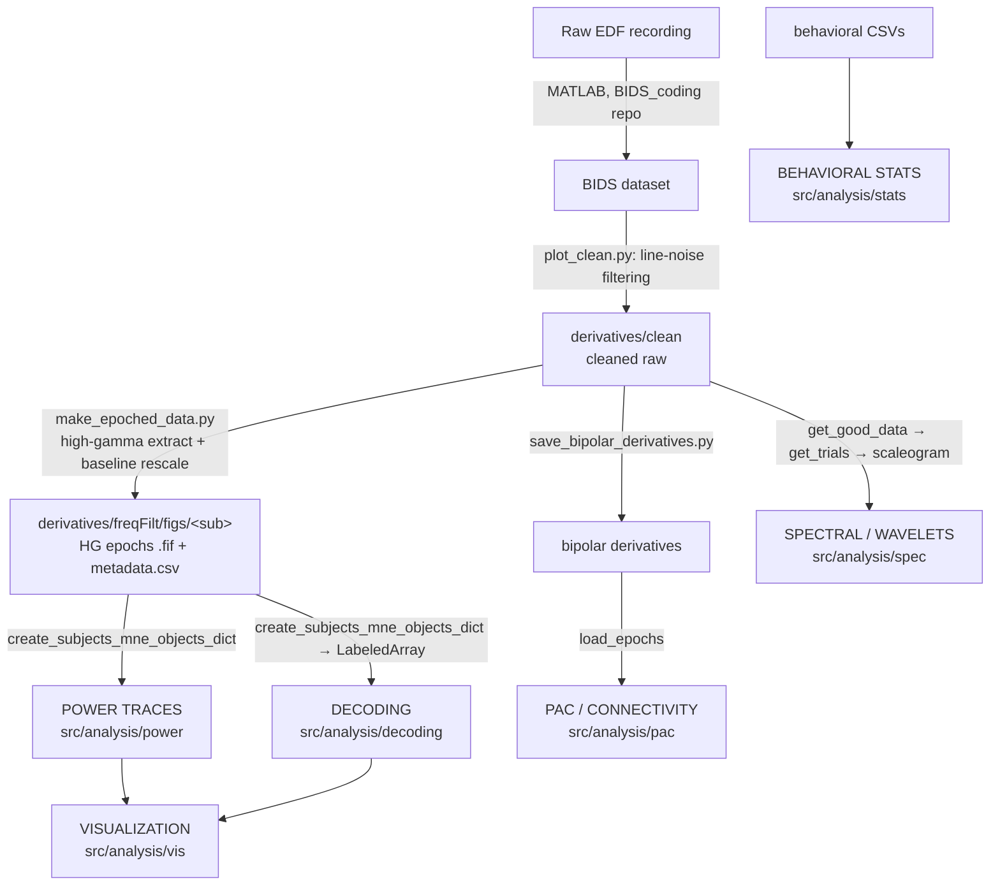

# Analysis Paths — Onboarding Guide

This document is for a new team member getting oriented in the GlobalLocal
analysis codebase. It explains the **different analysis paths**, the **code that
implements each one**, and the **function-call structure** you follow to run
each analysis end to end.

Everything downstream starts from **epoched iEEG data**. Each analysis path
consumes epoched data and produces a different kind of result (power traces,
decoding accuracies, time-frequency spectra, connectivity, etc.). The goal of
this doc is to make it obvious *where each path lives*, *what it eats*, and
*what it produces*.

> All source lives under `src/analysis/`. Cluster entry points (the scripts you
> actually launch) live under `dcc_scripts/`. Tests live under `tests/analysis/`.

---

## 1. The big picture



There are **two flavors of "epoched data"** in this repo, and knowing which one
a path consumes is the single most important thing to keep straight:

| Flavor | Produced by | Stored where | Loaded by | Consumed by |
|--------|-------------|--------------|-----------|-------------|
| **Saved high-gamma epochs** (`.fif`) | `preproc/make_epoched_data.py` | `derivatives/freqFilt/figs/<sub>/` | `general_utils.load_mne_objects` → `create_subjects_mne_objects_dict` | **Power traces**, **Decoding** |
| **On-the-fly re-epoched cleaned raw** | epoched at runtime | `derivatives/clean` (raw) | `general_utils.get_good_data` → `get_trials` | **Wavelets/Spectral**, **PAC** (via bipolar) |

The power and decoding paths share the *exact same* pre-computed high-gamma
epochs. The spectral and PAC paths re-epoch the cleaned raw data themselves
because they need the full-band (not high-gamma-only) signal.

---

## 2. Directory map

```
src/analysis/
├── preproc/     # Produces the epoched data everything else consumes
│   ├── plot_clean.py                     # line-noise filtering → derivatives/clean
│   ├── make_epoched_data.py              # high-gamma epochs (main shared input)
│   ├── make_epoched_data_with_phase.py   # variant that keeps complex/phase
│   ├── save_bipolar_derivatives.py       # bipolar-referenced derivatives (feeds PAC)
│   ├── makeRawBehavioralData.py          # accuracy/RT behavioral arrays
│   └── parcellation.py                   # anatomy / atlas labels
│
├── config/      # Shared definitions (conditions, ROIs, plotting)
│   ├── experiment_conditions.py          # condition name → BIDS event mapping
│   ├── condition_registry.py             # CONDITION_REGISTRY + get_comparisons(), etc.
│   ├── rois.py                           # ROI → Destrieux atlas label lists
│   ├── plotting_parameters.py
│   └── group_data.py
│
├── utils/       # Shared data-loading & array plumbing
│   ├── general_utils.py                  # load_mne_objects, get_good_data, sig chans, ROI maps
│   ├── labeled_array_utils.py            # MNE epochs → LabeledArray, bootstrapping (decoding)
│   └── epoch_metadata_utils.py           # trial metadata construction
│
├── spec/        # ANALYSIS PATH: time-frequency / wavelets
│   ├── wavelet_functions.py
│   └── subjects_tfr_objects_functions.py
│
├── power/       # ANALYSIS PATH: high-gamma power traces + windowed ANOVA
│   ├── power_traces.py
│   └── roi_analysis.py
│
├── decoding/    # ANALYSIS PATH: time-resolved decoding
│   ├── decoding.py                       # Decoder class + all decoding helpers
│   ├── process_bootstrap.py
│   └── run_*.py                          # per-stage orchestration helpers
│
├── pac/         # ANALYSIS PATH: phase-amplitude coupling / connectivity
│   ├── theta_connect.py                  # main coherence entry point
│   ├── env_correlation.py
│   └── *_plot.py, sig_test.py, get_channels_detail.py
│
├── stats/       # ANALYSIS PATH: behavioral / mixed-effects models
│   ├── erin_linear_mixed_effects_model.py
│   └── stability_flexibility_segregation.py
│
└── vis/         # Cross-path visualization (brain figures, F-traces)
    ├── brain_figure_glasser_separate_svgs_lateral_medial_view_less_bold.py
    ├── jim_mri.py
    └── power_traces_anova_f_traces_vis.py

dcc_scripts/      # Cluster launchers (what you actually run)
├── power/        # run_power_traces_dcc.py, power_traces_dcc.py, sbatch/submit *.sh
└── decoding/     # run_decoding_dcc.py, decoding_dcc.py, sbatch/submit *.sh
```

---

## 3. Shared building blocks (read these first)

Every path leans on the same small set of shared concepts. Learn these once and
the individual paths become easy to read.

### Conditions (`config/experiment_conditions.py` + `config/condition_registry.py`)

A **condition** is a human-readable name mapped to a list of BIDS event strings.
Example from `experiment_conditions.py`:

```python
stimulus_task_by_congruency_conditions = {
    "Stimulus_i_taskG": {"BIDS_events": ["Stimulus/i25.0/Taskg", "Stimulus/i75.0/Taskg"], ...},
    "Stimulus_c_taskG": {"BIDS_events": ["Stimulus/c25.0/Taskg", "Stimulus/c75.0/Taskg"], ...},
    ...
}
```

`condition_registry.py` wraps these into a registry keyed by a *comparison label*
and exposes accessor functions the paths call:

- `get_comparisons(label)` — the condition pairs to contrast (decoding, power)
- `get_conditions_obj(label)` — the full conditions object
- `get_anova_factors(label)` / `get_anova_interactions(label)` — ANOVA design (power)
- `get_subtraction_pairs(label)` — evoked subtraction pairs (power)
- `get_balance_strata(label)` / `get_pooled_shuffle_settings(label)` — decoding options

> **When you add a new condition or comparison, you edit `condition_registry.py`.**
> This is the single source of truth both the power and decoding paths read from.

### ROIs (`config/rois.py`)

`rois_dict` maps an ROI name (`dlpfc`, `acc`, `lpfc`, `v1`, `occ`, `parietal`, …)
to a list of Destrieux-atlas label substrings. Electrodes are assigned to ROIs
by matching their anatomical labels against these lists.

### Data loading & electrode plumbing (`utils/general_utils.py`)

| Function | Role |
|----------|------|
| `get_default_LAB_root()` | Resolve the data root per-OS / per-cluster |
| `load_mne_objects(sub, epochs_root_file, task, ...)` | Load one subject's saved HG epochs (`HG_ev1`, `HG_ev1_rescaled`, `HG_ev1_power_rescaled`, `HG_base`) |
| `create_subjects_mne_objects_dict(subjects, ..., conditions, ...)` | Load **all** subjects and slice each into the requested conditions → `subjects_mne_objects[sub][cond][obj_type]` |
| `get_good_data(sub, layout)` | Load cleaned raw for on-the-fly epoching (spec path) |
| `get_trials(data, events, times, ...)` | Epoch cleaned raw around events (spec path) |
| `make_or_load_subjects_electrodes_to_ROIs_dict(...)` | Build/lookup the electrode→ROI mapping |
| `get_sig_chans_per_subject(...)` | Task-significant electrodes per subject |
| `make_sig_electrodes_per_subject_and_roi_dict(...)` | Cross ROI membership with significance |
| `filter_electrode_lists_against_subjects_mne_objects(...)` | Drop electrodes missing from the loaded epochs |

### LabeledArray plumbing (`utils/labeled_array_utils.py`) — decoding only

Decoding needs dense arrays, not MNE objects. This module converts
`subjects_mne_objects` into `LabeledArray`s (`obs × channel × time`, plus `freq`
for TFR), and provides the **bootstrapping / downsampling** used to equalize
trial counts across electrodes and conditions:

- `put_data_in_labeled_array_per_roi_subject(...)`
- `remove_nans_from_all_roi_labeled_arrays(...)`
- `concatenate_conditions_by_string(...)`
- `make_bootstrapped_roi_labeled_arrays_with_nan_trials_removed_for_each_channel(...)`

---

## 4. Preprocessing — produces the shared input

Not an "analysis path" per se, but everything depends on it, so it comes first.

**`preproc/make_epoched_data.py`** is the workhorse. For each subject it:

1. Loads the cleaned raw: `raw_from_layout(layout.derivatives['derivatives/clean'], ...)`.
2. Epochs around events (`trial_ieeg`), with a baseline epoch too.
3. Extracts high gamma with `ieeg.timefreq.gamma.extract` (or a filter+Hilbert
   fallback), then `crop_pad` + `decimate`.
4. Baseline-rescales with `ieeg.calc.scaling.rescale(..., mode='zscore')`.
5. Saves the epochs to `derivatives/freqFilt/figs/<sub>/` as `.fif` plus
   `metadata.csv`:
   - `<sub>_<name>_HG_ev1-epo.fif` — raw high-gamma epochs
   - `<sub>_<name>_HG_ev1_rescaled-epo.fif` — z-scored high gamma
   - `<sub>_<name>_HG_ev1_power_rescaled-epo.fif` — z-scored power
   - `<sub>_<name>_HG_base-epo.fif` — baseline epochs

**Run it:**
```bash
python src/analysis/preproc/make_epoched_data.py --passband 70 150 --subjects D0057
```

The string `<name>` (e.g. `Stimulus_1sec_preStimulusBase_decFactor_10`) becomes
the **`epochs_root_file`** argument that the power and decoding paths pass to
`create_subjects_mne_objects_dict` to load these files back.

**`preproc/save_bipolar_derivatives.py`** builds bipolar-referenced derivatives
(adjacent-contact A−B). These are the input to the **PAC** path.

---

## 5. Analysis path: Spectral / Wavelets (`spec/`)

**Produces:** per-trial time-frequency representations (TFRs) — a
`freq × time` spectrogram per channel per trial — and cluster-corrected
**significant TFR differences** between conditions.

**Consumes:** cleaned raw, re-epoched on the fly (`get_good_data` → `get_trials`).
It does *not* use the saved HG epochs, because it needs the full-band signal.

**Key files:**
- `spec/wavelet_functions.py` — the low-level TFR computations (wavelet scaleogram
  and multitaper), plus significance testing between conditions.
- `spec/subjects_tfr_objects_functions.py` — the per-subject / per-ROI orchestration.

### Function-call structure

```
make_subjects_tfr_objects(subjects, layout, conditions, spec_method, ...)
└── for each subject, condition:
    make_subject_tfr_object(sub, layout, condition_name, condition_dict, spec_method, ...)
    ├── spec_method == 'wavelet':
    │   get_uncorrected_wavelets(sub, layout, events, times, ...)
    │   ├── get_good_data(sub, layout)              # cleaned raw
    │   ├── get_trials(good, events, padded_times)  # epoch it
    │   └── wavelet_scaleogram(...) + crop_pad(...)
    └── spec_method == 'multitaper':
        get_uncorrected_multitaper(...) / get_corrected_multitaper(...)  # baseline-corrected

load_or_make_subjects_tfr_objects(...)   # cached wrapper: load from disk or compute

# Significance between two conditions:
get_sig_tfr_differences_per_subject(...) / get_sig_tfr_differences_per_roi(...)
└── get_sig_tfr_differences(tfr1, tfr2, ...)   # ieeg time_perm_cluster over freq×time
```

TFR objects are saved to `derivatives/spec/<method>/<sub>/`. Convenience loaders
`load_wavelets` / `load_multitaper` / `load_tfrs` read them back;
`make_and_get_sig_wavelet_differences` / `load_and_get_sig_wavelet_differences`
combine compute+significance in one call. `plot_mask_pages` renders the
significant-cluster masks per channel.

**Bridge to decoding:** the significant TFR masks produced here feed
`decoding.decode_on_sig_tfr_clusters` (see §7).

---

## 6. Analysis path: Power traces (`power/`)

**Produces:** ROI-averaged **high-gamma power time traces** per condition, with
cluster-corrected significance between conditions, plus **within-electrode
windowed ANOVA** F-traces and interaction plots.

**Consumes:** the saved HG epochs, via `create_subjects_mne_objects_dict`.

**Key files:**
- `power/power_traces.py` — all the evoked-averaging, ANOVA, and plotting functions.
- `power/roi_analysis.py` — an older per-subject stats entry (`main()` currently
  being refactored; not the primary path).
- **Runner:** `dcc_scripts/power/power_traces_dcc.py` (`main(args)`), configured
  by `run_power_traces_dcc.py`, launched via `submit_specific_conditions_power_traces_dcc.sh`.

### Function-call structure (`power_traces_dcc.py: main`)

```
main(args)
├── subjects_mne_objects = create_subjects_mne_objects_dict(subjects, epochs_root_file, conditions, ...)
├── electrode/ROI setup:
│   make_or_load_subjects_electrodes_to_ROIs_dict(...)
│   get_sig_chans_per_subject(...) + make_sig_electrodes_per_subject_and_roi_dict(...)
│   filter_electrode_lists_against_subjects_mne_objects(...)
│
├── evks_dict_elecs = make_multi_channel_evokeds_for_all_conditions_and_rois(subjects_mne_objects, ...)
│   └── make_evoked_electrode_lists_for_all_conditions_and_rois(...)
│       └── create_list_of_single_channel_evokeds_across_subjects_for_roi_and_condition(...)
│           ├── get_evoked_for_specific_subject_and_condition(...)
│           ├── extract_single_electrode_evokeds(...)
│           └── combine_single_channel_evokeds(...)     # → per-ROI grand-average evoked
│
├── windowed ANOVA (optional):
│   windowed_data = process_windowed_data_for_anova(subjects_mne_objects, conditions, rois, ...)
│   df = create_windowed_anova_dataframe(windowed_data, ...)
│   run_within_electrode_windowed_anova_cluster_correction(df, ...)   # per-electrode F-traces
│       └── _fit_anova_per_window_per_unit(...) + _shuffle_labels_within_electrode(...)
│   # (or perform_windowed_anova / apply_fdr_correction_to_windowed_results for the simpler design)
│
└── plotting:
    plot_power_traces_for_all_rois(evks_dict_elecs, rois, ...)
    └── plot_power_trace_for_roi(...)
        ├── time_perm_cluster_between_two_evokeds(...)   # significance between two conditions
        └── find_clusters(...)                           # contiguous significant spans
    # interaction variants:
    plot_2way_interaction_for_roi(...) / plot_16_conditions_with_interaction_clusters_for_roi(...)
    plot_anova_interaction_results(...)
```

`subtract_evoked_conditions` / `create_subtracted_evokeds_dict` build difference
waves (using `get_subtraction_pairs` from the registry). The saved F-trace `.npz`
files are plotted separately by `vis/power_traces_anova_f_traces_vis.py`.

**Run it:**
```bash
# from dcc_scripts/power on the cluster:
sh submit_specific_conditions_power_traces_dcc.sh
# (edit conditions in submit_*.sh and parameters in run_power_traces_dcc.py)
```

---

## 7. Analysis path: Decoding (`decoding/`)

**Produces:** time-resolved **decoding accuracy traces** (true vs. shuffle) with
cluster-based significance, **confusion matrices** (static and over time), and
context/cross-block comparisons and low-dimensional (PCA/UMAP) trajectories.

**Consumes:** the saved HG epochs → converted to `LabeledArray`, then
**bootstrapped** (each electrode randomly downsampled to the min trial count in
its ROI×condition; then downsampled again to the min across the two conditions
being compared).

**Key files:**
- `decoding/decoding.py` — the `Decoder` class and *every* decoding helper
  (stats, plotting, PCA/UMAP, TFR-cluster decoding). It is large (~4.8k lines);
  the `Decoder` class and the `get_confusion_matrices_*` / `plot_accuracies_*`
  families are the parts you'll touch most.
- `decoding/process_bootstrap.py` — the per-bootstrap unit of work (run in parallel).
- `decoding/run_*.py` — orchestration helpers for aggregation, context
  comparisons, and debugging visualizations.
- **Runner:** `dcc_scripts/decoding/decoding_dcc.py` (`main(args)`), configured by
  `run_decoding_dcc.py`, launched via `submit_specific_conditions_decoding_dcc.sh`.

### The `Decoder` class (`decoding.py`)

`Decoder(PcaEstimateDecoder, MinimumNaNSplit)` — a cross-validated decoder that
handles NaN trials and PCA dimensionality reduction. Key methods:

- `cv_cm_jim(x_data, labels, ...)` — cross-validated confusion matrix (whole window).
- `cv_cm_jim_window_shuffle(x_data, labels, ...)` — sliding-window decoding with a
  shuffle distribution → the time-resolved accuracy traces.
- `_window_and_predict_minimal(...)` / `fit_predict(...)` — the per-fold inner loop.

### Function-call structure (`decoding_dcc.py: main`)

```
main(args)
├── subjects_mne_objects = create_subjects_mne_objects_dict(...)   # same HG epochs as power
├── electrode/ROI setup (same helpers as the power path)
├── condition_comparisons = get_comparisons(args.condition_label)  # from condition_registry
│
├── Parallel over bootstraps (joblib):
│   process_bootstrap(bootstrap_idx, subjects_mne_objects, args, rois, conditions, electrodes, ...)
│   ├── put_data_in_labeled_array_per_roi_subject(...)                       # → LabeledArray
│   ├── make_bootstrapped_roi_labeled_arrays_with_nan_trials_removed_...(...) # downsample/balance
│   └── get_confusion_matrices_for_rois_time_window_decoding_jim(...)
│       └── Decoder.cv_cm_jim_window_shuffle(...)   # per-window true + shuffle CMs
│
├── aggregate:
│   run_aggregate_and_plot_time_averaged_cms(time_averaged_cms_list, ...)
│   compute_accuracies(cm_true, cm_shuffle)
│   make_pooled_shuffle_distribution(...) + compute_pooled_bootstrap_statistics(...)
│
├── significance:
│   perform_time_perm_cluster_test_for_accuracies(...)
│   do_time_perm_cluster_comparing_two_true_bootstrap_accuracy_distributions(...)
│   cluster_perm_paired_ttest_by_duration(...) / run_two_one_tailed_tests_with_time_perm_cluster(...)
│
└── plot:
    plot_accuracies_nature_style(...) / plot_accuracies_with_multiple_sig_clusters(...)
    extract_pooled_cm_traces(...) → plot_cm_traces_nature_style(...)
    plot_static_pca_projection / plot_pca_over_time / plot_umap_3d_trajectory (optional)
```

**Special sub-paths inside decoding:**
- `run_context_comparison_analysis(...)` / `run_all_context_comparisons(...)` +
  `plot_cross_block_overlay(...)` — compare decoding across task blocks/contexts.
- `decode_on_sig_tfr_clusters(...)` + `compute_sig_tfr_masks_from_*` — decode using
  only the **significant time-frequency clusters** identified by the spec path
  (this is the bridge from §5 into decoding).

**Run it:**
```bash
# from dcc_scripts/decoding on the cluster:
sh submit_specific_conditions_decoding_dcc.sh
# (edit conditions in submit_*.sh and parameters in run_decoding_dcc.py)
```

> **Unit of analysis** matters here (`folds_as_samples` vs `repeats_as_samples`
> vs bootstrap): it determines how accuracies are summed/averaged and how error
> bars and stats are computed. See the README "Decoding" section.

---

## 8. Analysis path: PAC / Connectivity (`pac/`)

**Produces:** ROI–ROI **theta-band coherence over time windows** with a
permutation test + Benjamini–Hochberg FDR correction, plus envelope-correlation
analyses and timeline plots.

**Consumes:** bipolar-referenced epochs (built by
`preproc/save_bipolar_derivatives.py`), loaded via `load_epochs`.

**Key files:**
- `pac/theta_connect.py` — the main coherence entry point (`if __name__ == '__main__'`).
- `pac/env_correlation.py` — amplitude-envelope correlations.
- `pac/sig_test.py`, `theta_connect_plot.py`, `env_plot.py`, `plot_timeline.py`,
  `get_channels_detail.py` — significance and plotting.

### Function-call structure (`theta_connect.py: __main__`)

```
__main__(argparse: --bids_root --subjects --roi_json --part --condition --tmin --tmax ...)
├── windows = make_windows(tstart, tend, stepsize)             # contiguous time windows
├── epoch_dicts, df = load_epochs(subjects, bids_root, condition, epoch_suffix='full-epo')
└── for each subject:
    find_roi_names(part, subj, roi_json, epochs_ch_names)      # ROI → bipolar channels
    compute_alltrial_coherence_and_permutation(epochs, chs, freqs, n_cycles, method='coh', ...)
    └── spectral_connectivity_epochs(...) + permutation loop
        └── _bh_fdr(pvals, alpha)                              # FDR correction
```

**Run it:**
```bash
python src/analysis/pac/theta_connect.py \
  --bids_root <BIDS> --subjects D0057 D0059 --roi_json <roi.json> \
  --part dlpfc acc --condition stimulus_c --tmin -1 --tmax 1.5 --stepsize 0.5 \
  --fmin 3 --fmax 8 --method coh --mode cwt
```

---

## 9. Analysis path: Behavioral / mixed-effects stats (`stats/`)

**Produces:** behavioral statistical models — e.g. post-error slowing via a
linear mixed-effects model, and the "stability vs. flexibility" electrode
segregation tests.

**Consumes:** behavioral CSVs (`combinedData.csv`, produced by
`preproc/makeRawBehavioralData.py`) for the behavioral model; a long-format
per-(electrode, trial) high-gamma dataframe for the segregation analysis.

**Key files:**
- `stats/erin_linear_mixed_effects_model.py` — `PostErrorRT ~ PreviousErrorType *
  thisTrialCongruency * thisTrialSwitchType + IncongruentProportion +
  SwitchProportion + (1 | Subject)` via `statsmodels` mixed LM.
- `stats/stability_flexibility_segregation.py` — partial correlation (continuous)
  + Cochran–Mantel–Haenszel (categorical) tests of whether distinct
  subpopulations support stability vs. flexibility, with disjoint-trial-half and
  responsiveness residualization to control shared noise. Two optional knobs
  (`contrast_mode`, `effect_measure`) let stability/flexibility be defined by the
  LWPC / LWPS interactions (congruency×`incongruent_proportion`,
  switchType×`switch_proportion`) instead of the trial condition, and let each
  contrast be scored by its aggregate cluster-mass statistic instead of Cohen's
  _d_ on the window-mean HG.
- `post_error_slowing_analysis.py` (repo root) — related behavioral analysis.

These are mostly standalone scripts/notebooks rather than a multi-stage cluster
pipeline.

---

## 10. Visualization (`vis/`)

Cross-path plotting and anatomy figures:

- `vis/brain_figure_glasser_separate_svgs_lateral_medial_view_less_bold.py` —
  renders ROI-highlighted brain surfaces (Glasser/HCP-MMP1 atlas) as SVGs via MNE
  + PyVista.
- `vis/jim_mri.py` — MRI/anatomy figures.
- `vis/power_traces_anova_f_traces_vis.py` — plots the F-trace `.npz` files saved
  by the power path's windowed ANOVA.

---

## 11. Quick reference

| Path | Source dir | Cluster launcher | Input (epoched data) | Core function(s) | Output |
|------|-----------|------------------|----------------------|------------------|--------|
| **Preproc** | `preproc/` | `make_epoched_data.py` | cleaned raw (`derivatives/clean`) | `make_epoched_data.main` | saved HG epochs `.fif` |
| **Spectral / Wavelets** | `spec/` | (script/notebook) | cleaned raw, re-epoched | `make_subjects_tfr_objects` → `get_uncorrected_wavelets` | TFRs + sig masks |
| **Power traces** | `power/` | `power_traces_dcc.py` | saved HG epochs | `make_multi_channel_evokeds_for_all_conditions_and_rois` → `plot_power_traces_for_all_rois` | ROI power traces + ANOVA |
| **Decoding** | `decoding/` | `decoding_dcc.py` | saved HG epochs → LabeledArray | `process_bootstrap` → `Decoder.cv_cm_jim_window_shuffle` | accuracy traces + CMs |
| **PAC / Connectivity** | `pac/` | `theta_connect.py` | bipolar derivatives | `compute_alltrial_coherence_and_permutation` | ROI–ROI coherence |
| **Behavioral stats** | `stats/` | (script) | behavioral CSV / long-format HG | mixed LM / CMH | statistical models |

### Where to make common changes

- **Add a condition / comparison** → `config/condition_registry.py` (+ the raw
  events in `config/experiment_conditions.py`).
- **Change ROI definitions** → `config/rois.py`.
- **Change how epochs are built / rescaled** → `preproc/make_epoched_data.py`.
- **Change how epochs are loaded into a path** → `utils/general_utils.py`
  (`load_mne_objects` / `create_subjects_mne_objects_dict` / `get_good_data`).
- **Change decoding balancing/bootstrapping** → `utils/labeled_array_utils.py`.

### Tests

Path-level tests live under `tests/analysis/` (e.g.
`tests/analysis/decoding/test_decoding.py`,
`tests/analysis/utils/test_labeled_array_utils.py`,
`tests/analysis/utils/test_general_utils.py`). Run with `pytest` (see
`pytest.ini`).
