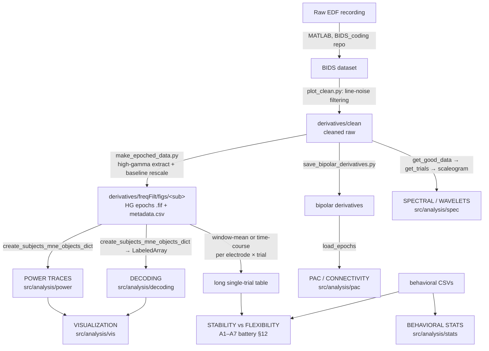

# Analysis Paths — Onboarding Guide

This document is for a new team member getting oriented in the GlobalLocal
analysis codebase. It explains the **different analysis paths**, the **code that
implements each one**, and the **function-call structure** you follow to run
each analysis end to end.

Everything downstream starts from **epoched iEEG data**. Each analysis path
consumes epoched data and produces a different kind of result (power traces,
decoding accuracies, time-frequency spectra, connectivity, etc.). The goal of
this doc is to make it obvious *where each path lives*, *what it eats*, and
*what it produces*.

> All source lives under `src/analysis/`. Cluster entry points (the scripts you
> actually launch) live under `dcc_scripts/`. Tests live under `tests/analysis/`.

### The other docs in `docs/`

| Doc | Read it when you want |
|---|---|
| **`analysis_paths.md`** (this) | *Where does each analysis live, and what does it eat?* |
| `stability_flexibility_guide.md` | The **why** behind the A1–A6 battery — scientific plan, statistical-rigor checklist, the four-interaction electrode definition, line-by-line walk-throughs |
| `stability_flexibility_data_flow.md` | The **shape of the data at every step** of A1–A7 — one fake dataset followed end to end, with the actual tables printed. Backed by the runnable `docs/examples/stability_flexibility_data_flow_demo.py` |
| `stability_flexibility_segregation_methods.md` | Manuscript-ready **Methods** text for the segregation analysis, in a `cluster` and a `cohens_d` version |
| `refactoring_guide.md` | How the big modules were split (and how to split the next one). Records what has already been done to `decoding/` and `power/` |
| `learning_assignments/segregation_bootstrap/` | **A7** — a build-a-feature self-check with a pytest grader (§12.7) |
| `skeletons/` | Runnable stubs `aN_*.py` for each assignment |

---

## 1. The big picture


```mermaid
flowchart TD
    EDF[Raw EDF recording] -->|MATLAB, BIDS_coding repo| BIDS[BIDS dataset]
    BIDS -->|plot_clean.py: line-noise filtering| CLEAN[derivatives/clean<br/>cleaned raw]

    CLEAN -->|make_epoched_data.py<br/>high-gamma extract + baseline rescale| HGEP[derivatives/freqFilt/figs/&lt;sub&gt;<br/>HG epochs .fif + metadata.csv]
    CLEAN -->|save_bipolar_derivatives.py| BIP[bipolar derivatives]

    HGEP -->|create_subjects_mne_objects_dict| POWER[POWER TRACES<br/>src/analysis/power]
    HGEP -->|create_subjects_mne_objects_dict → LabeledArray| DEC[DECODING<br/>src/analysis/decoding]
    HGEP -->|window-mean or time-course<br/>per electrode × trial| LONG[long single-trial table]
    CLEAN -->|get_good_data → get_trials → scaleogram| SPEC[SPECTRAL / WAVELETS<br/>src/analysis/spec]
    BIP -->|load_epochs| PAC[PAC / CONNECTIVITY<br/>src/analysis/pac]

    BEH[behavioral CSVs] --> STATS[BEHAVIORAL STATS<br/>src/analysis/stats]
    LONG --> SF[STABILITY vs FLEXIBILITY<br/>A1–A7 battery §12]
    BEH --> SF

    POWER --> VIS[VISUALIZATION<br/>src/analysis/vis]
    DEC --> VIS
```

There are **two flavors of "epoched data"** in this repo, and knowing which one
a path consumes is the single most important thing to keep straight:

| Flavor | Produced by | Stored where | Loaded by | Consumed by |
|--------|-------------|--------------|-----------|-------------|
| **Saved high-gamma epochs** (`.fif`) | `preproc/make_epoched_data.py` | `derivatives/freqFilt/figs/<sub>/` | `general_utils.load_mne_objects` → `create_subjects_mne_objects_dict` | **Power traces**, **Decoding** |
| **On-the-fly re-epoched cleaned raw** | epoched at runtime | `derivatives/clean` (raw) | `general_utils.get_good_data` → `get_trials` | **Wavelets/Spectral**, **PAC** (via bipolar) |

The power and decoding paths share the *exact same* pre-computed high-gamma
epochs. The spectral and PAC paths re-epoch the cleaned raw data themselves
because they need the full-band (not high-gamma-only) signal.

There is also a **third shape**, derived from the first: the stability/flexibility
battery (§12) flattens the saved HG epochs into a **long single-trial table**, one
row per (electrode, trial), where `hg` is either the window mean or the window's
time course. Every module in that battery consumes only that table — which is why
each one can be run end to end on synthetic ground truth with no data on disk.
See `docs/stability_flexibility_data_flow.md`.

---

## 2. Directory map

```
src/analysis/
├── preproc/     # Produces the epoched data everything else consumes
│   ├── plot_clean.py                     # line-noise filtering → derivatives/clean
│   ├── make_epoched_data.py              # high-gamma epochs (main shared input)
│   ├── make_epoched_data_with_phase.py   # variant that keeps complex/phase
│   ├── epoch_helpers.py                  # shared epoching/outlier helpers
│   ├── save_bipolar_derivatives.py       # bipolar-referenced derivatives (feeds PAC)
│   ├── makeRawBehavioralData.py          # accuracy/RT behavioral arrays
│   └── parcellation.py                   # anatomy / atlas labels
│
├── config/      # Shared definitions (conditions, ROIs, plotting)
│   ├── experiment_conditions.py          # condition name → BIDS event mapping
│   ├── condition_registry.py             # CONDITION_REGISTRY + get_comparisons(), etc.
│   ├── rois.py                           # ROI → Destrieux atlas label lists
│   ├── plotting_parameters.py
│   └── group_data.py
│
├── utils/       # Shared data-loading & array plumbing
│   ├── general_utils.py                  # load_mne_objects, get_good_data, sig chans, ROI maps
│   ├── labeled_array_utils.py            # MNE epochs → LabeledArray, bootstrapping (decoding)
│   └── epoch_metadata_utils.py           # trial metadata construction
│
├── spec/        # ANALYSIS PATH: time-frequency / wavelets
│   ├── wavelet_functions.py
│   └── subjects_tfr_objects_functions.py
│
├── power/       # ANALYSIS PATH: high-gamma power traces + windowed ANOVA
│   ├── power_traces.py                   # FACADE — re-exports the three modules below
│   ├── evoked_builders.py                # per-ROI/condition evoked construction + subtraction
│   ├── windowed_anova.py                 # windowed ANOVA, cluster correction, FDR
│   ├── plots.py                          # power traces + interaction plots
│   └── roi_analysis.py
│
├── decoding/    # ANALYSIS PATH: time-resolved decoding
│   ├── decoding.py                       # FACADE — re-exports every public name below
│   ├── decoder.py                        # the Decoder class + cv_cm_* methods
│   ├── data_prep.py                      # balancing, mixup2, flatten_features, sample_fold
│   ├── accuracy_stats.py                 # permutation / bootstrap / cluster stats on accuracies
│   ├── roi_confusion.py                  # per-ROI confusion-matrix orchestration
│   ├── tfr_cluster.py                    # sig-TFR masks + cluster decoding (bridge from spec/)
│   ├── context_comparison.py             # cross-block / context comparisons + overlay
│   ├── plots/                            # accuracies.py, confusion.py, trajectories.py, style.py
│   ├── process_bootstrap.py
│   ├── cross_decoding.py                 # A4: contrasts + circularity table + label-pair glue (§12)
│   ├── trial_splitting.py                # disjoint def/decode split (circularity control, §13)
│   └── run_*.py                          # per-stage orchestration helpers
│
├── pac/         # ANALYSIS PATH: phase-amplitude coupling / connectivity
│   ├── theta_connect.py                  # main coherence entry point
│   ├── env_correlation.py
│   └── *_plot.py, sig_test.py, get_channels_detail.py
│
├── stats/       # ANALYSIS PATH: behavioral / mixed-effects models + stability/flexibility battery (§12)
│   ├── erin_linear_mixed_effects_model.py
│   ├── stability_flexibility_segregation.py    # A1 ANOVA defn + A2 conjunction + continuous corr/CMH
│   ├── stability_flexibility_anatomy.py        # A3: coverage-conditioned ROI/Destrieux enrichment + group brain maps
│   ├── stability_flexibility_timing.py         # A5: relative onset (50%-of-peak + jackknife)
│   ├── stability_flexibility_brain_behavior.py # A6: brain↔behavior correlation
│   ├── stability_flexibility_*_tutorial.ipynb  # per-analysis walk-throughs
│   └── stability_flexibility_assignments_sandbox.ipynb  # learn-by-doing A1–A6
│
└── vis/         # Cross-path visualization (brain figures, F-traces)
    ├── brain_figure_glasser_separate_svgs_lateral_medial_view_less_bold.py
    ├── jim_mri.py
    └── power_traces_anova_f_traces_vis.py

dcc_scripts/      # Cluster launchers (what you actually run)
├── preproc/      # submit_plot_clean.sh, submit_make_epoched_data.sh
├── spec/         # make_wavelets, plot_wavelets, wavelet_differences,
│                 # get_sig_tfr_differences + sbatch/submit *.sh
├── power/        # run_power_traces_dcc.py, power_traces_dcc.py, sbatch/submit *.sh
├── decoding/     # run_decoding_dcc.py, decoding_dcc.py, sbatch/submit *.sh
│                 # + stability_flexibility_cross_decoding (A4) + def-split launcher (§13)
├── stats/        # A1/A2 (anova_conjunction, segregation) + A3 (anatomy)
│                 # + A5 (timing) + A6 (brain_behavior) launchers (§12)
└── vis/          # plot_sig_electrodes_dcc.py + condition_plot_specs.py

docs/examples/    # Runnable doc companions
└── stability_flexibility_data_flow_demo.py   # every table in the data-flow doc
```

> **Two facades.** `decoding/decoding.py` and `power/power_traces.py` used to be
> ~4.7k- and ~2.4k-line monoliths. They are now thin re-export shims, so every
> existing `from src.analysis.decoding.decoding import ...` still resolves — but
> **new code should import from the specific submodule** (`decoding.decoder`,
> `power.windowed_anova`, …). See `docs/refactoring_guide.md` for the full map
> and for two pre-existing bugs the split surfaced.

---

## 3. Shared building blocks (read these first)

Every path leans on the same small set of shared concepts. Learn these once and
the individual paths become easy to read.

### Conditions (`config/experiment_conditions.py` + `config/condition_registry.py`)

A **condition** is a human-readable name mapped to a list of BIDS event strings.
Example from `experiment_conditions.py`:

```python
stimulus_task_by_congruency_conditions = {
    "Stimulus_i_taskG": {"BIDS_events": ["Stimulus/i25.0/Taskg", "Stimulus/i75.0/Taskg"], ...},
    "Stimulus_c_taskG": {"BIDS_events": ["Stimulus/c25.0/Taskg", "Stimulus/c75.0/Taskg"], ...},
    ...
}
```

`condition_registry.py` wraps these into a registry keyed by a *comparison label*
and exposes accessor functions the paths call:

- `get_comparisons(label)` — the condition pairs to contrast (decoding, power)
- `get_conditions_obj(label)` — the full conditions object
- `get_anova_factors(label)` / `get_anova_interactions(label)` — ANOVA design (power)
- `get_subtraction_pairs(label)` — evoked subtraction pairs (power)
- `get_balance_strata(label)` / `get_pooled_shuffle_settings(label)` — decoding options

> **When you add a new condition or comparison, you edit `condition_registry.py`.**
> This is the single source of truth both the power and decoding paths read from.

### ROIs (`config/rois.py`)

`rois_dict` maps an ROI name (`dlpfc`, `acc`, `lpfc`, `v1`, `occ`, `parietal`, …)
to a list of Destrieux-atlas label substrings. Electrodes are assigned to ROIs
by matching their anatomical labels against these lists.

### Data loading & electrode plumbing (`utils/general_utils.py`)

| Function | Role |
|----------|------|
| `get_default_LAB_root()` | Resolve the data root per-OS / per-cluster |
| `load_mne_objects(sub, epochs_root_file, task, ...)` | Load one subject's saved HG epochs (`HG_ev1`, `HG_ev1_rescaled`, `HG_ev1_power_rescaled`, `HG_base`) |
| `create_subjects_mne_objects_dict(subjects, ..., conditions, ...)` | Load **all** subjects and slice each into the requested conditions → `subjects_mne_objects[sub][cond][obj_type]` |
| `get_good_data(sub, layout)` | Load cleaned raw for on-the-fly epoching (spec path) |
| `get_trials(data, events, times, ...)` | Epoch cleaned raw around events (spec path) |
| `make_or_load_subjects_electrodes_to_ROIs_dict(...)` | Build/lookup the electrode→ROI mapping |
| `get_sig_chans_per_subject(...)` | Task-significant electrodes per subject |
| `make_sig_electrodes_per_subject_and_roi_dict(...)` | Cross ROI membership with significance |
| `filter_electrode_lists_against_subjects_mne_objects(...)` | Drop electrodes missing from the loaded epochs |

### LabeledArray plumbing (`utils/labeled_array_utils.py`) — decoding only

Decoding needs dense arrays, not MNE objects. This module converts
`subjects_mne_objects` into `LabeledArray`s (`obs × channel × time`, plus `freq`
for TFR), and provides the **bootstrapping / downsampling** used to equalize
trial counts across electrodes and conditions:

- `put_data_in_labeled_array_per_roi_subject(...)`
- `remove_nans_from_all_roi_labeled_arrays(...)`
- `concatenate_conditions_by_string(...)`
- `make_bootstrapped_roi_labeled_arrays_with_nan_trials_removed_for_each_channel(...)`

---

## 4. Preprocessing — produces the shared input

Not an "analysis path" per se, but everything depends on it, so it comes first.

**`preproc/make_epoched_data.py`** is the workhorse. For each subject it:

1. Loads the cleaned raw: `raw_from_layout(layout.derivatives['derivatives/clean'], ...)`.
2. Epochs around events (`trial_ieeg`), with a baseline epoch too.
3. Extracts high gamma with `ieeg.timefreq.gamma.extract` (or a filter+Hilbert
   fallback), then `crop_pad` + `decimate`.
4. Baseline-rescales with `ieeg.calc.scaling.rescale(..., mode='zscore')`.
5. Saves the epochs to `derivatives/freqFilt/figs/<sub>/` as `.fif` plus
   `metadata.csv`:
   - `<sub>_<name>_HG_ev1-epo.fif` — raw high-gamma epochs
   - `<sub>_<name>_HG_ev1_rescaled-epo.fif` — z-scored high gamma
   - `<sub>_<name>_HG_ev1_power_rescaled-epo.fif` — z-scored power
   - `<sub>_<name>_HG_base-epo.fif` — baseline epochs

**Run it:**
```bash
python src/analysis/preproc/make_epoched_data.py --passband 70 150 --subjects D0057
```

The string `<name>` (e.g. `Stimulus_1sec_preStimulusBase_decFactor_10`) becomes
the **`epochs_root_file`** argument that the power and decoding paths pass to
`create_subjects_mne_objects_dict` to load these files back.

**`preproc/save_bipolar_derivatives.py`** builds bipolar-referenced derivatives
(adjacent-contact A−B). These are the input to the **PAC** path.

---

## 5. Analysis path: Spectral / Wavelets (`spec/`)

**Produces:** per-trial time-frequency representations (TFRs) — a
`freq × time` spectrogram per channel per trial — and cluster-corrected
**significant TFR differences** between conditions.

**Consumes:** cleaned raw, re-epoched on the fly (`get_good_data` → `get_trials`).
It does *not* use the saved HG epochs, because it needs the full-band signal.

**Key files:**
- `spec/wavelet_functions.py` — the low-level TFR computations (wavelet scaleogram
  and multitaper), plus significance testing between conditions.
- `spec/subjects_tfr_objects_functions.py` — the per-subject / per-ROI orchestration.
- **Runners:** `dcc_scripts/spec/` — `make_wavelets_dcc.py` (compute TFRs),
  `plot_wavelets_dcc.py`, `wavelet_differences_dcc.py`, and
  `get_sig_tfr_differences_dcc.py`, each with a `run_*.py` config and
  `sbatch_*.sh` / `submit_*.sh` pair, in the same shape as the power and decoding
  launchers.

### Function-call structure

```
make_subjects_tfr_objects(subjects, layout, conditions, spec_method, ...)
└── for each subject, condition:
    make_subject_tfr_object(sub, layout, condition_name, condition_dict, spec_method, ...)
    ├── spec_method == 'wavelet':
    │   get_uncorrected_wavelets(sub, layout, events, times, ...)
    │   ├── get_good_data(sub, layout)              # cleaned raw
    │   ├── get_trials(good, events, padded_times)  # epoch it
    │   └── wavelet_scaleogram(...) + crop_pad(...)
    └── spec_method == 'multitaper':
        get_uncorrected_multitaper(...) / get_corrected_multitaper(...)  # baseline-corrected

load_or_make_subjects_tfr_objects(...)   # cached wrapper: load from disk or compute

# Significance between two conditions:
get_sig_tfr_differences_per_subject(...) / get_sig_tfr_differences_per_roi(...)
└── get_sig_tfr_differences(tfr1, tfr2, ...)   # ieeg time_perm_cluster over freq×time
```

TFR objects are saved to `derivatives/spec/<method>/<sub>/`. Convenience loaders
`load_wavelets` / `load_multitaper` / `load_tfrs` read them back;
`make_and_get_sig_wavelet_differences` / `load_and_get_sig_wavelet_differences`
combine compute+significance in one call. `plot_mask_pages` renders the
significant-cluster masks per channel.

**Bridge to decoding:** the significant TFR masks produced here feed
`decoding.decode_on_sig_tfr_clusters` (see §7).

---

## 6. Analysis path: Power traces (`power/`)

**Produces:** ROI-averaged **high-gamma power time traces** per condition, with
cluster-corrected significance between conditions, plus **within-electrode
windowed ANOVA** F-traces and interaction plots.

**Consumes:** the saved HG epochs, via `create_subjects_mne_objects_dict`.

**Key files:**
- `power/power_traces.py` — **facade only**; re-exports the three modules below so
  old imports keep working. New code should import from the specific module:
  - `power/evoked_builders.py` — per-subject/ROI/condition evoked construction,
    grand averages, subtraction pairs, `time_perm_cluster_between_two_evokeds`.
  - `power/windowed_anova.py` — `process_windowed_data_for_anova`,
    `create_windowed_anova_dataframe`,
    `run_within_electrode_windowed_anova_cluster_correction`, FDR helpers.
  - `power/plots.py` — `plot_power_trace_for_roi`, the 2-way / 16-condition
    interaction plots, `DEFAULT_PLOT_STYLE`.
- `power/roi_analysis.py` — an older per-subject stats entry (`main()` currently
  being refactored; not the primary path).
- **Runner:** `dcc_scripts/power/power_traces_dcc.py` (`main(args)`), configured
  by `run_power_traces_dcc.py`, launched via `submit_specific_conditions_power_traces_dcc.sh`.

### Function-call structure (`power_traces_dcc.py: main`)

```
main(args)
├── subjects_mne_objects = create_subjects_mne_objects_dict(subjects, epochs_root_file, conditions, ...)
├── electrode/ROI setup:
│   make_or_load_subjects_electrodes_to_ROIs_dict(...)
│   get_sig_chans_per_subject(...) + make_sig_electrodes_per_subject_and_roi_dict(...)
│   filter_electrode_lists_against_subjects_mne_objects(...)
│
├── evks_dict_elecs = make_multi_channel_evokeds_for_all_conditions_and_rois(subjects_mne_objects, ...)
│   └── make_evoked_electrode_lists_for_all_conditions_and_rois(...)
│       └── create_list_of_single_channel_evokeds_across_subjects_for_roi_and_condition(...)
│           ├── get_evoked_for_specific_subject_and_condition(...)
│           ├── extract_single_electrode_evokeds(...)
│           └── combine_single_channel_evokeds(...)     # → per-ROI grand-average evoked
│
├── windowed ANOVA (optional):
│   windowed_data = process_windowed_data_for_anova(subjects_mne_objects, conditions, rois, ...)
│   df = create_windowed_anova_dataframe(windowed_data, ...)
│   run_within_electrode_windowed_anova_cluster_correction(df, ...)   # per-electrode F-traces
│       └── _fit_anova_per_window_per_unit(...) + _shuffle_labels_within_electrode(...)
│   # (or perform_windowed_anova / apply_fdr_correction_to_windowed_results for the simpler design)
│
└── plotting:
    plot_power_traces_for_all_rois(evks_dict_elecs, rois, ...)
    └── plot_power_trace_for_roi(...)
        ├── time_perm_cluster_between_two_evokeds(...)   # significance between two conditions
        └── find_clusters(...)                           # contiguous significant spans
    # interaction variants:
    plot_2way_interaction_for_roi(...) / plot_16_conditions_with_interaction_clusters_for_roi(...)
    plot_anova_interaction_results(...)
```

`subtract_evoked_conditions` / `create_subtracted_evokeds_dict` build difference
waves (using `get_subtraction_pairs` from the registry). The saved F-trace `.npz`
files are plotted separately by `vis/power_traces_anova_f_traces_vis.py`.

**Run it:**
```bash
# from dcc_scripts/power on the cluster:
sh submit_specific_conditions_power_traces_dcc.sh
# (edit conditions in submit_*.sh and parameters in run_power_traces_dcc.py)
```

---

## 7. Analysis path: Decoding (`decoding/`)

**Produces:** time-resolved **decoding accuracy traces** (true vs. shuffle) with
cluster-based significance, **confusion matrices** (static and over time), and
context/cross-block comparisons and low-dimensional (PCA/UMAP) trajectories.

**Consumes:** the saved HG epochs → converted to `LabeledArray`, then
**bootstrapped** (each electrode randomly downsampled to the min trial count in
its ROI×condition; then downsampled again to the min across the two conditions
being compared).

**Key files:** `decoding/decoding.py` used to hold the whole pipeline in one
~4.8k-line file. It is now a **125-line facade** that re-exports everything, so
every old `from src.analysis.decoding.decoding import ...` still works — but the
code now lives in focused modules, and that's where to make changes:

| Module | Holds |
|---|---|
| `decoder.py` | the **`Decoder`** class + its `cv_cm_*` methods |
| `data_prep.py` | balancing, `mixup2`, `flatten_features`, `sample_fold` |
| `accuracy_stats.py` | permutation / bootstrap / cluster stats on accuracies |
| `roi_confusion.py` | `get_confusion_matrices_for_rois_*` orchestration |
| `tfr_cluster.py` | sig-TFR masks + cluster decoding (the bridge from §5) |
| `context_comparison.py` | `run_context_comparison_analysis`, `plot_cross_block_overlay` |
| `plots/accuracies.py`, `plots/confusion.py`, `plots/trajectories.py`, `plots/style.py` | all plotting |
| `process_bootstrap.py` | the per-bootstrap unit of work (run in parallel) |
| `run_*.py` | orchestration helpers for aggregation, context comparisons, debug viz |

- **Runner:** `dcc_scripts/decoding/decoding_dcc.py` (`main(args)`), configured by
  `run_decoding_dcc.py`, launched via `submit_specific_conditions_decoding_dcc.sh`.

### The `Decoder` class (`decoding/decoder.py`)

`Decoder(PcaEstimateDecoder, MinimumNaNSplit)` — a cross-validated decoder that
handles NaN trials and PCA dimensionality reduction. Key methods:

- `cv_cm_jim(x_data, labels, ...)` — cross-validated confusion matrix (whole window).
- `cv_cm_jim_window_shuffle(x_data, labels, ...)` — sliding-window decoding with a
  shuffle distribution → the time-resolved accuracy traces.
- `_window_and_predict_minimal(...)` / `fit_predict(...)` — the per-fold inner loop.

Four optional arguments on `cv_cm_jim_window_shuffle` (all default to the
historical behaviour, so existing runs are unchanged):

| Argument | Effect |
|---|---|
| `labels_test` | score against a **different labelling of the same trials** — this is what makes A4's cross-decoding possible (§12.4) |
| `stratify_labels` | what the fold split is stratified on. Defaults to the train labels; pass the joint condition cell when cross-decoding so the test fold stays balanced on the label you *score* |
| `frac_train` | set the **train/test proportion** directly (`StratifiedShuffleSplit`) instead of the fixed `(n_splits-1)/n_splits` of `StratifiedKFold`. `n_splits` then counts random resamples per repeat |
| `temporal_generalization` | fit at each train window and predict at **every** test window → a `(n_train_windows, n_test_windows, …)` matrix (Fig 10). `n_windows` fits, `n_windows²` predictions |

### Function-call structure (`decoding_dcc.py: main`)

```
main(args)
├── subjects_mne_objects = create_subjects_mne_objects_dict(...)   # same HG epochs as power
├── electrode/ROI setup (same helpers as the power path)
├── condition_comparisons = get_comparisons(args.condition_label)  # from condition_registry
│
├── Parallel over bootstraps (joblib):
│   process_bootstrap(bootstrap_idx, subjects_mne_objects, args, rois, conditions, electrodes, ...)
│   ├── put_data_in_labeled_array_per_roi_subject(...)                       # → LabeledArray
│   ├── make_bootstrapped_roi_labeled_arrays_with_nan_trials_removed_...(...) # downsample/balance
│   └── get_confusion_matrices_for_rois_time_window_decoding_jim(...)
│       └── Decoder.cv_cm_jim_window_shuffle(...)   # per-window true + shuffle CMs
│
├── aggregate:
│   run_aggregate_and_plot_time_averaged_cms(time_averaged_cms_list, ...)
│   compute_accuracies(cm_true, cm_shuffle)
│   make_pooled_shuffle_distribution(...) + compute_pooled_bootstrap_statistics(...)
│
├── significance:
│   perform_time_perm_cluster_test_for_accuracies(...)
│   do_time_perm_cluster_comparing_two_true_bootstrap_accuracy_distributions(...)
│   cluster_perm_paired_ttest_by_duration(...) / run_two_one_tailed_tests_with_time_perm_cluster(...)
│
└── plot:
    plot_accuracies_nature_style(...) / plot_accuracies_with_multiple_sig_clusters(...)
    extract_pooled_cm_traces(...) → plot_cm_traces_nature_style(...)
    plot_static_pca_projection / plot_pca_over_time / plot_umap_3d_trajectory (optional)
```

**Special sub-paths inside decoding:**
- `run_context_comparison_analysis(...)` / `run_all_context_comparisons(...)` +
  `plot_cross_block_overlay(...)` — compare decoding across task blocks/contexts.
- `decode_on_sig_tfr_clusters(...)` + `compute_sig_tfr_masks_from_*` — decode using
  only the **significant time-frequency clusters** identified by the spec path
  (this is the bridge from §5 into decoding).

**Run it:**
```bash
# from dcc_scripts/decoding on the cluster:
sh submit_specific_conditions_decoding_dcc.sh
# (edit conditions in submit_*.sh and parameters in run_decoding_dcc.py)
```

> **Unit of analysis** matters here (`folds_as_samples` vs `repeats_as_samples`
> vs bootstrap): it determines how accuracies are summed/averaged and how error
> bars and stats are computed. See the README "Decoding" section.

---

## 8. Analysis path: PAC / Connectivity (`pac/`)

**Produces:** ROI–ROI **theta-band coherence over time windows** with a
permutation test + Benjamini–Hochberg FDR correction, plus envelope-correlation
analyses and timeline plots.

**Consumes:** bipolar-referenced epochs (built by
`preproc/save_bipolar_derivatives.py`), loaded via `load_epochs`.

**Key files:**
- `pac/theta_connect.py` — the main coherence entry point (`if __name__ == '__main__'`).
- `pac/env_correlation.py` — amplitude-envelope correlations.
- `pac/sig_test.py`, `theta_connect_plot.py`, `env_plot.py`, `plot_timeline.py`,
  `get_channels_detail.py` — significance and plotting.

### Function-call structure (`theta_connect.py: __main__`)

```
__main__(argparse: --bids_root --subjects --roi_json --part --condition --tmin --tmax ...)
├── windows = make_windows(tstart, tend, stepsize)             # contiguous time windows
├── epoch_dicts, df = load_epochs(subjects, bids_root, condition, epoch_suffix='full-epo')
└── for each subject:
    find_roi_names(part, subj, roi_json, epochs_ch_names)      # ROI → bipolar channels
    compute_alltrial_coherence_and_permutation(epochs, chs, freqs, n_cycles, method='coh', ...)
    └── spectral_connectivity_epochs(...) + permutation loop
        └── _bh_fdr(pvals, alpha)                              # FDR correction
```

**Run it:**
```bash
python src/analysis/pac/theta_connect.py \
  --bids_root <BIDS> --subjects D0057 D0059 --roi_json <roi.json> \
  --part dlpfc acc --condition stimulus_c --tmin -1 --tmax 1.5 --stepsize 0.5 \
  --fmin 3 --fmax 8 --method coh --mode cwt
```

---

## 9. Analysis path: Behavioral / mixed-effects stats (`stats/`)

**Produces:** behavioral statistical models — e.g. post-error slowing via a
linear mixed-effects model, and the "stability vs. flexibility" electrode
segregation tests.

**Consumes:** behavioral CSVs (`combinedData.csv`, produced by
`preproc/makeRawBehavioralData.py`) for the behavioral model; a long-format
per-(electrode, trial) high-gamma dataframe for the segregation analysis.

**Key files:**
- `stats/erin_linear_mixed_effects_model.py` — `PostErrorRT ~ PreviousErrorType *
  thisTrialCongruency * thisTrialSwitchType + IncongruentProportion +
  SwitchProportion + (1 | Subject)` via `statsmodels` mixed LM.
- `stats/stability_flexibility_segregation.py` — partial correlation (continuous)
  + Cochran–Mantel–Haenszel (categorical) tests of whether distinct
  subpopulations support stability vs. flexibility, with disjoint-trial-half and
  responsiveness residualization to control shared noise. Two optional knobs
  (`contrast_mode`, `effect_measure`) let stability/flexibility be defined by the
  LWPC / LWPS interactions (congruency×`incongruent_proportion`,
  switchType×`switch_proportion`) instead of the trial condition, and let each
  contrast be scored by an aggregate cluster-mass statistic or a peak-*t* instead
  of Cohen's _d_ on the window-mean HG (see §12).
- `post_error_slowing_analysis.py` (repo root) — related behavioral analysis.

The behavioral model is a standalone script; the stability/flexibility modules
(`stability_flexibility_{segregation,anatomy,timing,brain_behavior}.py`) are the
one part of `stats/` with a real cluster pipeline behind it — see §12.

---

## 10. Visualization (`vis/`)

Cross-path plotting and anatomy figures:

- `vis/brain_figure_glasser_separate_svgs_lateral_medial_view_less_bold.py` —
  renders ROI-highlighted brain surfaces (Glasser/HCP-MMP1 atlas) as SVGs via MNE
  + PyVista.
- `vis/jim_mri.py` — MRI/anatomy figures.
- `vis/power_traces_anova_f_traces_vis.py` — plots the F-trace `.npz` files saved
  by the power path's windowed ANOVA.

---

## 11. Quick reference

| Path | Source dir | Cluster launcher | Input (epoched data) | Core function(s) | Output |
|------|-----------|------------------|----------------------|------------------|--------|
| **Preproc** | `preproc/` | `make_epoched_data.py` | cleaned raw (`derivatives/clean`) | `make_epoched_data.main` | saved HG epochs `.fif` |
| **Spectral / Wavelets** | `spec/` | `dcc_scripts/spec/make_wavelets_dcc.py`, `get_sig_tfr_differences_dcc.py` | cleaned raw, re-epoched | `make_subjects_tfr_objects` → `get_uncorrected_wavelets` | TFRs + sig masks |
| **Power traces** | `power/` (`evoked_builders`, `windowed_anova`, `plots`) | `power_traces_dcc.py` | saved HG epochs | `make_multi_channel_evokeds_for_all_conditions_and_rois` → `plot_power_traces_for_all_rois` | ROI power traces + ANOVA |
| **Decoding** | `decoding/` (`decoder`, `data_prep`, `accuracy_stats`, `plots/`) | `decoding_dcc.py` | saved HG epochs → LabeledArray | `process_bootstrap` → `Decoder.cv_cm_jim_window_shuffle` | accuracy traces + CMs |
| **PAC / Connectivity** | `pac/` | `theta_connect.py` | bipolar derivatives | `compute_alltrial_coherence_and_permutation` | ROI–ROI coherence |
| **Behavioral stats** | `stats/` | (script) | behavioral CSV / long-format HG | mixed LM / CMH | statistical models |
| **Stability/flexibility A1–A6** (§12) | `stats/`, `decoding/` | `dcc_scripts/stats/*`, `dcc_scripts/decoding/*cross_decoding*` | long-format single-trial HG | `per_electrode_anova_labels`, `cmh_conjunction`, `roi_group_enrichment_test`, `cross_decode`, `jackknife_onset_difference`, brain–behavior | segregation / anatomy / code / timing / behavior verdicts |
| **A7 self-check** (§12.7) | `docs/learning_assignments/segregation_bootstrap/` | `pytest` | A1 labels + sensitivities | `bootstrap_conjunction_or`, `segregation_verdict` | OR CI + reconciled verdict |
| **Def/decode trial split** (§13) | `decoding/trial_splitting.py` | `dcc_scripts/decoding/submit_decoding_with_electrode_definition_split_dcc.sh` | saved HG epochs | `apply_electrode_definition_split` | non-circular decoding accuracies |

### Where to make common changes

- **Add a condition / comparison** → `config/condition_registry.py` (+ the raw
  events in `config/experiment_conditions.py`).
- **Change ROI definitions** → `config/rois.py`.
- **Change how epochs are built / rescaled** → `preproc/make_epoched_data.py`.
- **Change how epochs are loaded into a path** → `utils/general_utils.py`
  (`load_mne_objects` / `create_subjects_mne_objects_dict` / `get_good_data`).
- **Change decoding balancing/bootstrapping** → `utils/labeled_array_utils.py`.
- **Change the `Decoder` itself** → `decoding/decoder.py` (not `decoding.py`,
  which is now only a re-export facade).
- **Change accuracy stats / cluster tests** → `decoding/accuracy_stats.py`.
- **Change a power-path plot** → `power/plots.py`; the windowed ANOVA →
  `power/windowed_anova.py`.
- **Change how stability/flexibility electrodes are defined** →
  `stats/stability_flexibility_segregation.py` (`per_electrode_anova_labels`).

### Tests

Path-level tests live under `tests/analysis/`:

| File | Covers |
|---|---|
| `decoding/test_decoding.py` | the decoding stack |
| `decoding/test_trial_splitting.py` | the disjoint split (§13) — 16 tests |
| `decoding/test_cross_decoding_circularity.py` | A4's double-dipping guard |
| `stats/test_stability_flexibility_anova_labels.py` | A1's four-interaction definition |
| `stats/test_stability_flexibility_timing.py` | A5, incl. the amplitude-invariance guard |
| `stats/test_stability_flexibility_brain_behavior.py` | A6 |
| `utils/test_labeled_array_utils.py`, `utils/test_general_utils.py` | shared plumbing |
| `preproc/test_time_perm_cluster.py` | cluster permutation |

Run with `pytest` (see `pytest.ini`). The A7 grader lives outside this tree, at
`docs/learning_assignments/segregation_bootstrap/test_a7_segregation_verdict.py`.

---

## 12. Analysis path: Stability vs. Flexibility population battery (A1–A7)

**The question.** Are **stability** (LWPC — the list-wide proportion-congruent
adjustment, i.e. proactive/congruency control) and **flexibility** (LWPS — the
list-wide proportion-switch adjustment, i.e. reactive/task-switching control)
carried by the **same** neural machinery or by **distinct** machinery? The
battery attacks that one question from six complementary angles. Each angle is a
numbered assignment (`A1`–`A6`) with a production module, a **tutorial
notebook**, and a **DCC launcher**. `A7` (§12.7) is a self-check assignment on
top, not a production analysis.

**The governing documents:**
- **`docs/stability_flexibility_guide.md`** — read this for the *why*. The single
  merged guide: scientific plan, the §2 statistical-rigor checklist, the
  **four-interaction electrode definition** and the double-dipping "ignore the
  diagonal decode" rule (§3), the window-mean vs per-timepoint-cluster ANOVA
  decision (§4), the staged build plan and run order (§9), and line-by-line
  function walk-throughs. It supersedes the former
  `stability_flexibility_analysis_plan.md`,
  `stability_flexibility_coding_assignments.md`, and
  `decoding_and_electrode_definition_notes.md` (now redirect stubs). Runnable
  stubs still live in `docs/skeletons/aN_*.py`.
- **`docs/stability_flexibility_data_flow.md`** — read this for the *shape of the
  data*. One fake dataset followed through A1→A7 with the actual intermediate
  table printed at every hand-off, plus the design detour showing what the
  balanced difference-of-differences is protecting you from. Everything in it is
  produced by `docs/examples/stability_flexibility_data_flow_demo.py`, which runs
  in about five minutes with no cluster and no data on disk (only A4's decode
  needs `ieeg`; that stage degrades to printing the data flow without it).
- **`docs/stability_flexibility_segregation_methods.md`** — manuscript-ready
  Methods text, in a `cluster` and a `cohens_d` version that can be swapped
  one-for-one.

**Learn-by-doing sandbox.** `src/analysis/stats/stability_flexibility_assignments_sandbox.ipynb`
is a single notebook that walks A1→A6 with fill-in-the-blank cells, on-demand
hints (`reveal("aN_hint1")`), and reference solutions
(`reveal("aN_solution")` / `load_reference("aN")`). It runs on **synthetic
ground-truth data** with no cluster access, so it's the fastest way to see the
whole battery end to end.

### 12.0 Map of the battery

| # | Plan § | What it answers | Module | Tutorial notebook | DCC launcher |
|---|---|---|---|---|---|
| **A1** | §1 | Which electrodes are stability-(S) and/or flexibility-(F) selective? | `stats/stability_flexibility_segregation.py` (`per_electrode_anova_labels`) | `stats/stability_flexibility_segregation_tutorial.ipynb` | `dcc_scripts/stats/submit_stability_flexibility_anova_conjunction_dcc.sh` |
| **A2** | §2 | Do S and F co-occur on the same electrodes more/less than chance? | `stats/stability_flexibility_segregation.py` (`cmh_conjunction`, permutation null, threshold sweep, `subject_clustered_corr`) | same as A1 | same as A1 (+ `submit_stability_flexibility_segregation_dcc.sh` for the continuous/CMH-only run) |
| **A3** | §3 | Are the distinct subpopulations in different **places** (conditioned on coverage)? Electrodes from A1 **or** `power_traces`; ROI-group or Destrieux level; brain maps per group. | `stats/stability_flexibility_anatomy.py` | `stats/stability_flexibility_anatomy_tutorial.ipynb` | `dcc_scripts/stats/submit_stability_flexibility_anatomy_dcc.sh` |
| **A4** | §4 | One **shared code** or two **orthogonal codes** on the `both` electrodes? | `decoding/cross_decoding.py` | `decoding/cross_decoding_tutorial.ipynb` | `dcc_scripts/decoding/submit_stability_flexibility_cross_decoding_dcc.sh` |
| **A5** | §5 | Does stability information arise **earlier** than flexibility (or vice versa)? | `stats/stability_flexibility_timing.py` | `stats/stability_flexibility_a5_a6_tutorial.ipynb` | `dcc_scripts/stats/submit_stability_flexibility_timing_dcc.sh` |
| **A6** | §6 | Does the neural selectivity predict the actual **behavioral** control adjustment? | `stats/stability_flexibility_brain_behavior.py` | `stats/stability_flexibility_a5_a6_tutorial.ipynb` | `dcc_scripts/stats/submit_stability_flexibility_brain_behavior_dcc.sh` |
| **A7** | — | *(self-check)* Do the continuous and categorical layers **agree**, and how uncertain is the odds ratio? | `docs/learning_assignments/segregation_bootstrap/a7_segregation_verdict.py` (stubs — you implement it) | — | `pytest` (§12.7) |

**Consumes:** the same saved HG epochs as power/decoding, assembled into a
**long single-trial table** (`subject | electrode | hg | congruency | switchType
| incongruent_proportion | switch_proportion`). With `effect_measure='cluster'`
(A4/A5) the `hg` column holds each trial's HG *time course* over the window
instead of the window mean.

**Two knobs shared across the segregation module:**

| Knob | Values | Effect |
|---|---|---|
| `contrast_mode` | `'condition'` (default) / `'proportion'` | Define stability/flexibility by the **trial condition** (congruency, switchType) or by the **LWPC/LWPS interactions** (congruency×`incongruent_proportion`, switchType×`switch_proportion`). The battery uses `'proportion'`. |
| `effect_measure` | `'cohens_d'` (default) / `'cluster'` / `'peak_t'` | Score each contrast as a standardized mean difference on window-mean HG; as a signed supra-threshold *t* mass over the window (time-resolved `hg`); or as the signed per-bin *t* at the instant of maximal \|t\| — amplitude only, invariant to how long the effect lasts. `peak_t` is the robustness complement to `cluster`, which conflates amplitude with duration and is mildly trial-count sensitive. |

> **Every DCC launcher has a `DATA_SOURCE=synthetic` dry-run** that validates the
> whole path in seconds with ground-truth data — run that first to confirm your
> environment before pointing `EPOCHS_ROOT_FILE` at real data. Every module is
> also directly runnable (`python src/analysis/stats/<module>.py`) for a
> synthetic smoke test.

### 12.1 · A1 — per-electrode ANOVA electrode definition (four interaction groups)

**What it does.** For each electrode, `per_electrode_anova_labels` fits **all four**
two-way **Type III** (sum-coded) ANOVAs on window-mean HG and FDR-corrects each
interaction's p-values across electrodes to set a binary flag:

| Group | Interaction | Reads as |
|---|---|---|
| **`CPC`** | congruency × incongruent-proportion | **LWPC / stability** (aliased `S`) |
| **`SPS`** | switchType × switch-proportion | **LWPS / flexibility** (aliased `F`) |
| **`CPS`** | congruency × switch-proportion | cross |
| **`SPC`** | switchType × incongruent-proportion | cross |

Sum coding keeps the model well posed over the deliberately unequal (~75/25)
proportion cells, and Type III makes the interaction row orthogonal to both main
effects, so a pure congruency or switch main effect cannot inflate it.

> **Why the two cross interactions are *defined groups*, not just report-only
> p-values** (this changed): A4 decodes a **2×2 of {contrast} × {block
> modulator}**, and each of those four decode cells is the readout analogue of one
> of these four interactions. To keep A4 non-circular you have to be able to
> *name* the electrode set each cell would double-dip on — hence `CPS` and `SPC`
> get real flags. In *univariate* HG they are still expected to be ~null, so their
> surviving counts double as the specificity control they always were. Pass
> `include_cross_controls=False` for the two-group version.

Flags are **direction-agnostic**: an electrode is selected whenever its
(two-sided) interaction is significant, whether the condition effect grows or
shrinks across the modulator's levels — the sign of a neural block-proportion
modulation is not known a priori. The signed direction is still recorded per
electrode in `<g>_sign` for reporting.

**Backward-compatible aliases** are emitted so nothing downstream had to change:
`S` = `CPC`, `F` = `SPS`, plus the old `p_cong`/`q_cong`/`F_cong`/`s_sign` and
`p_switch`/`q_switch`/`F_switch`/`f_sign` columns.

**Run on DCC** (from `dcc_scripts/stats`):
```bash
DATA_SOURCE=synthetic bash submit_stability_flexibility_anova_conjunction_dcc.sh  # dry run
bash submit_stability_flexibility_anova_conjunction_dcc.sh                        # real (set EPOCHS_ROOT_FILE first)
```

**Interpret the output.** `anova_labels.csv` / `labels.csv` gives each electrode
its interaction F, p, FDR q, signed effect direction, and the four flags. A `both`
electrode (`CPC`=1 & `SPS`=1) is selective for *both* processes. The
**cross-interaction groups (`CPS`, `SPC`) should be near-empty** — if they aren't,
the orthogonalization didn't take and the CPC/SPS flags are suspect.

See `stability_flexibility_data_flow.md` §2 for a worked example on planted
ground truth, including the near-miss electrode that raw *p* selects and FDR
correctly rejects.

### 12.2 · A2 — conjunction: overlap vs. chance

**What it does.** Given the A1 `S`/`F` labels, tests whether "both" electrodes are
*more or fewer* than chance: (a) a **within-subject permutation null** on the
overlap count (shuffle S vs F pairing inside each subject, preserving each
subject's S and F marginals), (b) a **Cochran–Mantel–Haenszel** odds ratio pooling
the per-subject 2×2 tables, and (c) a **threshold sweep** so the conclusion is
shown to be stable across selection cutoffs, not an artifact of one α. The
**continuous** counterpart (`subject_clustered_corr`, run by the `segregation`
launcher) correlates each electrode's stability effect size against its
flexibility effect size across **disjoint trial halves**.

**Run on DCC:** the `anova_conjunction` launcher above runs A1+A2 together; the
`submit_stability_flexibility_segregation_dcc.sh` launcher runs the continuous
correlation + CMH on their own (see `dcc_scripts/stats/README.md`).

**Interpret the output** (`conjunction.json`, `correlation.json`,
`segregation_summary.png`):
- **CMH odds ratio `OR < 1`** (fewer "both" than chance) **or continuous
  `corr ≤ 0`** → **segregation**: distinct populations carry the two processes.
- **`OR > 1` / `corr > 0`** → a **shared core** carries both.
- The **threshold sweep** should not flip the sign of the conclusion across
  reasonable cutoffs; if it does, that's a finding to report, not hide.
- On synthetic data with independent effects the null p is n.s. and `OR ≈ 1`
  across the whole sweep — the built-in check that the test isn't manufacturing a
  result.

> A2 is the only test in the battery that can give **positive evidence for
> distinctness** (`OR < 1`). Decoding (A4) can only *fail* to find a shared code,
> which is weaker.

### 12.3 · A3 — anatomy: coverage-conditioned ROI enrichment

**What it does.** Joins the per-electrode S/F labels to each electrode's anatomy,
then asks whether selectivity-group membership (`S_only` / `F_only` / `both`) is
associated with **location** — **conditioned on coverage**, because iEEG coverage
is clinical and a raw ROI difference can just reflect where electrodes happen to
be. It restricts to ROIs sampled in ≥ `MIN_SUBJECTS` subjects, runs a Pearson χ²
on the group × ROI table, and builds the null by permuting the group label
**within each subject** (so the null respects both the subject nesting and the
coverage). Reports per-ROI coverage alongside, and draws the selective electrodes
themselves on the fsaverage brain (one colour per group) through the same
`vis/jim_mri.plot_on_average` renderer `plot_sig_electrodes_dcc.py` uses.

**Two electrode definitions.** `LABEL_SOURCE=a1` (default) fits the window-mean
interaction ANOVA on the epoched data. `LABEL_SOURCE=power_traces` instead reads
finished **within-electrode windowed ANOVA + cluster correction** runs via
`power_traces_conjunction.electrode_labels` — the more sensitive detector for
transient interactions, and it needs no epoched data (point it at the run dirs).

**Two anatomical levels.** `ANAT_LEVEL=group` counts/tests the coarse ROI groups
of `config/rois.py`; `ANAT_LEVEL=destrieux` uses the **raw Destrieux labels**.
`auto` (default) picks Destrieux whenever the analysis is restricted to one ROI
group — inside an lpfc-only run every electrode's ROI is `lpfc`, so only the
Destrieux labels still resolve location. `ROI_FILTER=lpfc` is the restriction
knob; it subsets `rois_dict` before mapping, because the groups overlap
(`dlpfc` is listed first and would otherwise claim `G_front_middle`,
`S_front_inf`, … out from under `lpfc`).

**Run on DCC** (from `dcc_scripts/stats`):
```bash
DATA_SOURCE=synthetic bash submit_stability_flexibility_anatomy_dcc.sh                    # planted enrichment
DATA_SOURCE=synthetic SYNTHETIC_ENRICHMENT=0.0 bash submit_stability_flexibility_anatomy_dcc.sh  # null → n.s.
bash submit_stability_flexibility_anatomy_dcc.sh                                          # real, A1 electrodes

# power_traces electrodes, lpfc only, counted by raw Destrieux label:
LABEL_SOURCE=power_traces ROI_FILTER=lpfc PT_ROI=lpfc \
  PT_RUN_DIR=<power figs>/<epochs_root>/anova_within_electrode/stimulus_experiment_conditions_24_subjects \
  bash submit_stability_flexibility_anatomy_dcc.sh
```

**Interpret the output** (`roi_enrichment.json`, `roi_group_histogram.png`,
`destrieux_group_histogram.png`, `anatomy_coverage_enrichment.png`,
`selectivity_groups_on_brain.png`): a **significant** permutation p means group
membership is associated with location *beyond* what placement forces. Read the
χ² p **together with `per_roi_coverage`** — every anatomical claim is only as
strong as the number of subjects wired in that ROI. ROIs below the
`MIN_SUBJECTS` threshold are excluded by design, and the histograms are raw
counts (not the test).

### 12.4 · A4 — cross-decoding: shared vs. orthogonal code

**What it does.** Co-localization (A1–A3) shows the *same electrodes* are
selective for both processes, but not whether they carry **one shared code** or
**two orthogonal codes**. A4 trains a classifier on one contrast and tests whether
its decision axis **transfers** to the other.

**It runs on the ordinary decoding pipeline** (§7), which already supplies
everything the transfer needs:

| Requirement | Where it already comes from |
|---|---|
| cross-subject **pseudopopulation** | the ROI LabeledArray — subjects are NaN-padded to the per-condition max and concatenated along the **channel** axis (`put_data_in_labeled_array_per_roi_subject`), with `mixup2` filling the padding |
| **disjoint train/test** (circularity guard) | the CV split in `cv_cm_jim_window_shuffle` |
| the **null** | `shuffle=True` permutes the TRAIN labels and **refits**, so the null carries the variance of the whole pipeline |
| **multiple comparisons** | the usual bootstrap + `time_perm_cluster` correction across windows |

All A4 adds is a **second label vector**: `cv_cm_jim_window_shuffle(x, labels,
labels_test=...)` fits on one labelling of the trials and scores against another.
`cross_decoding.py` supplies the contrast definitions, the circularity table, and
`build_cross_decoding_arrays`, which turns one ROI's LabeledArray into the two
label vectors plus the **condition-cell strata** — pass those as
`stratify_labels` so every fold stays balanced on the label you *score*, not just
the one you train on.

Designs: (0) within-block decoding baseline (Fig 9) — a contrast decoded within
each block level, i.e. an ordinary decode over `filter_conditions(...)`; (a) label
transfer per electrode group; (c) temporal generalization (Fig 10) via
`temporal_generalization=True`. Design (b) "electrode-set transfer" is just the
same contrast decoded with `electrodes` restricted, so it has no separate code
path.

**Run on DCC** (from `dcc_scripts/decoding`):
```bash
DATA_SOURCE=synthetic SYNTHETIC_CODE=shared     bash submit_stability_flexibility_cross_decoding_dcc.sh  # should transfer
DATA_SOURCE=synthetic SYNTHETIC_CODE=orthogonal bash submit_stability_flexibility_cross_decoding_dcc.sh  # should NOT
bash submit_stability_flexibility_cross_decoding_dcc.sh                                                   # real
# sweep the train/test proportion (StratifiedShuffleSplit instead of StratifiedKFold):
FRAC_TRAIN=0.5 bash submit_stability_flexibility_cross_decoding_dcc.sh
```
The hyperparameters are the **ordinary decoding ones** — `WINDOW_SIZE`,
`STEP_SIZE`, `N_SPLITS`, `N_REPEATS`, `EXPLAINED_VARIANCE` — plus `FRAC_TRAIN`
and `ROI`.

**Interpret the output** (`cross_decoding.json`, `accuracy_traces.npz`,
`tempgen_*.npy`, `cross_decoding_summary.png`):
- Cross-decoding **above chance on the `both` group** → a **shared** code (the
  classifier's axis is reused across processes).
- **Chance on `both`** while each process is *individually* decodable →
  **orthogonal** codes = representational-level segregation.
- Read **`n_sig_windows`**, not any single window's accuracy — the verdict is
  cluster-corrected across time, and chance is the refit shuffle null rather than
  an assumed 0.5.
- **Temporal generalization matrix**: broad off-diagonal generalization → a
  sustained/stable code; a narrow diagonal → a moving/phasic code.

Also exported for the double-dipping guard: `circular_decode_for_group(group)`
returns the one `(contrast, block_col)` decode each electrode group must *not*
run on itself, and `is_circular_decode(group, contrast, block_col)` checks a
specific cell. To keep the diagonal cell instead of skipping it, define the
electrodes on a disjoint set of trials (§13) — cross-validation alone does **not**
fix it, because the selection happened before the CV split, on every trial.

### 12.5 · A5 — timing: relative onset of stability vs. flexibility

**What it does.** Computes each process's interaction magnitude **over time** (the
equal-cell-weight difference-of-differences per time bin), then measures **onset =
first upward crossing of 50% of that effect's own peak** and **peak latency** as a
cross-check. The two onsets are compared with the **Ulrich–Miller jackknife**:
onsets measured on smooth leave-one-subject-out grand-averages, jackknife SE, and
the `(N−1)`-corrected paired t. Normalizing to each effect's own peak neutralizes
the **latency–amplitude confound** — a bigger effect crosses any *absolute*
threshold sooner, so without this "earlier" would just mean "larger" (baked into a
unit test: `stab(t) = k·flex(t)` ⇒ equal onsets).

**Run on DCC** (from `dcc_scripts/stats`):
```bash
DATA_SOURCE=synthetic bash submit_stability_flexibility_timing_dcc.sh   # dry run
# falsification — plant the REVERSE ordering; the reported sign must flip:
DATA_SOURCE=synthetic SYNTHETIC_STAB_ONSET=0.40 SYNTHETIC_FLEX_ONSET=0.20 \
    bash submit_stability_flexibility_timing_dcc.sh
bash submit_stability_flexibility_timing_dcc.sh                        # real (set EPOCHS_ROOT_FILE first)
```
Note the launcher's window defaults to `[-0.2, 0.8]s` rather than the A1/A2
`[0.0, 0.5]s`: A5 reads a **rising flank**, so the window must contain the
baseline and enough post-stimulus time for both effects to turn over — a
50 %-of-peak threshold is meaningless while an effect is still climbing at
`WINDOW_TMAX` (the job warns when that happens).

For a no-cluster check: `python src/analysis/stats/stability_flexibility_timing.py`
(module smoke test), then walk
`src/analysis/stats/stability_flexibility_a5_a6_tutorial.ipynb`.

**Interpret the output.** The signed **onset difference with a CI** (from
`jackknife_onset_difference`) is the headline: its sign says which process's
information arises first; the CI/`(N−1)`-corrected t says whether that ordering is
reliable. A claim should rest on **onset and peak latency agreeing** — report both.

### 12.6 · A6 — brain–behavior correlation

**What it does.** Ties the neural selectivity to the actual behavioral control
adjustment, so the substrates are shown to be *functional*. Two levels: (1)
**across subjects** (n = subjects, honest but underpowered) — does a subject with
more/stronger LWPC electrodes show a larger behavioral LWPC (congruency ×
incongruent-proportion) RT effect, and likewise LWPS? (2) **within subject,
single-trial** (preferred) — does trial-by-trial HG in the LWPC electrode group
predict the trial-by-trial congruency-sequence RT adjustment (LWPS group ↔ switch
adjustment), via a mixed model with a subject random effect? Behavioral effects
come from the same design as `stats/erin_linear_mixed_effects_model.py` /
`combinedData.csv`.

**Run on DCC** (from `dcc_scripts/stats`):
```bash
DATA_SOURCE=synthetic bash submit_stability_flexibility_brain_behavior_dcc.sh   # dry run
# falsification — each neural group drives BOTH adjustments equally, so
# `specificity_ok` must stop holding:
DATA_SOURCE=synthetic SYNTHETIC_CROSS_FRAC=1.0 \
    bash submit_stability_flexibility_brain_behavior_dcc.sh
bash submit_stability_flexibility_brain_behavior_dcc.sh                        # real (set EPOCHS_ROOT_FILE, BEHAVIOR_CSV)
```
`trialwise_brain_behavior` takes the per-trial behavioral adjustment columns as
*input* — the operationalization is a design choice, so the launcher makes it
explicit: `adj_congruency(t) = w(t) · (RT_t − that subject's mean RT)`, where
`w(t)` is the trial's cell weight in the LWPC difference-of-differences (`+1` on
the (i, high-incongruent) / (c, low-incongruent) diagonal, `−1` on the other).
A subject's mean `adj_congruency` is therefore their behavioral LWPC / 4, and RT
and the group HG are both **centered within subject** so the mixed-model slope is
a purely within-subject quantity. See `dcc_scripts/stats/README.md` (A6) for the
full statement.

For a no-cluster check:
`python src/analysis/stats/stability_flexibility_brain_behavior.py` (module smoke
test), then walk `src/analysis/stats/stability_flexibility_a5_a6_tutorial.ipynb`.

**Interpret the output.** The **matched** pairing (LWPC group ↔ congruency-sequence
adjustment; LWPS group ↔ switch adjustment) should be **stronger than the cross**
pairing — that gap is the specificity result and the whole point of A6. Report the
across-subject correlation with its n and the honest "underpowered at n = subjects"
caveat; lean on the within-subject mixed model for the real test.

### 12.7 · A7 — bootstrap OR CI + a reconciled segregation verdict *(self-check)*

**What it is.** Not a production analysis and not one of the official A1–A6 items
— a **build-a-feature assignment** that checks you understand how the battery's
two inference layers relate. It lives outside `src/` on purpose:
`docs/learning_assignments/segregation_bootstrap/`.

**Why it exists.** A2's two layers can disagree, and they disagree in a specific,
diagnosable way: the continuous correlation is far better powered than the
categorical CMH on the same electrodes (on the worked example in the data-flow
doc, `corr = −0.71, p = 0.0005` next to `OR = 0.75, p = 0.67`). A7 makes you
build the machinery that turns that into one honest verdict.

| # | Function to implement | What it tests that you understand |
|---|---|---|
| 1 | `bootstrap_conjunction_or` | inference resamples **subjects, not electrodes** — and a subject drawn twice must become two separate CMH strata |
| 2 | `classify_segregation` | what `OR < 1` / `corr < 0` vs `OR > 1` / `corr > 0` *mean*, and that a genuine disagreement is its own outcome |
| 3 | `segregation_verdict` | the pipeline order — sensitivities → responsiveness → residualise → correlate, in parallel with labels → CMH → null → bootstrap |

**Run the grader** (from the repo root):
```bash
python -m pytest docs/learning_assignments/segregation_bootstrap/test_a7_segregation_verdict.py -q
```
It is **red until you implement the stubs**, and there is no solution file. The
acceptance criteria are the point: the bootstrap point estimate must equal
`cmh_conjunction(labels)['mh_odds_ratio']` exactly; on the synthetic data (where
`bx`/`by` are drawn independently) the OR CI must **cover 1** and the verdict must
be `inconclusive`; and the subject-resampled CI must be **no tighter** than one
that wrongly treats each electrode as its own stratum — the nesting principle
turned into a test.

---

## 13. Disjoint trial splitting — the decoding ↔ electrode-definition circularity control

**The problem it solves.** When decoding is restricted to a *selected* electrode
set, and that selection is computed on the **same trials** the decoder then
scores, the selection biases decoding accuracy upward (double-dipping — plan
§0.1/§0.2; `docs/decoding_and_electrode_definition_notes.md` §C). The bulletproof
fix is a **disjoint trial partition**: define electrodes on one set of trials,
decode on a disjoint set.

**The module.** `src/analysis/decoding/trial_splitting.py` provides the
unit-tested primitives and one orchestration helper:

| Function | Role |
|---|---|
| `stratified_trial_split(strata, frac_def, seed)` | Split trial indices into disjoint definition/decode sets, **stratified** within each stratum so both stay balanced on condition/block; deterministic under `seed`. |
| `strata_key_from_metadata(metadata, strata_cols)` | Build one stratum key per trial from metadata columns (missing columns skipped with a warning). |
| `select_responsive_channels(window_means, baseline_means, alpha)` | Held-out selector: per-channel responsiveness t-test with **FDR across channels**; drops dead/zero-variance channels. Run on the *definition* partition only. |
| `apply_electrode_definition_split(subjects_mne_objects, electrodes, rois, ...)` | Orchestration glue: splits every `(subject, condition)` epochs object, selects responsive channels on the pooled definition trials, restricts `electrodes` to them, and returns the **decode partition** so the decoder never sees the definition trials. |

**Tutorial:** `src/analysis/decoding/trial_splitting_tutorial.ipynb` — a
synthetic, runs-anywhere walk-through of every primitive, including the
double-dipping demo (selecting on the scored trials inflates accuracy on
pure-noise data; the disjoint split returns it to chance) and a guarded MNE
`apply_electrode_definition_split` example.

**Tests:** `tests/analysis/decoding/test_trial_splitting.py` (16 tests — disjointness,
stratum-proportion preservation, determinism, singleton handling, the FDR selector,
zero-variance rejection). The primitives carry the correctness guarantees; the
orchestration is I/O glue — **smoke-test it on one subject before a full run.**

### How it's wired into the DCC decoding pipeline

The split is **off by default** so existing runs reproduce exactly. It threads
through the ordinary decoding stack:

```
submit_*.sh  --(env vars)-->  run_decoding_dcc.py  --(args)-->  decoding_dcc.py: main()
                                                                    └── if args.electrode_definition_split:
                                                                        apply_electrode_definition_split(...)
                                                                        # electrodes reselected on P_def,
                                                                        # decoder runs on disjoint P_dec only
```

`run_decoding_dcc.py` reads every split parameter from the environment (falling
back to its hardcoded defaults), so a launcher can turn the split on **without
editing code**. Output filenames get a `_defsplit` tag so split and non-split runs
don't collide.

**The higher-level launcher — "define held-out significant electrodes, then
decode":** `dcc_scripts/decoding/submit_decoding_with_electrode_definition_split_dcc.sh`
runs the whole non-circular flow in one job (define electrodes on `P_def` →
decode on the disjoint `P_dec`), reusing the ordinary `sbatch_decoding_dcc.sh`:

```bash
cd dcc_scripts/decoding
bash submit_decoding_with_electrode_definition_split_dcc.sh
# tune the split from the environment:
FRAC_DEF=0.6 SEED=1 ALPHA=0.05 STRATA=congruency,switchType,blockType \
    CONDITIONS="stimulus_congruency_by_switch_prop_block_balanced_conditions" \
    bash submit_decoding_with_electrode_definition_split_dcc.sh
```

| Env var | Default | Meaning |
|---|---|---|
| `FRAC_DEF` | `0.5` | fraction of each subject's trials used to **define** electrodes |
| `STRATA` | `congruency,switchType,blockType` | metadata columns to stratify the split on |
| `SEED` | `0` | RNG seed for the split (reproducible) |
| `ALPHA` | `0.05` | FDR q-value for the held-out responsiveness selector |
| `CONDITIONS` | two block-balanced conditions | space-separated condition labels to decode |

**Interpret the output.** Read the `_defsplit` accuracy traces exactly like the
ordinary decoding output (§7) — the only difference is that the electrode set was
chosen on trials the decoder never scored, so the accuracy is **not** inflated by
selection. Expect it to be **lower than the non-split run**; that gap is roughly
the double-dipping bias the control removes. The job log prints how many
electrodes survived the held-out selector per ROI.
