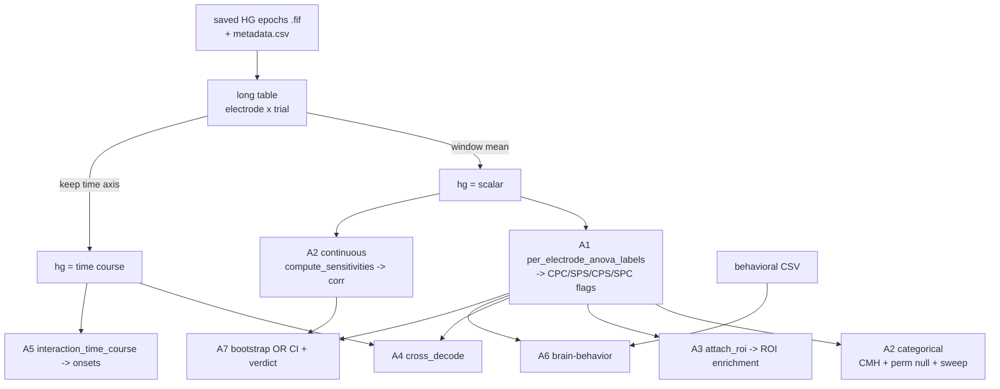

# Data Flow Walk-Through — Stability vs. Flexibility (A1–A7)

This document follows **one fake dataset** all the way through the
stability/flexibility battery, printing the actual table at every hand-off. It
answers the question *"what shape is the data at each step, and what does each
function turn it into?"* — the thing that is hard to see from the source alone.

**It is a companion, not a replacement:**

| Doc | Answers |
|---|---|
| `docs/analysis_paths.md` | *Where does each analysis live?* (§12 is the battery's map) |
| `docs/stability_flexibility_guide.md` | *Why is it designed this way?* (plan, rigor checklist, line-by-line) |
| `docs/stability_flexibility_segregation_methods.md` | *How do I write it up?* (manuscript Methods) |
| **this doc** | ***What does the data look like at each step?*** |

Everything below is generated by one runnable script:

```bash
pip install numpy pandas scipy statsmodels scikit-learn
python docs/examples/stability_flexibility_data_flow_demo.py           # all stages, ~1 min
python docs/examples/stability_flexibility_data_flow_demo.py a1 a2     # just these
```

Stages: `design`, `a1`, `a2`, `a3`, `a4`, `a5`, `a6`, `split`. It needs **no
cluster, no BIDS tree, no MNE, and no iEEG data on disk** — every stage uses the
module's own synthetic generator with *planted ground truth*, so you can always
check the answer against what was planted. Every output below is pasted verbatim
from that script; it is seeded, so you will get the same numbers.

---

## 0. The one table everything consumes

Every stats analysis in the battery eats the same thing: a **long table, one row
per (electrode, trial)**.

| Column | Meaning |
|---|---|
| `subject` | subject id |
| `electrode` | electrode id, **already scoped by subject** (`0_4`, not `4`) |
| `hg` | single-trial high gamma — a **scalar** window mean (A1/A2), or a **1-D time course** over the window (A4/A5) |
| `congruency` | `'c'` / `'i'` |
| `switchType` | `'s'` / `'r'` |
| `incongruent_proportion` | block-level, `25.0` / `75.0` |
| `switch_proportion` | block-level, `25.0` / `75.0` |

**Where it comes from on real data.** The saved high-gamma epochs (§4 of
`analysis_paths.md`) are loaded with `create_subjects_mne_objects_dict`, the
window is averaged (or kept, for the time-resolved measures), and the epochs'
`metadata` supplies the four design columns. The DCC launchers in
`dcc_scripts/stats/` do this for you; `DATA_SOURCE=synthetic` swaps in the fake
generator without changing anything downstream. **That substitutability is the
point** — if an analysis can't run on synthetic ground truth, it can't be
validated.

**The fake version used here** (`make_mini` in the demo script): 6 subjects × 8
electrodes × 240 trials. Per subject, electrodes 0–1 carry the LWPC interaction,
2–3 carry LWPS, electrode 4 carries **both**, and 5–7 carry nothing. A congruency
**main effect** is added to every electrode on purpose, so the analyses have
something to *not* be fooled by.

```
 subject electrode congruency switchType  incongruent_proportion  switch_proportion        hg
       0       0_0          i          s                    75.0               75.0  2.774203
       0       0_0          i          r                    75.0               25.0  2.559591
       0       0_0          i          s                    75.0               75.0  1.415948
       0       0_0          i          r                    75.0               75.0  1.534290
       0       0_0          i          r                    75.0               25.0 -1.177261
       0       0_0          i          s                    75.0               75.0  1.487710
```



---

## 1. Design detour — why the estimator looks the way it does

Run `... demo.py design`. This stage has no analysis in it; it exists to show
what the balanced difference-of-differences is protecting you from.

Take 20 000 trials with a **pure congruency main effect and an interaction of
exactly zero**, in a design where the blocks are unequal (3× as many
high-incongruent blocks as low), so the four cells are lopsided:

```
                                    mean   size
congruency incongruent_proportion
c          25.0                   -0.589   3658
           75.0                   -0.624   3714
i          25.0                    0.585   1235
           75.0                    0.598  11393

  true interaction                      =  0.000  (by construction)
  pooled  (+cells) - (-cells)           = +0.631  <-- the main effect, leaked
  balanced equal-cell d-o-d             = +0.048  <-- unbiased
  sum-coded Type III interaction        =  F=1.579, p=0.209  <-- n.s., correct
```

A trial-count-weighted **pooled** contrast — averaging the two `+1` cells and
subtracting the two `−1` cells — reports `+0.631` where the truth is `0`. It is
dominated by the frequent cells, so the congruency main effect walks straight
into the "interaction". The **equal-cell difference-of-differences**
`(M₁₁ − M₀₁) − (M₁₀ − M₀₀)` weights each cell the same and returns `+0.048` ≈ 0.

This is why `_interaction_effect` / `_dod_cells` never pool, and why the ANOVA
uses **sum coding with Type III SS**: same protection, in the parametric path.

---

## 2. A1 — `per_electrode_anova_labels`

`long table  ->  one row per electrode, with four binary selectivity flags`

For each electrode, four two-way Type III ANOVAs on window-mean HG, one per
interaction, FDR-corrected **across electrodes** within each interaction:

| Flag | Interaction | Reads as |
|---|---|---|
| `CPC` | congruency × incongruent-proportion | **LWPC / stability** |
| `SPS` | switchType × switch-proportion | **LWPS / flexibility** |
| `CPS` | congruency × switch-proportion | cross |
| `SPC` | switchType × incongruent-proportion | cross |

```
 subject electrode   F_cpc  p_cpc  q_cpc  cpc_sign   F_sps  q_sps  q_cps  q_spc  CPC  SPS  CPS  SPC  S  F
       0       0_0 79.1044 0.0000 0.0000       1.0  0.0528 0.9490 0.8696 0.9241    1    0    0    0  1  0
       0       0_1 60.9543 0.0000 0.0000       1.0  0.9142 0.5440 0.7787 0.9506    1    0    0    0  1  0
       0       0_2  0.1450 0.7037 0.8444      -1.0 35.2669 0.0000 0.9106 0.9506    0    1    0    0  0  1
       0       0_3  4.4841 0.0353 0.0806       1.0 29.6802 0.0000 0.9615 0.9506    0    1    0    0  0  1
       0       0_4 39.6244 0.0000 0.0000       1.0 36.5950 0.0000 0.9615 0.5421    1    1    0    0  1  1
       0       0_5  0.0469 0.8288 0.8840      -1.0  0.0079 0.9490 0.9109 0.4580    0    0    0    0  0  0
       0       0_6  0.9638 0.3272 0.5610      -1.0  0.0116 0.9490 0.8280 0.9241    0    0    0    0  0  0
       0       0_7  0.6761 0.4118 0.6376       1.0  0.6196 0.6284 0.7572 0.9506    0    0    0    0  0  0

selected: {'CPC': 18, 'SPS': 18, 'CPS': 0, 'SPC': 0} | both = 6 | n_electrodes = 48
ground truth per subject: 3 CPC (elecs 0,1,4), 3 SPS (2,3,4), 1 both (4), 0 cross
```

**Read it against the plant.** 18 CPC = 3 per subject × 6 subjects, exactly the
electrodes 0, 1, 4. Same for SPS. Electrode `0_4` fires on both. `0_3` is the
interesting near-miss: `F_cpc = 4.48`, raw `p = 0.035` — significant on its own,
**not** after FDR (`q = 0.081`), which is correct, because nothing was planted
there.

**Three things to check on every real run:**

1. **`CPS` and `SPC` should be ≈ 0.** They are here (0 and 0). These cross
   interactions are the specificity control — in univariate HG there is no reason
   for congruency to be modulated by *switch* proportion. If they light up, the
   `CPC`/`SPS` flags are not measuring what you think.
2. **`cpc_sign` is recorded but never gates selection.** Electrode `0_2` has
   `cpc_sign = -1` and is not selected anyway (`q_cpc = 0.84`). Selection is
   **two-sided**: an electrode counts as LWPC whenever the congruency effect is
   modulated by block proportion, in either direction. The sign is for reporting.
3. **The aliases are aliases.** `S` is literally `CPC` and `F` is literally
   `SPS`; the old `p_cong`/`q_switch`/… columns are copies of the new ones. The
   whole downstream stack (A2/A3/A6) still reads `S`/`F`, so nothing broke when
   the four-group naming landed.

> **Why four groups and not two?** A4 decodes a **2 × 2 of {contrast} ×
> {block modulator}**, and each of those four decode cells is the multivariate
> readout of one of these four interactions. To keep A4 non-circular you have to
> be able to *name* the electrode set each cell would double-dip on — so `CPS`
> and `SPC` have to be defined groups, not just report-only p-values. See
> `guide.md` §3.2.

Pass `include_cross_controls=False` to get the two-group version.

---

## 3. A2 — do the two populations overlap?

Two independent tests on the same question, and they are worth running both
because they fail differently.

### 3a. Categorical — Cochran–Mantel–Haenszel on the A1 flags

`labels  ->  one 2x2 per subject  ->  pooled odds ratio`

```
per-subject 2x2 tables:
 subject  both  stab_only  flex_only  neither
       0     1          2          2        3
       1     1          2          2        3
       2     1          2          2        3
       3     1          2          2        3
       4     1          2          2        3
       5     1          2          2        3

pooled 2x2 (descriptive only — ignores subject nesting):
[[ 6 12]
 [12 18]]

MH odds ratio = 0.750   CMH p = 0.6657   OR 95% CI = (0.221, 2.546)
permutation null (F shuffled WITHIN subject): observed=6  null_mean=6.74  z=-0.42  p=0.7986
```

Each subject gets its **own** 2×2 table and CMH pools them — that is the whole
reason it is CMH and not a plain Fisher's exact on the pooled table. The pooled
table is printed as a descriptive only.

The permutation null shuffles `F` **within each subject**, so every subject's
`S`-count and `F`-count stay fixed and only the *pairing* is randomized. A global
shuffle would break the nesting and manufacture significance.

`OR = 0.75` points toward segregation, but with 48 electrodes the CI is
`(0.22, 2.55)` and `p = 0.67` — **this test is simply underpowered here.**

### 3a′. Threshold sweep

A verdict that only exists at one α is not a verdict:

```
 threshold  n_S  n_F  n_both  mh_odds_ratio  cmh_p
      0.01   18   18       6         0.7500 0.6657
      0.05   18   18       6         0.7500 0.6657
      0.10   21   18       8         1.0476 0.9429
```

Stable and n.s. across the sweep. (Note how loosening to `q < 0.10` pulls in 3
extra `S` electrodes — the near-misses like `0_3` — and drags `OR` to 1.05. On
real data, watch for exactly this: a conclusion that lives or dies on the cutoff.)

### 3b. Continuous — correlate the two sensitivities

`long table  ->  (x, y) per electrode  ->  residualise  ->  centre  ->  correlate`

```
compute_sensitivities (x and y from DISJOINT trial halves):
 subject electrode       x       y
       0       0_0  2.5788  0.0651
       0       0_1  2.4200 -0.3326
       0       0_2 -0.1173  1.8167
       0       0_3  0.6232  1.7240
       0       0_4  1.8349  1.7422
       0       0_5  0.0366  0.0201

after add_responsiveness + prepare_continuous (x1/y1 = responsiveness-residualised, *_resid = within-subject centred):
 subject electrode       x       y   resp      x1      y1  x_resid  y_resid
       0       0_0  2.5788  0.0651 0.2612  1.6385 -0.7621   1.3784  -0.7117
       0       0_1  2.4200 -0.3326 0.2493  1.5301 -1.1240   1.2700  -1.0736
       0       0_2 -0.1173  1.8167 0.2260 -0.9073  1.0961  -1.1674   1.1466
       0       0_3  0.6232  1.7240 0.2390 -0.2225  0.9640  -0.4826   1.0144

subject_clustered_corr: corr = -0.707   p = 0.00050   n_elec = 48   n_subj = 6
```

Read the `(x, y)` table straight against the plant: `0_0` and `0_1` are high-x /
low-y, `0_2` and `0_3` are low-x / high-y, `0_4` is high on both, `0_5` is flat.

The three bias controls, each visible as a column:

- **`x` and `y` come from disjoint trial halves** (averaged over 20 random
  splits), so their sampling noise is independent. Estimating both on all trials
  makes shared trial noise inflate the correlation toward whatever sign the noise
  happens to share.
- **`x1`/`y1` are residualised on `resp`**, overall task drive. A high-gain
  electrode is bigger on *everything*, which would fake a positive correlation.
- **`x_resid`/`y_resid` are within-subject centred**, so the estimate is a
  *within*-subject quantity — matching the within-subject permutation null.

**Verdict: `corr = −0.71`, `p = 0.0005` → segregation.** Compare with the
categorical `OR = 0.75, p = 0.67` on the *same electrodes*: same direction,
wildly different power. That gap is the entire motivation for A7.

---

## 4. A3 — anatomy, conditioned on coverage

`labels + electrode->ROI map  ->  group x ROI table  ->  within-subject permutation chi2`

```
attach_roi adds `roi` and the derived `group`:
subject electrode  S  F      roi   group
    S00    S00-e0  0  0 parietal neither
    S00    S00-e1  0  0 parietal neither
    S00    S00-e2  1  1 parietal    both
    S00    S00-e3  0  0 parietal neither

build_coverage_matrix (subject x ROI — who is even wired where):
roi       acc  dlpfc   lpfc    occ  parietal    v1
subject
S00      True   True   True   True      True  True
S01      True   True   True  False      True  True
S02      True   True  False  False     False  True
S03      True   True  False   True     False  True

group x ROI contingency:
        acc  dlpfc  lpfc  occ  parietal  v1
both      6      5     5    1         2   2
S_only   17     14    19    2         3   9
F_only    3      6     3   13        13  14

per-ROI coverage (n subjects):
roi
acc         10
dlpfc       10
lpfc         9
occ          7
parietal     8
v1          10

chi2 = 44.041   permutation p = 0.0005   n_electrodes = 137   rois_tested = ['acc', 'dlpfc', 'lpfc', 'occ', 'parietal', 'v1']
NULL control (enrichment=0.0):  chi2 = 10.642   p = 0.4013   <-- must be n.s.
```

`group` is derived from the `S`/`F` flags: `both`, `S_only`, `F_only`, `neither`
(`neither` is excluded from the test — the question is *where the selective cells
are*).

**Coverage is the whole difficulty of iEEG anatomy.** Where electrodes sit is a
clinical decision, so a raw ROI difference can be pure placement. Two guards:

1. ROIs sampled in fewer than `min_subjects` subjects are dropped outright.
2. The null **permutes the `group` label within each subject**, holding every
   electrode's ROI fixed. Coverage is therefore identical in the null and in the
   data — only the group labels move.

Read the contingency table with the coverage row next to it, always. Here
`S_only` piles into acc/dlpfc/lpfc and `F_only` into occ/parietal/v1, which is
what was planted. And the null control — same generator, `enrichment=0.0` —
returns `p = 0.40`, confirming the test isn't manufacturing structure.

---

## 5. A4 — cross-decoding: shared code, or two orthogonal codes?

A1–A3 can show the *same electrodes* are selective for both processes. They
cannot tell you whether those electrodes carry **one shared code** or **two
orthogonal ones**. A4 trains on one contrast and tests whether the decision axis
**transfers** to the other.

```
input is the SAME long table shape, `hg` = per-trial time course:
  columns: ['subject','electrode','congruency','switchType','incongruent_proportion','switch_proportion','hg']
  shape (8240, 7) | hg cell len 16

  shared     train=congruency -> test=switchType: acc = 0.7448  null_mean = 0.5012  p = 0.005  (n_channels=40)
  orthogonal train=congruency -> test=switchType: acc = 0.5053  null_mean = 0.5017  p = 0.711  (n_channels=40)
```

Both synthetic worlds are *individually* decodable; they differ only in whether
the two contrasts load on the same population axis. The transfer accuracy tells
them apart cleanly — `0.74` vs `0.51`.

Subjects don't share trials, so `assemble_pseudopopulation` pools electrodes into
a **pseudopopulation** and `build_pseudo_trials` synthesizes **pseudo-trials** by
matching on the full condition cell, with train and test drawn from **disjoint
reservoirs** (`_split_reservoirs`) — the circularity guard.

### The double-dipping guard

```
  circular_decode_for_group('CPC') = ('congruency', 'incongruent_proportion')
  circular_decode_for_group('SPS') = ('switchType', 'switch_proportion')
  circular_decode_for_group('CPS') = ('congruency', 'switch_proportion')
  circular_decode_for_group('SPC') = ('switchType', 'incongruent_proportion')

  is_circular_decode("CPC", "congruency", "incongruent_proportion") = True
  is_circular_decode("CPC", "switchType", "switch_proportion")      = False
```

Each group was *selected* for one of the four interactions, so decoding that same
interaction on that same group is guaranteed to look good — it's the diagonal of
the 2×2, and it must be ignored (or run under the disjoint trial split, §8). The
**off-diagonal** cells are the informative ones.

### ⚠️ Caveat: `strip_condition_means=True` is currently degenerate

```
per-condition mean removal, train == test == congruency:
  strip_condition_means=False -> acc = 0.7542  null_mean = 0.4990  p = 0.005
  strip_condition_means=True  -> acc = 0.5023  null_mean = 0.4987  p = 0.871
```

This is the *same contrast trained and tested on itself*, on the `shared`
generator where the multivariate axis is real by construction — and mean removal
still drops it to exactly chance.

The reason is structural. `build_pseudo_trials` returns `cell_id` = the index of
the **source condition cell**, and `remove_condition_means` subtracts each
cell's per-feature mean. Every pseudo-trial in a cell is an average of trials
drawn from that one cell, and the class label is a *function* of the cell — so
removing the cell mean removes 100 % of the class-relevant signal and leaves
resampling noise. **Any** transfer collapses under this control, genuine or not.

So do **not** read "collapsed after mean removal ⇒ it was a univariate offset"
from the current implementation — the control cannot distinguish those cases.
Report the raw transfer, and treat the mean-removal number as uninformative until
the control is redefined (a per-channel or across-channel centring, which leaves
pattern information intact, is the usual form). Flagged here rather than silently
changed, since it affects an analysis decision.

---

## 6. A5 — timing

`long table with time-course hg  ->  d-o-d(t)  ->  onset  ->  jackknifed comparison`

```
input: same long table, but `hg` holds a TIME COURSE per trial
  shape (55501, 7) | hg cell = ndarray of len 40

interaction_time_course -> one d-o-d value per time bin:
  times[:8] = [-0.2   -0.174 -0.149 -0.123 -0.097 -0.072 -0.046 -0.021]
  lwpc[:8]  = [ 0.024  0.015 -0.003 -0.007 -0.014 -0.014  0.02  -0.031]
  lwpc[12:20] = [0.065 0.09  0.235 0.407 0.594 0.838 0.957 1.022]  <-- the rising flank

onset (50% of own peak): lwpc = 0.203 s   lwps = 0.402 s
peak latency            : lwpc = 0.518 s   lwps = 0.569 s

jackknife_onset_difference (Ulrich-Miller):
  diff (LWPC - LWPS) = -0.1989 s   se = 0.0033   ci = (-0.2067, -0.1911)
  t_raw = -423.38  ->  t_corrected = -60.48  (df = 7)   p = 8.87e-11
  peak_diff = -0.0513 s  (must agree in sign with the onset diff)

FALSIFICATION — plant the REVERSE ordering; the sign must flip:
  diff = +0.2022 s (was -0.1989 s), p = 2.21e-11
```

Onsets were planted at `0.20` and `0.40 s`; recovered as `0.203` and `0.402`, so
the difference of `−0.199 s` is right on the planted `−0.20`.

**Onset = first upward crossing of 50 % of that effect's own peak.** Normalizing
to each effect's *own* peak is what neutralizes the latency–amplitude confound: a
bigger effect crosses any *absolute* threshold sooner, so without this, "earlier"
would just mean "larger". If `stab(t) = k·flex(t)`, the threshold scales by the
same `k` and both cross at the identical time — baked into a unit test
(`_assert_amplitude_invariance`).

**Ulrich–Miller.** Single-subject latencies are far too noisy, so onsets are read
off **leave-one-subject-out grand averages**. Those N values are almost identical
by construction, which inflates the raw t by a factor of `(N−1)`; dividing it out
gives `t_corrected`. Note `t_raw = −423` vs `t_corrected = −60.5` — reporting
`t_raw` would be badly wrong.

**Two guards to check on real data:** `peak_diff` must agree in sign with the
onset difference (it does: both negative), and the window must be wide enough
that both effects have turned over. The launcher defaults to `[-0.2, 0.8] s`, not
the A1/A2 `[0.0, 0.5] s`, for exactly this reason — a 50 %-of-peak threshold is
meaningless while an effect is still climbing at `WINDOW_TMAX`, and the job warns
when that happens.

---

## 7. A6 — brain–behavior

Three inputs converge here:

```
  elec_labels  (A1 output)      : ['subject', 'electrode', 'S', 'F']
  behavior     (per subject)    : ['subject', 'lwpc', 'lwps']
  trial_df     (per trial)      : ['subject', 'hg_lwpc', 'hg_lwps', 'adj_congruency', 'adj_switch']

neural_summary_by_subject:
subject  n_elec  n_S  n_F  frac_S  frac_F
    S00      41    4    0  0.0976  0.0000
    S01      43   13    5  0.3023  0.1163
    S02      39    4    7  0.1026  0.1795
    S03      25    1    0  0.0400  0.0000

LEVEL 1 — across subjects (n = 16):
  matched: corr_lwpc = +0.764 (p = 0.0006)   corr_lwps = +0.682 (p = 0.0036)
  cross  : stab->lwps = -0.267 (p = 0.317)  flex->lwpc = -0.215 (p = 0.423)

LEVEL 2 — within subject, single trial (the powered test):
  LWPC: matched slope = +0.5954 (z = 34.9)   cross slope = +0.1499 (z = 7.7)   specificity_ok = True
  LWPS: matched slope = +0.6141 (z = 36.7)   cross slope = +0.1706 (z = 8.7)   specificity_ok = True
```

**The result is the gap, not either number.** Matched pairing (LWPC electrodes ↔
congruency-sequence RT adjustment) is far stronger than the cross pairing at both
levels. A neural group that predicted *both* adjustments equally would mean the
selectivity isn't functionally specific — which is exactly what the launcher's
falsification run (`SYNTHETIC_CROSS_FRAC=1.0`) plants, and `specificity_ok` then
stops holding.

Level 1 (n = subjects) is honest but underpowered — the module says so in its own
returned `caveat` string. Level 2 is the real test: `adjustment ~ hg_group` with
a subject random intercept, on 3 547 trials.

**`trialwise_brain_behavior` takes the adjustment columns as *input*** — the
operationalization is a design choice, so the launcher states it explicitly
rather than burying it:

```
adj_congruency(t) = w(t) · (RT_t − that subject's mean RT)
```

where `w(t)` is the trial's cell weight in the LWPC difference-of-differences
(`+1` on the (i, high-incongruent) / (c, low-incongruent) diagonal, `−1` on the
other). A subject's mean `adj_congruency` is therefore their behavioral LWPC / 4.
RT and the group HG are both **centred within subject**, so the mixed-model slope
is a purely within-subject quantity. Full statement in
`dcc_scripts/stats/README.md` (A6).

---

## 8. The disjoint trial split (circularity control)

Used whenever decoding is restricted to a *selected* electrode set. If the
selection is computed on the same trials the decoder scores, accuracy is inflated
by selection alone.

```
epochs.metadata (12 trials) -> strata_key_from_metadata(['congruency','switchType','blockType'])
  ['c|s|A','c|r|A','i|s|A','i|r|A','c|s|A','i|r|A','c|s|B','i|r|B','c|s|B','i|r|B','c|s|B','i|r|B']

P_def (define electrodes) = [1, 2, 3, 4, 6, 7, 10, 11]
P_dec (decode)            = [0, 5, 8, 9]
disjoint = True | together they cover every trial = True

select_responsive_channels (run on P_def only) -> [False  True False False False]
  channel 1 planted responsive -> kept; channel 4 zero-variance -> dropped
```

The split is **stratified**: trial indices are partitioned within each
`congruency|switchType|blockType` stratum, so both partitions stay balanced on
condition and block, and it is deterministic under `seed`. Channels are then
selected on `P_def` (responsiveness t-test, FDR across channels, zero-variance
channels dropped) and the decoder only ever sees `P_dec`.

Expect **lower** accuracy than the non-split run — that gap is roughly the
double-dipping bias the control removes. `trial_splitting_tutorial.ipynb` has a
demo where selecting on the scored trials produces above-chance decoding from
**pure noise**, and the split returns it to chance.

---

## 9. A7 — reconciling the two answers (self-check assignment)

§3 above is the motivation: on the same 48 electrodes the continuous test said
`corr = −0.71, p = 0.0005` (segregated) and the categorical test said
`OR = 0.75, p = 0.67` (nothing). What do you report?

A7 (`docs/learning_assignments/segregation_bootstrap/`) is a **build-a-feature
assignment**, not a production analysis — three stubs to implement, with a test
suite as the grader:

| Function | What it checks you understand |
|---|---|
| `bootstrap_conjunction_or` | inference resamples **subjects, not electrodes** — and a subject drawn twice becomes two separate CMH strata |
| `classify_segregation` | what the two layers *mean*, and that a genuine disagreement is its own outcome |
| `segregation_verdict` | the pipeline order — sensitivities → responsiveness → residualise → correlate, in parallel with labels → CMH → null → bootstrap |

```bash
python -m pytest docs/learning_assignments/segregation_bootstrap/test_a7_segregation_verdict.py -q
```

It is **red until you implement it** (the stubs raise `NotImplementedError`), and
there is no solution file. The acceptance criteria are the interesting part: the
bootstrap point estimate must equal `cmh_conjunction(...)['mh_odds_ratio']`
exactly; on independently-drawn synthetic data the OR CI must **cover 1** and the
verdict must be `inconclusive`; and the CI must be **no tighter** than one that
(wrongly) treats each electrode as its own stratum — the nesting principle turned
into a test.

---

## 10. Aside: how is A2-continuous related to RSA?

It comes up because both reduce condition structure to a number per unit and then
correlate. The mapping is worth having straight, because it's the reverse of the
obvious guess.

**A2-continuous is not "RSA minus the model-RDM correlation" — the model
comparison is the part it keeps, and the RDM is the part it skips.** Each
electrode's `x` is its condition profile projected onto a *fixed* contrast vector,
the LWPC difference-of-differences `(+1, −1, −1, +1)` over the four cells; `y` is
the same against the LWPS contrast. That contrast **is** the model. What never
gets built is the full pairwise dissimilarity geometry — the analysis goes
straight from cell means to a projection onto two 1-D model axes.

Three further differences that matter more than the analogy:

1. **Univariate, not multivariate.** RSA's unit of representation is a *pattern*
   across channels; A2's unit is a single electrode's scalar (or time course).
   There is no pattern dimension at all. In this battery the representational
   geometry lives in **A4**, not A2.
2. **Signed, not a distance.** RDM entries are dissimilarities; the d-o-d is
   signed, and A2's entire verdict is the *sign* of the correlation.
3. **The second-level step has no RSA counterpart.** Standard RSA correlates a
   data RDM with a model RDM. A2 correlates *two model fits with each other,
   across electrodes* — "do the same units score high on both models?" That is a
   co-localization question, closer to overlaying two contrast maps than to
   second-order RSA. The disjoint-half estimator and responsiveness
   residualization exist specifically to keep that across-unit correlation
   unbiased, a problem model-RDM RSA doesn't have.

**A real RSA version would be a different (and complementary) analysis:** per ROI
or pseudopopulation, build the condition × condition RDM from HG *patterns*, then
correlate against an LWPC model RDM and an LWPS model RDM, and ask whether the two
model fits co-localize across ROIs. That would be sensitive to multivariate
structure invisible to per-electrode univariate contrasts. Not implemented; the
nearest thing in the codebase is A4's pseudopopulation machinery, which already
does the pooling and pseudo-trial construction such an analysis would need.

---

## 11. Run order and where to go next

```
A1  ->  A2  ->  A3   (labels, then overlap, then anatomy)
        A2  ->  A7   (reconcile the two layers)
A1  ->  A4           (shared vs orthogonal code, off-diagonal cells only)
        A5           (timing; independent of A1 labels)
A1  ->  A6           (function)
```

| Want | Go to |
|---|---|
| Where each analysis lives, and its launcher | `docs/analysis_paths.md` §12 |
| Why it's designed this way, line-by-line | `docs/stability_flexibility_guide.md` |
| Manuscript Methods text | `docs/stability_flexibility_segregation_methods.md` |
| Fill-in-the-blank practice, A1→A6 | `src/analysis/stats/stability_flexibility_assignments_sandbox.ipynb` |
| Per-analysis tutorials | `stability_flexibility_*_tutorial.ipynb`, `cross_decoding_tutorial.ipynb`, `trial_splitting_tutorial.ipynb` |
| Runnable stubs | `docs/skeletons/aN_*.py` |
| How to launch on DCC | `dcc_scripts/stats/README.md`, `dcc_scripts/decoding/README_stability_flexibility_cross_decoding.md` |
